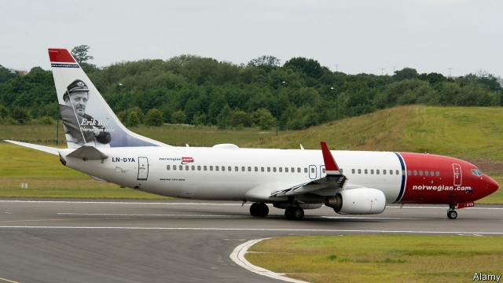

###### Laker Airways 2.0

# The disappearance of Norwegian would be bad news for consumers 

 

> print-edition iconPrint edition | Business | Feb 9th 2019 

IN THE 1960S long-haul air travel was a glamorous but expensive proposition. Then in the 1970s Sir Freddie Laker, a British entrepreneur, set about trying to open it up to the masses. In 1977 he launched Skytrain, the first low-cost, long-haul service between London and New York. Within only five years Laker Airways went bust. Recently another European entrepreneur, Bjorn Kjos of Norwegian, hoped to succeed where Laker failed and in 2013 he relaunched low-cost flights across the Atlantic. It looks as if Norwegian may suffer the same fate as Laker Airways. 

Norwegian’s finances have been in a bad way since it embarked on its new project. As an airline mainly flying domestic and short-haul routes in Scandinavia, in 2013 it made an annual operating profit of NKr970m ($166m). On February 7th Norwegian said it had made operating losses of NKr3.85bn in 2018, during which almost half of its flights were on long-haul routes. 

The firm had been limping on hoping for a takeover from IAG or Lufthansa, two big European airline groups. But in late January its shares fell by a third after its potential suitors walked away due to worries over the pricing of a deal and about losing flying rights in the event of a no-deal Brexit. To avoid bankruptcy through breaching agreements with bondholders, Norwegian was obliged to raise 3bn krone—over half its market capitalisation—in a rights issue. 

Analysts are sceptical about whether it can continue operating. Mr Kjos plans to rein in growth ambitions and cut costs to keep the airline aloft in 2019. An ongoing fare war in Europe and rising fuel prices are likely to make losses worse. The company hopes that shifting planes from loss-making European holiday routes to South America, where countries are opening up to foreign airlines, will reduce its losses. But political and financial instability in some markets mean that returns could prove volatile. 

If Norwegian disappears, will the long-haul, low-cost model survive? The idea was to apply the low-cost model as successfully mastered by Ryanair, to longer routes. Norwegian and its imitators, such as Primera of Denmark and WOW of Iceland, have offered loss-making fares on routes, hoping to make the money back by filling planes to capacity and by selling extras on-board rather than with tickets. 

The strategy has not worked well on longer routes. Norwegian filled only 76% of its seats in January compared with 91% for Ryanair. One reason is that flyers will more readily choose a no-frills flight for an hour-long flight than for eight hours. Other long-haul budget rivals are doing worse: Primera went bust last October and WOW is teetering on the edge of bankruptcy. 

Yet Norwegian also made mistakes that could be avoided by other airlines, argues Ross Harvey of Davy, a stockbroking firm. First, it grew too quickly with too weak a balance-sheet. The losses that Norwegian racked up in order to stimulate demand were not steep enough to trouble a big airline group with deep pockets. But Norwegian, which is heavily indebted, cannot easily absorb them. 

Second, unlike Ryanair and easyJet, the airline did not control its costs tightly. “It is not a long-haul, low-cost airline, but a long-haul, low-fare one”, says Daniel Roeska of Bernstein, a research firm. Its weak balance-sheet also means it has to pay high interest to finance aircraft. 

The rise of low-fare startups such as Norwegian has reduced the share of seats across the Atlantic carried by the big three European airlines and their joint-venture partners from 80% in 2015 to 72%, according to CAPA, an aviation consultancy. Their success has prompted larger airline groups to copy the model. IAG has responded to Norwegian, for example, by launching its own budget long-haul operation, called LEVEL. It is converting Aer Lingus, its Irish airline, into another. Lufthansa has done the same with Eurowings’ long-haul routes. For a while, low-cost long-haul carriers will live on as part of larger airline groups. But the bad news for flyers is that if Norwegian goes bust, the big airlines would have free rein to raise fares, presumably while keeping no-frills service. 

A takeover by a low-cost rival with money to spare, such as Ryanair, is another possible outcome. The Irish firm has been looking for opportunities to expand outside its western European territories, where the market for air travel is saturated. But its boss, Michael O’Leary, is wary about a bid. He has looked at buying Norwegian but thinks that Europe’s three big airline groups will do everything they can to destroy low-cost rivals competing with the long-haul flights which earn their corn. That seems a reasonable conclusion. 

