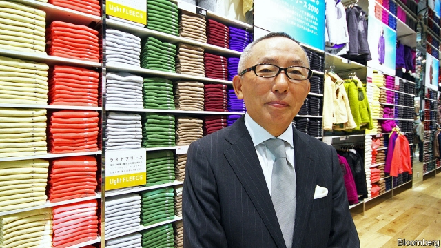

###### Back to basics

# UNIQLO’s founder plots a way to beat Zara and H&M 

 

> print-edition iconPrint edition | Business | Feb 9th 2019 

WHEN ASKED what guides his vision of UNIQLO, Tadashi Yanai, its founder and chief executive, pulls off the shelf the 1987 autumn/winter collection catalogue of Next, a mass-market British retailer. All of the clothes are so classic, he says, that they could be worn today. While Inditex of Spain, which owns Zara, and Hennes & Mauritz of Sweden, the world’s two largest clothing retailers, slavishly follow fashion trends, UNIQLO, the main brand of the third-largest, Fast Retailing, of Japan, sticks to timeless basics. 

Mr Yanai has a solid base at home from which to expand into his Western competitors’ main markets of Europe and America. But instead his priority remains Asia. He wants to turn UNIQLO into the world’s largest clothing retailer by becoming the first Asian “SPA” or speciality store retailer of private-label apparel. “Asia is the engine of growth today,” he says, pointing to the millions of consumers across the region who are reaching the middle class. UNIQLO will open its first shop in India this year and is considering whether to expand into Vietnam and other countries (it has already opened networks of shops in Indonesia, Singapore and Thailand). 

The success or not of UNIQLO’s overseas operations matters greatly to investors at home. Fast Retailing’s shares—Mr Yanai owns just over 20% of the firm—have been rising since 2015, largely, analysts reckon, owing to its international expansion and improved logistics. At home the firm is closing stores because the population is shrinking. Fast Retailing’s operating profit in the year to August 2018 was ¥236.2bn ($2.15bn), the bulk of which is made up by UNIQLO. Last year UNIQLO’s international revenue overtook its domestic sales for the first time and its foreign operating profit almost equalled its Japanese equivalent. 

UNIQLO has a strong Asian foothold by way of China, home to over half its overseas shops. China contributed around 70% of total international revenues last year. This success has surprised some, and not only because of ill-feeling towards Japan from many Chinese because of the latter’s wartime record. China is not an easy place to work, and, in clothing at least, Chinese consumers tend to revere brands. But even the label-obsessed need plain bits and bobs for layering or co-ordination. Chinese consumers are after quality, and UNIQLO’s special fabrics, especially its Heattech range for cold weather, function well. Above all analysts point to the company’s savvy Japan-educated Chinese executives who understand both the culture of the Japanese business and that of China. 

But the rest of Asia may be harder to crack. For one thing, a warm climate in several countries means that UNIQLO cannot rely on its cold-weather products as a main driver of sales. It may have to tweak its formula, which could be risky, says Takahiro Saito, a fashion-retail analyst and author of a book comparing UNIQLO and Zara. 

Though they are very different markets, Europe and America offer a cautionary tale. UNIQLO in America struggled outside the big cities of the east and west coasts. Growth in the heartlands remains elusive for UNIQLO both there and in Europe. In part that is because the same business model exists there already with firms such as Gap, says Mr Saito. But UNIQLO could do better at explaining what it does. Well thought-out partnerships with ambassadors, such as tennis player Roger Federer, and collaborations with designers, like Jil Sander, are starting to help. 

Mr Yanai, an ardent fan of globalisation unlike many Japanese executives (the firm’s working language is English and many employees, even in Japan, are foreign), is confident that he can guide UNIQLO through the changes needed. He also talks of expanding into shoes as well as dresses and skirts, where UNIQLO currently has only slim offerings. 

The backlash against globalisation is the biggest risk to UNIQLO’s Asian plans, he says. It could limit free movement of goods and people, disrupting both supply chains and workers. Still, a Japanese firm that has managed as much foreign success as UNIQLO should be able to cope. 

