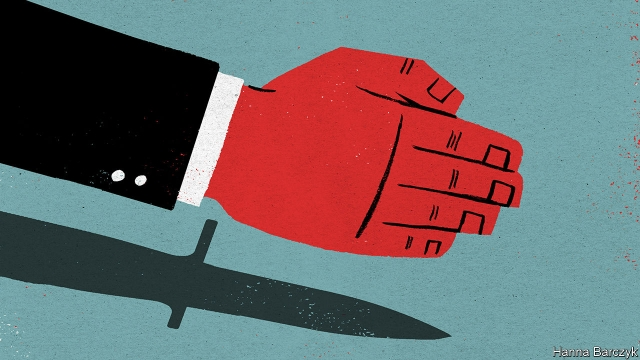

###### Chaguan

# Does China understand Taiwan? 

 

> print-edition iconPrint edition | China | Feb 9th 2019 

IF CHINA’S RULERS ever decide to invade Taiwan—a grim but not impossible prospect—they will need good answers to two questions. First, would the People’s Liberation Army win? The consensus in Taipei is that the PLA is close to that goal but is not “100% sure” of victory. Second, would ordinary Taiwanese submit? 

Chinese leaders have limited patience for Taiwanese opinion. Their offer to the democratic island of 23m is ostensibly generous. Under the slogan “One Country, Two Systems”, Taiwan is promised lots of autonomy alongside access to China’s vast market. This is backed by honeyed words about unifying a family sundered for 70 years, since China’s civil war ended with the losing Nationalist Party, or Kuomintang (KMT) retreating to what they hoped would be temporary exile on Taiwan. Still, China is committed to using force to block any bid for formal independence. 

Chinese optimists call time their ally, as Taiwan’s population ages and its economy slows. Chaguan visited Taiwan recently. It is true that China’s gleaming coastal cities make Taipei’s 1980s skyscrapers look shabby. But time is China’s foe too, says Freddy Lim, a heavy-metal rock star and legislator for Taiwan’s pro-independence New Power Party. Mr Lim cites polls showing that youngsters increasingly identify as Taiwanese and consider China another country, albeit one where they like to do business. 

Put bluntly, China’s proposals sound creepy to many young, urban Taiwanese. In effect, they hear a demand to submit to marriage with a stern cousin, arranged decades ago: “I am rich now, let me cherish you—or I will kill you.” 

Taiwanese defiance may anger China’s leaders. But they cannot safely ignore it. Any Chinese victory would need to be quick, with Taiwan’s will to fight broken so swiftly that calls for an American rescue become moot. Taiwanese security experts are frank about what they fear: a psychological collapse among the public, for instance after initial waves of Chinese missiles wreck more than half the island’s defences, or blow up oil and gas terminals to cut power supplies. Then there is the question of what happens the day after China wins. Politicians predict mass protests in Taiwanese cities. Would China send tanks to subdue its sullen new satrapy? 

Alas, China has closed off avenues to answering such questions. Communist bosses growl that they will only engage with Taiwanese who agree that their island is part of China. That excludes President Tsai Ing-wen and her ruling Democratic Progressive Party (DPP). The DPP says that the island they govern is a country in its own right, though to avoid a crisis they fudge what they mean by that. In their desire to teach Taiwanese voters that DPP rule brings pain and isolation, China has sought to ostracise the party since Ms Tsai won election in 2016. Government-to-government contacts have been limited to such technical subjects as air-traffic control, food safety and some police co-operation, for instance when one side seeks the return of a fleeing murderer. Chinese pressure is blamed for sharp declines in tourism from the mainland and in short-term exchanges by mainland students, though about 3,500 Chinese students remain in Taiwan on degree courses. Even scholars close to the DPP have been blacklisted from travel to China, among them Tseng Chien-yuan of Chung Hua University. He adds that Chinese academics he has known for decades are now barred from formal contacts with him. “I worry about this situation, because if the Chinese government only hears what it wants to know, they can never understand Taiwan,” says Mr Tseng. 

China does hear from conservative supporters of the KMT, which backs closer ties with China, although not unification. About 370,000 mainlanders married to Taiwanese live on the island. Those who vote lean KMT. Equally, at any moment there are a million Taiwanese in China, including 400,000 long-term residents. Tales abound of Chinese officials offering economic rewards to Taiwanese businessmen who endorse unification. 

Wang Ting-yu, a DPP legislator who sits on the parliament’s foreign affairs and defence committees, says that China’s intelligence services gather information about Taiwan from “between 10,000 and 100,000” agents and informers. Fewer than 5,000 are professional spies, he estimates. Chinese informers might be Taiwanese gangsters on the hustle in southern China, or Taiwanese businessmen looking for favours. Mr Wang cautions that China may not learn much from its spies. (Taiwan’s spooks are underwhelming when he asks about China, he notes, either because they do not trust parliamentarians or because “they don’t know anything”.) 

A big danger is that ignorance leads to impatience. There are over 140 students from both sides of the straits at the Graduate Institute for Taiwan Studies at the University of Xiamen, a handsome port city with close geographic and cultural links to Taiwan. Chen Xiancai, a professor at the institute, says many arrive knowing little about the other side. Mainland students point to China’s strength and ask: “Why haven’t we unified yet?” His Taiwanese students retort: “Why are you in such a hurry?” The institute’s scholars stand out for their professionalism, visiting Taiwan often to conduct fieldwork. The professor leads a DPP study centre opened within the institute in 2017. But he is cautious about describing its work, saying it is focused on building a database of academic papers. Still, he is sometimes berated by online nationalists, who complain that the DPP should be “exterminated”, not studied. 

Sherry Yu, a Taiwanese student in Xiamen, comes from a family that votes for the KMT. She wants a career in China but still laments that Chinese classmates—reared on jingoistic schoolbooks and censored news—cannot comprehend why Taiwanese would vote for the DPP or resist unification, insisting that they must simply want to humiliate China. Ms Yu thinks that Taiwanese just want to preserve their freedoms. When politics comes up, she often starts with “we”, then sadly finds herself using “you” and “me”. 

