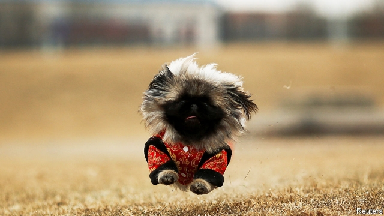

###### Mao’s best friend

# Once denounced as bourgeois vanity, pets are big business in China 

 

> print-edition iconPrint edition | China | Feb 9th 2019 

WITH ITS overflowing ball pits, indoor swimming pools and elaborate obstacle course, the Maidao Play Centre offers a fun-packed day out, reviewers gush. “My girl just loves it here—she just leaps into the car when she realises where we’re going and she can’t wait to play with all her friends,” says a woman in her early 30s. 

While children would probably love Maidao, it is aimed at dogs. It is just one of hundreds of puppy-grooming parlours, animal hotels and doggy day-care centres that have sprung up across China to cash in on the booming pet industry. The market for food, toys, coats and other products for pets was worth 170bn yuan ($25bn) in 2018, up by more than a quarter from the previous year, reckons Goumin, a pet-services portal. This would make it bigger than China’s tea industry. Goumin says China has 73.5m cat- or dog-owners, a group approaching the size of the 90m-strong Communist Party. 

This is a big change for a country where a dog might once have been as likely to be eaten as fed a treat. Until recently few Chinese saw much sense in keeping animals that could not be put to work. Famine ravaged the country as recently as 1961. Moreover, during the Cultural Revolution of the 1960s and 1970s the bourgeois indulgence of keeping a pet would have attracted the attention of the dreaded Red Guards. Rabies fuelled official paranoia about dogs; until 1993, when Beijing lifted its ban on them, pooches were routinely rounded up and killed. Dogs over 35cm tall are still not allowed in most of the capital. They are said to be too dangerous and noisy. 

Today’s pet boom is being fuelled by a generation that barely remembers the privations of the past. City-dwelling young professionals born in the 1980s and 1990s account for 70% of spending on pets, according to Goumin. Theirs is a richer China, where the old emphasis on community has been replaced by a greater sense of individualism. Many of them are also lonelier than earlier generations, having been lured away from their families and friends by jobs in big cities. 

“The air is bad outside and it’s so easy to stay in and watch things on the internet,” says Wang Xiaoyang, a café-owner in her 20s who moved to Beijing from her hometown in Inner Mongolia. She is one of more than 200m unmarried Chinese in their 20s or 30s. “I live alone, so it’s nice to have little Liuyi waiting all happy to see me when I get home,” she adds, as she flicks through photos of other cats on her iPhone. 

Owners like to splurge on their pets. They spend an average of more than 5,000 yuan a year on pet paraphernalia, according to Goumin—more than the average college graduate in China earns in a month. Tiny, stuffed-toy-like Pomeranians and Japanese Shiba Inu are big sellers thanks to their popularity among stars of Chinese social media, says a pet-shop assistant in Beijing. A Pomeranian puppy can fetch as much as 18,000 yuan, although those who risk buying one online might pay only 2,000. Corgis, French bulldogs and huskies are also in vogue. 

Not all Chinese welcome pets on the streets. A recent video of a woman being pushed by a man after she kicked his dog away from her child sparked fury about pet owners’ failure to restrain their animals. Since then the south-western city of Wenshan has imposed a ban on dog-walking from 7am to 10pm. Jinan, in the east, has introduced a points system for pet-owners. Those committing offences such as failing to register their dog or letting it off the lead in public lose points. If enough points are lost the pet can be confiscated. 

Many Chinese see the proliferation of pets as a symptom of a bigger crisis. China is ageing rapidly. Although the one-child policy was replaced with a two-child rule in 2016, and has been further eased since, the birth rate is still falling. On Zhihu, an online forum, many ask why young people choose raising pets over their Confucian duty of raising children. “We must encourage the younger generation to think more about the prosperity of the motherland,” argues one teacher. Drawing an analogy with pet-loving but stagnant Japan, they fear dog days are on their way. 

