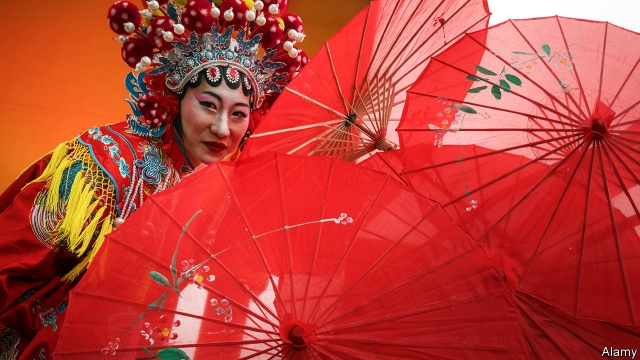

###### Culture wars

# The Communist Party capitalises on foreign interest in Chinese culture 

 

> print-edition iconPrint edition | China | Feb 9th 2019 

LUO YUQUAN can barely hide his glee. The Chinese new year jamboree thrown by the China Cultural Centre (CCC) in Tokyo, which he heads, has gone swimmingly. Ethnic-Tibetan singers flown in from China enchanted the audience, many of whom danced along to the catchy tunes. Copious Tsingtao beer helped sustain the high spirits. An exhibition in an adjoining room featured paintings with Buddhist themes, also shipped in from China. “We are proud to show off 5,000 years of Chinese civilisation!” beams Mr Luo, “As more Japanese come to appreciate Chinese culture, they will naturally grow to love China.” 

Chinese officials often declare that China has a 5,000-year history. In truth, that is overstating things by about 1,000 years. Yet the myth serves a useful purpose for the Communist Party. At home, it is a source of national pride. Abroad, it justifies a sort of Chinese exceptionalism. Xi Jinping, the president, told the visiting Donald Trump, his American counterpart, that China’s is the world’s oldest continuous civilisation. China routinely invokes its awesome history as grounds to continue charting its own development path. Don’t expect China to embrace Western ideas about democracy, the logic goes, for China has always been on its own unique course. 

China’s propagandists also know that Marxism-Leninism doesn’t have the pulling power of kung fu or kung pao chicken. CCCs are intended to breed affection for China—the equivalent of Germany’s Goethe Institutes and France’s Alliances Françaises. There are 37 of them around the world, from Minsk to Mexico City. A further 13 are planned by the end of next year, up from a total of just 13 in 2012. 

In 2015, the most recent year for which data are available, the culture ministry spent 360m yuan ($57m) on CCCs. That may not seem much, yet it represented a near-tripling of the amount spent the previous year. Moreover, the published figure reflects only central-government funding. Provincial governments also help pay for CCCs. One Chinese commentator believes that the government chose not to release spending figures for more recent years lest “foreigners grow anxious about perceived Chinese infiltration”. 

Mr Xi appears to be personally invested in the push to expand CCCs. In 2009 he inaugurated the one in Tokyo, for instance, when he was still vice-president. Since 2014 Mr Xi has presided over the opening of half a dozen of them. 

China has long recognised that it suffers a “soft-power” deficit. Its international cultural influence has not grown as fast as its economy. In 2007 then-president Hu Jintao declared that getting other countries to like China was a national priority. The form of outreach Mr Hu favoured was Confucius Institutes, which are managed by the ministry of education. They offer mainly Chinese-language classes at “partner” academic institutions. More than 500 universities around the world host one. 

Over the past decade, however, Confucius Institutes have arguably done as much harm as good to China’s image. Western scholars and politicians have accused the institutes’ instructors, who are typically dispatched by China’s government, of compromising academic freedom. They allege that the institutes suppress discussion of sensitive topics such as Taiwanese independence and that they spread Communist Party propaganda. In 2014 the American Association of University Professors urged American universities with Confucius Institutes to shut them down. 

Regardless of whether this fear is justified, Chinese officials are well aware of the “controversial reputation” of Confucius Institutes, notes Zhang Xiaoling of the University of Nottingham’s branch in Ningbo. Because of this, Ms Zhang reckons, the task of public diplomacy will increasingly “be shared with CCCs”. 

Although CCCs share the same goal as Confucius Institutes, they aim to arouse less controversy. The library inside Tokyo’s is revealing. The shelves are stacked with comic books and biographies of such luminaries as Shakespeare and da Vinci (in both Chinese and Japanese). Conspicuously absent are Xi Jinping’s turgid works, such as “The Governance of China”, a must-read for any party apparatchik. The activities the centre organises, much like the new year bash, are lighthearted. (All are free of charge.) Among the highlights this month are a movie screening of a Chinese comedy, a “Shaolin martial-arts” performance and a talk on traditional Chinese medicine. CCCs are not completely apolitical—they are just careful to be subtle when they have a point to make. Last summer, for example, Malta’s hosted an exhibition featuring artists from Taiwan which the director billed as a display of “creativity in China”. 

The version of Chinese culture that CCCs present does not go unchallenged, however. Taiwan’s government funds rival outfits called Taiwan Cultural Centres. There are some 15 of these around the world, including one in Toyko a stone’s throw from the CCC. In a not-so-subtle dig, Wang Shu-fang, the director of Taiwan’s centre in Tokyo, says the appeal of Taiwanese culture lies in its creativity—and “creativity can only thrive in a free society.” Happily for Mr Luo, Ms Wang’s centre is not as well-staffed as his. He can put on two to three events a week. She may only manage half that. Still, the mere existence of separate Taiwanese institutes is a reminder to foreign audiences that Taiwan does not want to be subsumed. 

There is also Shen Yun, a dance troupe founded in 2006 by devotees of Falun Gong, a religious group that is banned in China. It puts on shows in more than 100 cities every year. By chance, Shen Yun was gyrating in Tokyo at the same time as Mr Luo was throwing his party. Awkwardly for the Communist Party, Shen Yun also claims to promote, through traditional dance, China’s 5,000-year-old civilisation. 

Indeed, Shen Yun casts itself as the true protector of Chinese culture and the party as its scourge. There is some truth to this. Under Mao Zedong, countless ancient paintings, books and statues were burned or smashed because they represented “old culture”. Shen Yun’s shows depict the persecution of Falun Gong. Annoyingly for the party, Shen Yun appears to be better known than CCCs in much of the world. 

Asked about the competition between his CCC, Taiwan’s cultural centre and Shen Yun, Mr Luo’s disarming smile disappears. He affirms that “as long as what the other organisations are doing is legal”, he will be content to mind his own business. To win the battle of hearts and minds, China will need more than culture and charm. 

