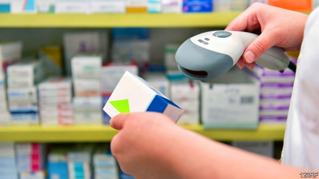

###### Phantom fakes

# Europe’s vast new anti-bogus-drugs system will not find many 

 

> print-edition iconPrint edition | Europe | Feb 9th 2019 

TEETHING PROBLEMS are to be expected with an online system linking more than 150,000 organisations in 28 countries to one giant data hub. That is what the European Medicines Verification System, which goes live on February 9th, will do with pharmacies, hospitals, drug firms and their distributors. From now on, each of the 18bn packs of prescription medicines sold in the EU each year must have a tamper-proof seal and a unique code, which pharmacists must scan in to verify it is not a fake. As the deadline approaches, the system’s glitches are becoming clearer; its benefits, less so. 

According to the EU’s Falsified Medicines Directive, the goal is to protect consumers from the threat of falsified medicines in the legal supply chain. But that threat barely exists in Europe. When the directive was issued in 2011, just one in 20,000 medicine packs was reckoned to be fake. There are no data suggesting this has changed. According to Europol, seizures of fake pharmaceuticals at EU borders in recent years have fallen. Most such shipments are simply passing through the EU on their way to countries with weak safeguards where they will be easier to sell. 

Roberto Frontini, former president of the European Association of Hospital Pharmacists, doubts whether the new system’s priority is patients’ safety. If it were, he points out, all over-the-counter medicines would have been included too. Mihai Rotaru of the European Federation of Pharmaceutical Industries and Associations says pharma companies pushed for an all-EU verification system because some countries were considering setting up their own, which would have created a packaging nightmare for manufacturers. Others in Brussels say big pharma’s motivation was to throw a spanner in the works of parallel-trade firms, which export medicines from low-price to high-price EU countries (a thriving business because countries often fix domestic drug prices). 

The burden falls partly on pharmacies, which have to pay €530 ($604) apiece for new scanners and adapt their software. Urging them to get ready has been a tough sell, say national pharmacists’ associations, because incidents with fake medicines in the legal supply chain are rare or non-existent. Most pharmacies in Britain are ready, but a no-deal Brexit would cut them off from the data hub. 

Disdain percolates in hospitals, too. Many get their medicines directly from manufacturers, which makes verification redundant. Hospital pharmacy units dispatch hundreds of packs to wards each day. Scanning each of them would require more staff. Many hospitals are lobbying to be exempted from scanning, or to be allowed to scan shipments in bulk. Because they are mostly government-owned, hospitals are less worried than street pharmacies about sanctions for not meeting the deadline. 

What should patients expect? Recent tests of the system make it clear that false alarms will be beeping at pharmacies for the first few weeks, if not months. Some packs with the new codes are already on the market but not in the system. Labels sometimes fail to scan. What pharmacists should do is not always clear. Some countries are still writing their guidelines on when to quarantine a pack and how to inspect it. For now, when a pack triggers an alarm, pharmacists are told to go ahead and dispense it to patients anyway. 

