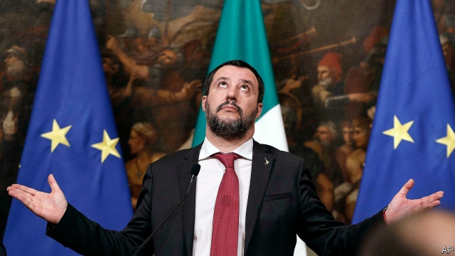

###### When you wish upon Five Stars

# Italy’s populist government is dreaming of economic growth 

 

> print-edition iconPrint edition | Europe | Feb 9th 2019 

FOR ITALY, 2019 will be bellissimo, its prime minister, Giuseppe Conte, said this month. The economy, he declared, could grow by up to 1.5%. With much of Europe at risk of slipping into recession, that sounds pretty good. 

In fact, Italy is already in recession. Its GDP fell in both the third and fourth quarters of 2018, and few forecasters are as sanguine as Mr Conte. The Bank of Italy expects the economy to grow by just 0.6% this year. The prime minister is banking on an expansionary budget. If this fails to revive the economy, the two parties in his populist coalition, the Five Star Movement (M5S) and the nationalist Northern League, will be in trouble. Many question whether their fractious marriage can survive beyond summer. 

The economy is not their only problem. Matteo Salvini, leader of the League and a deputy prime minister, may be tried for kidnapping. Last year, in keeping with his tough stance on immigration, he stopped 177 migrants from getting off a coast-guard vessel that had rescued them in the Mediterranean. They languished on the ship in port at Catania for five days. Last month a court decided Mr Salvini should be indicted for illegally detaining them, though the prosecutors who investigated his conduct asked that the case be shelved. 

Arraigning an Italian lawmaker requires clearance from parliament. To avoid prosecution, Mr Salvini needs the votes of M5S. But M5S has always told voters that it rejects Italy’s grubby history of political obstruction of the courts. And the party has already sacrificed plenty of principles since coming to power. 

One prominent voter who has noticed is Michele Riondino, an actor who starred in the popular television crime series, The Young Montalbano. Mr Riondino voted for M5S last year because it promised to close a noxious steel plant in his native city of Taranto. But the factory has stayed open. The television star spoke for many when, in an interview this week, he vowed to abstain in the next election. 

The regional election in Abruzzo on February 10th will be an important test of the public mood. Polls show that M5S’s share of the national vote has dropped from almost a third at the parliamentary election last March to roughly a quarter. The League, meanwhile, has almost doubled its share to more than 30%. 

In reaction Luigi Di Maio, the M5S leader, has adopted a more radical stance. He now shares platforms with Alessandro Di Battista, a shrill polemicist popular with the party’s left wing. This week, when Italy vetoed the EU’s planned recognition of Juan Guaidó, an opposition leader, as interim president of Venezuela, it was the M5S’s work. (By contrast Mr Salvini denounces Nicolás Maduro, the leftist who stole Venezuela’s most recent presidential election, as a criminal.) On February 5th Mr Di Maio flew with Mr Di Battista to Paris to meet leaders of the gilets jaunes protest movement. If Emmanuel Macron, France’s president, needed another reason to be angry with M5S, he has one. 

The M5S may yet decide to block Mr Salvini’s indictment in parliament. But it will want something in return. The obvious concession would be Mr Salvini’s agreement to postpone or scrap a half-built high-speed rail link between Turin and the French city of Lyon. The movement has always opposed it as unnecessary and environmentally damaging. Now, in a sign of how the party is changing, it has begun using the renascent rhetoric of populist nationalism to belittle the very idea of linking two countries together. As the M5S infrastructure minister, Danilo Toninelli, put it: “Who cares about going to Lyon?” 

