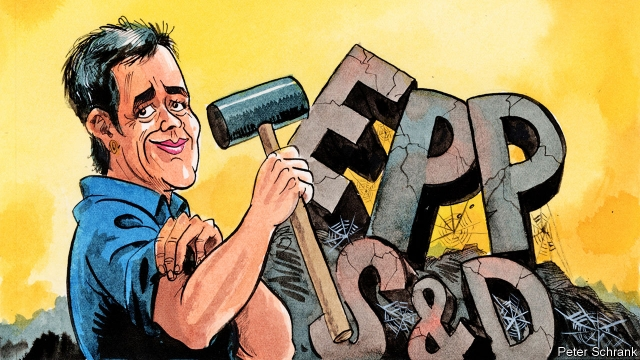

###### Charlemagne

# Margrethe Vestager, bane of Alstom and Siemens, could get the EU’s top job 

 

> print-edition iconPrint edition | Europe | Feb 7th 2019 

REST IN PEACE, “Trainbus”. On February 6th Margrethe Vestager, the European Union’s competition commissioner, vetoed a merger between Germany’s Siemens and France’s Alstom that proposed to do for train-building what Airbus has done for plane-building: create a European giant capable of competing with the world’s biggest. The move dismays Angela Merkel and Emmanuel Macron, who argue that Europe needs champions to take on rivals such as China’s CRRC. But the commissioner ruled that the merger would eliminate competition in certain sectors, and argued that the EU should instead take on Chinese industrial might with better rules on state subsidies, data privacy and takeovers. Her wariness is welcome. Achieving competitive European firms through mega-mergers confronts the symptom—a lack of European industrial giants—rather than the underlying problem, which is insufficient integration of European markets. 

Ms Vestager (pronounced “Vest-ayer”) does not shy away from making powerful enemies. Brought up in a bustling Lutheran parsonage in a coastal corner of Denmark, she is known in Brussels for her straight manner and dry humour. She arrived there in 2014 after a career in Copenhagen as education minister, economy minister and leader of Radikale, a small social-liberal party. Her detractors say she has since picked easy targets, predominantly American technology firms, to make herself popular. Her admirers, greater in number, say she has taken on mighty corporate interests where others would have wavered. She faced down Tim Cook, the boss of Apple, in a stormy meeting in 2016 and later forced his company to cough up €14bn ($16bn) after ruling that Ireland had given it illegal tax breaks. (That decision is under appeal.) She has imposed €7bn in fines on Google, has raided the offices of German carmakers suspected of cheating on emissions tests, and is now investigating banks over possible bond-trading collusion. 

All of which shows why she would make a fine president of the European Commission. Ms Vestager is independent-minded and capable, both traits needed at the top of the EU’s executive. Hers is not a hands-off-at-all-costs liberalism; rather, she sees the state as a policer of rules and a curb on vested interests. In a speech on February 4th she compared firms like Google to Danish castles on the Oresund strait, the entrance to the Baltic Sea. Denmark did not have to control the sea’s entire coastline to control access to it, she notes. Technology firms, Ms Vestager rightly concluded, can similarly exercise disproportionate power: “We can’t trade our freedom for better maps or our democracy for a better social-media algorithm.” She has not ruled out a tilt at the commission presidency when Jean-Claude Juncker’s term ends this autumn. 

Winning it will require Europe’s top trust-buster to break up its biggest political duopoly: the alliance of the two largest groups in the European Parliament, the centre-right European People’s Party (EPP) and the centre-left Socialists and Democrats (S&D). The two function as a sort of cartel, colluding in the allocation of big EU jobs and putting up most of the commission presidents to date. They tightened their grip in 2014 with the introduction of the so-called Spitzenkandidat system, whereby the designated candidate of the largest group in the parliament has an automatic claim. This process strengthens the big groups, especially the EPP, which is expected to remain the largest at the European election in May. 

Now is a good moment to challenge it. The EPP and the S&D are alliances of big-tent national parties, such as Christian democrats and social democrats. In most countries, such parties are struggling. The EPP and the S&D will probably lose their joint majority in May. The centrist Alliance of Liberals and Democrats for Europe (ALDE), which includes Radikale, could go from the fourth-largest group to the second-largest—especially if it forms an alliance with Mr Macron’s La République En Marche (LRM) party in France. 

The two big groups have not helped themselves with their candidate selection. The S&D picked Frans Timmermans, a clubbable social democrat who is not expected to get the support of the liberal government in his native Netherlands. The EPP went with Manfred Weber, a Bavarian conservative whose indulgence of Viktor Orban, Hungary’s authoritarian prime minister, makes him unpalatable to liberals and greens, whose backing he would need for a majority. It is not so hard to imagine the European Council (the EU heads of government, who formally propose commission presidents) eschewing Mr Weber in favour of safer EPP figures like Michel Barnier, the Brexit negotiator, or Peter Altmaier, Germany’s multilingual economy minister. It might even call for Ms Vestager. 

Europe’s liberals could make this prospect more likely. To do so, they would have to unite to maximise their strength in the Parliament and reject the Spitzenkandidat process. Lars Lokke Rasmussen, the Danish prime minister whose centre-right Venstre party is a member of ALDE, would need to back Ms Vestager. Most of all, Emmanuel Macron, Europe’s most powerful liberal, would need to champion her and take on Mrs Merkel, who backs Mr Weber. 

But none of this is happening. Mr Macron and Mark Rutte, the Dutch prime minister and ALDE’s dominant figure, disagree over euro-zone reforms and have failed to get the alliance between LRM and ALDE off the drawing board. ALDE has promised a list of seven candidates to disrupt the Spitzenkandidat process, but it has been delayed; Mr Weber and Mr Timmermans are already touring the continent. Mr Rasmussen is unlikely to back Ms Vestager, and Mr Macron is weakened at home and angry about her ruling on the Alstom-Siemens deal. It may all come to nothing. 

That would be a shame. Europe’s liberals talk much about the need to rebuild confidence in the EU in populist times. In Ms Vestager they have a chance to pick a head of the European Commission who actually believes in enforcing the rules. If they fail to get their act together, they may not get many more such chances. 

