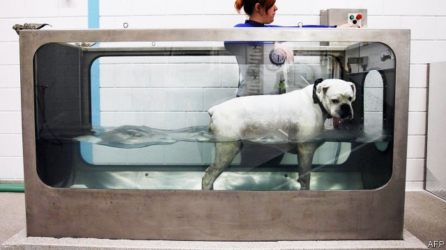

###### Sniffing out corruption

# The curious incident of Hungary’s treadmill for dogs 

 

> print-edition iconPrint edition | Europe | Feb 9th 2019 

THERE WAS no underwater treadmill for dogs. That, Sherlock Holmes would have said, was the curious incident. In 2009 a Hungarian entrepreneur received a €140,000 ($195,000) grant from the European Union to manufacture one. This was by no means absurd: hydrotherapy is an established technique of post-surgical rehabilitation for dogs and humans. But the grantee made no effort to design or build the device. (The version above is made by a different manufacturer.) When OLAF, the EU’s office for investigating fraud, discovered this, it alerted Hungarian prosecutors. Last October a Hungarian court gave him a suspended sentence of 22 months in jail. 

If that sounds lenient, bigger cases of suspected Hungarian misuse of EU funds have led to even less punishment. In January 2018 OLAF sent Hungarian police a file documenting irregularities in 35 municipal-lighting projects in 2011-15, which got €43.7m in EU funding. According to Atlatszo.hu, an investigative website, the contracts were won by a company co-owned at the time by the son-in-law of Viktor Orban, the prime minister. But in November Hungarian police closed the case, saying no crime had been committed. Since OLAF can only refer cases to national authorities, that was the end of the matter. 

The EU’s new public prosecutor’s office, which is due to launch by the end of 2020, will have enforcement powers. But participation is voluntary, and Hungary has not opted in. Zoltan Kovacs, the government’s spokesperson, says Hungary thinks judicial affairs are matters of national sovereignty, and claims the corruption accusations are “political”. The government refuses to release OLAF’s full report. Until it does, suspicions of a cover-up will continue to dog it. 

