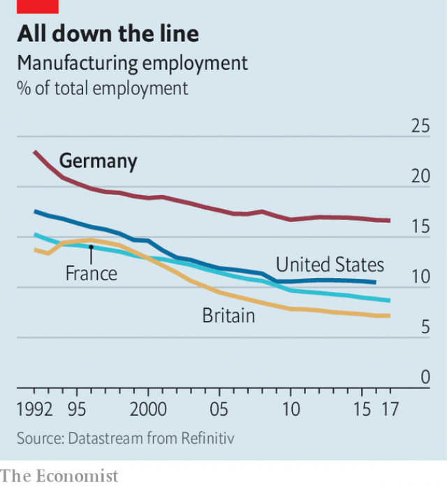
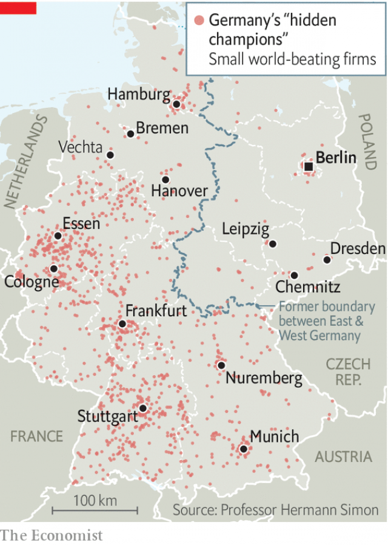

###### Happy Helmuts

# Why Germany has no gilet jaunes protesters 

 

> print-edition iconPrint edition | Europe | Feb 9th 2019 

“IT’S IMPORTANT to understand the minds of pigs and chickens,” says Bernd Meerpohl, as he shows off his company’s wares. Big Dutchman, the firm he runs, designs sophisticated machinery, housing units and software tools, with names like EggFlowMaster and BigFarmNet, to help farmers get more from their beasts. These innovations have lifted sales 27-fold in real terms since 1985, to €960m ($1.1bn) last year. Such success means ambitious locals from Vechta, the small town in north-west Germany in which Big Dutchman is based, can often find professional satisfaction without having to leave home. In nearby Lohne, Tanja Sprehe, digital sales manager at Pöppelmann, a high-end plastics manufacturer, thought she’d never return to the area after building a career in Hamburg. But the demands of family brought her back. Now, having secured a good job and wallowing in the pleasures of small-town life, the only thing she misses about her former home is good sushi. 

As democracies across the West fret about decaying, depopulating regions and the radical politics they can foster, Vechta, population 33,000, offers a different lesson. “Our problem,” says Helmut Gels, the mayor, “is that we have no problems.” The birth rate is extraordinarily high by German standards, and the town has been growing for decades. Successful family firms like Big Dutchman and Pöppelmann employ generations of locals, take on hundreds of apprentices and support thousands more jobs via their suppliers. Vechta’s employers even spy a silver lining in Germany’s economic slowdown (see article). A looser labour market could help them find the skilled workers they crave—local unemployment is just 3.7%—and help moderate wages, which Mr Meerpohl says are “running out of control”. 

 

If Vechta is not typical, it is far from unique. Pöppelmann (local workforce 2,100) and Big Dutchman (900) are two of Germany’s “hidden champions”, a term coined in the 1990s by Hermann Simon, an academic-turned-consultant, for Germany’s innumerable obscure, smallish and world-beating firms. Unlike high-end services companies, which benefit from the network effects and talent pools in big cities, specialist manufacturers are often found in places you’ve never heard of: at least two-thirds of the hidden champions are in settlements below 50,000 people, and they are dotted throughout Germany (see map). Their success helps explain the relatively high share of manufacturing in Germany’s workforce and the slow pace of its decline (see chart). Germany is also politically decentralised, which Philip McCann at Sheffield University says keeps regional inequality in check. And while creative sorts flock to cities, scientists and engineers keep small towns in rich areas alive. “I can stay here all my life,” chirrups Michael Fabich, a young production worker for a local grocery firm. 

 

Decentralisation blunts a source of discontent that has plagued some of Germany’s neighbours. In France the revolt by gilets jaunes at first seemed to be about small-town grievances against the big cities in which economic opportunity has become concentrated. According to Andrés Rodriguez-Pose, a professor of economic geography at the LSE, Ile-de-France (which contains Paris) was the only French region with above-average growth between 1990 and 2014. Not only were the gilets jaunes left behind, they felt scorned by the winners of globalisation, embodied by the haughty and remote figure of Emmanuel Macron. 

Germany should not consider itself immune to such problems, argues Marcel Fratzscher of the German Institute for Economic Research. Beneath its glowing jobs numbers lurk growing inequality and a vast low-pay sector, nurtured by a long period of wage suppression. Germany has gained more from globalisation than it has lost; you can see that in Big Dutchman’s logistics yard, full of packages destined for Senegal and Chile. But regions that specialised in low-end products like ceramics or textiles, such as upper Franconia or parts of the Palatinate, were walloped by cheap imports in the 1990s. Policy can hurt places, too: the government may have to spend €40bn to compensate regions affected by its recent decision to scrap lignite mining. 

Yet there is no obvious parallel in Germany to the insecure, “peripheral” France of the gilets jaunes. Hidden champions create jobs and opportunities far from cities, limiting the brain drain. Local politicians are more responsive to voters’ demands than Jupiterian presidents in distant capitals. In troubled areas, Germany’s constitutionally mandated system of fiscal transfers across states can smooth globalisation’s rougher edges. Jens Südekum, an economist at Düsseldorf’s Heinrich Heine University, calculates that in 2010 such payments amounted to fully 12.4% of Germany’s aggregate tax revenue. Cities like Duisburg and Essen, in the post-industrial Ruhr valley, have been spared the ravages that deindustrialisation brought to parts of America’s Midwest or the Pas-de-Calais region in northern France, now a stronghold of Marine Le Pen’s National Rally. Comparable parts of Germany have not made a comparable populist turn. Indeed, researchers find no clear correlation between AfD support and economic hardship. 

The big caveat is the former East Germany. Despite success in isolated areas like optics, only a fraction of Mr Simon’s hidden champions are found in the east. After reunification the mass sell-off of industry, largely to western investors, left easterners with what Mr Südekum calls a “deep perception that they were ripped off”, which lingers today. Extremist parties do best in the five eastern states. Dresden and Chemnitz have spawned thuggish protests. 

Moreover, the trends that mark Germany out from its industrialised peers are not immutable. Automation will cut into manufacturing’s share of the workforce, and Germany’s mighty carmakers seem ill-prepared for the disruption of self-driving and electric vehicles. Despite the hidden champions’ success, urbanisation continues apace, as rocketing house prices in large cities indicate. Vechta is keeping its natives, but attracting new talent is hard when the competition is Berlin. 

