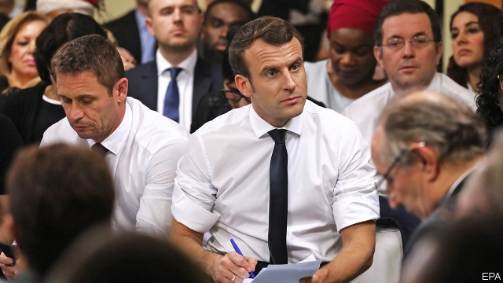

###### Le grand débat

# With a town-hall tour, Emmanuel Macron tries to win France back 

 

> print-edition iconPrint edition | Europe | Feb 9th 2019 

FOUR HOURS into the town-hall debate, and members of the audience begin to fidget. One man yawns. A few others put on coats and slip out quietly. But Emmanuel Macron is just hitting his stride. Perched on a plastic chair in the municipal hall, his shirtsleeves rolled up, the French president carries on for another two hours, taking notes and answering queries. One minute it is housing benefits, the next the reimbursement of psychiatric care or delays to the extension of a Metro line. It is not until close to midnight that Mr Macron finally exhausts the questions (and the audience), accedes to requests for selfies and drives off into the night. 

Battered in the polls and facing weekly protests in the street, Mr Macron is attempting a comeback in the way he knows best: with the force of argument, reason and relentless acronyms. This week’s stop in Evry-Courcouronnes, a town 30km south of Paris, was part of his “great national debate”, intended to let citizens register grievances and contribute ideas. It also allowed the president to take his town-hall road-show away from rural France, the natural habitat of the gilets jaunes protesters, and into the multi-ethnic outer-city districts, or banlieues. “We can do better,” Mr Macron told participants, conceding that he had “convictions” but “not all the solutions”. The government had increased the DSU (urban solidarity and social cohesion budget), he argued, even if it had cut the DPV (cities’ budget). 

Mr Macron’s grasp of policy detail sometimes baffles as much as it clarifies. But his marathon meetings are more national group therapy than public lectures. One by one, the 300 local mayors and community workers gathered in this town-hall annex down the road from a Turkish kebab restaurant raised their hands and took the microphone. A centre-right mayor pleaded for help saving 800 factory jobs. A communist mayor said the banlieue wants “justice, not charity”. A football-club organiser wants volunteers to be properly valued. “I’m sure you’ll listen to me, because I’m called Brigitte,” ventured another mayor, who shares a name with the president’s wife. All the while, and without briefing papers, Mr Macron listened to the litany of complaints and offered a response to each. 

Three months after the gilets jaunes movement emerged, and with weekly protests continuing, Mr Macron is gambling that the national debate is a way to turn chaos into an opportunity. By taking seriously the grassroots grievances, while denouncing the violence, he hopes to win round public opinion, which has supported the movement, and marginalise the hard core. The president has swapped the chandeliers and gilt of the presidential palace for draughty municipal gyms. He has ditched his lofty know-it-all tone for dialogue and debate. The point “is to show that France is not just the gilets jaunes,” says Amélie de Montchalin, a deputy from Mr Macron’s La République en Marche party. 

The president’s detractors dismiss it as a gimmick. Jean-Luc Mélenchon, on the far left, terms it a “masquerade”. Facebook groups run by gilets jaunes call it “blabla”, accusing Mr Macron of campaigning at taxpayers’ expense. Yet the French seem keen to have their say. Over 4,000 town-hall debates have been organised. Mayors have opened “books of grievances”. An online questionnaire has drawn 700,000 contributions on taxation, public services, the environment and democracy. Mr Macron’s approval rating in February was up by six points, to 34%, according to Ifop—still pretty dismal, but an improvement on his record low of 23% in December. 

The next problem is what to do with this outpouring of civic participation when the debate draws to a close on March 15th. In Evry-Courcouronnes, Mr Macron promised that the national debate would “not end in a classic way”. One idea is to hold a referendum, with questions on such matters as the number of deputies in the National Assembly or term limits. This could partly meet the gilets jaunes demand for more direct democracy. Yet Mr Macron has also ruled out backtracking on his main policy choices, including the abolition of the wealth tax. It may well be that the central demand which emerges from the consultation is a familiar contradiction: more public services and lower taxes. 

In Evry-Courcouronnes, the initially sceptical locals seemed broadly satisfied. Manuel, in tracksuit bottoms and trainers, said he is “not interested” in politics. But when he called out from the balcony of his housing-estate flat to Mr Macron as he arrived, the president invited him along, and he got to ask him a question about racial discrimination. Afterwards, he judged the president “pretty good”. So did Guy Bellanger, who runs a sports club and says he wanted just to “be heard”. Ghislaine Bazir, headmistress of a lycée, suggests “people don’t dare” to say they approve of Mr Macron, because of the “stigma” of doing so. 

The president has shown that, in six hours of non-stop discussion, he can win over most of a room. If he wants to prove wrong all those who consider the affair a charade, he now needs to conquer public opinion as a whole and to turn conflicting proposals into coherent policies. 

