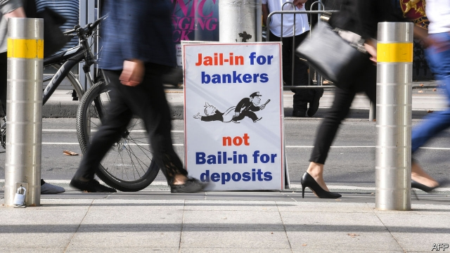

###### Profit and loss

# A commission of inquiry reaches a damning verdict on Australia’s banks 

 

> print-edition iconPrint edition | Finance and economics | Feb 7th 2019 

IF A HEALTHY banking system is dull, then Australia’s must be sick to the core. A royal commission with a broad remit to investigate abuses by the country’s financial institutions has found many troubling practices. Hearings revealed that for years banks had hidden fees, charged money for non-existent services and docked charges from the dead. Financial advisers earned bonuses for channelling clients’ cash towards underperforming funds. Insurance companies flogged junk schemes to the poor or mentally disabled. 

Australia’s four biggest lenders saw their market capitalisation fall by an average of 16.3% while the commission was sitting, knocking A$66bn ($47.1bn) off their combined value. In April the country’s biggest asset manager, AMP, sacked its chief executive and chairman after the inquiry heard that it had not only charged customers for advice that was never provided, but had lied to the regulators about it. On February 4th Kenneth Hayne, the judge who led the inquiry, handed his final report to the government. Heads have rolled: the chairman and chief executive of National Australia Bank, which Mr Hayne singled out for particular criticism, have resigned. 

The commissioner has asked regulators to investigate 24 possible breaches of civil or criminal law. Mr Hayne expressed particular disgust at those who gouged fees without providing services. Almost A$1bn has already been paid in compensation to the victims. Offenders may have broken a law against “dishonest conduct in relation to a financial product or financial service”. The report said the Australian Securities and Investments Commission (ASIC), the corporate regulator, should consider the maximum penalties: large fines, or up to ten years in prison for individuals. Thus Australia, a country widely regarded as having had a “good” financial crisis, with a stable, profitable banking system, may become one of the few places where bankers are jailed for institutional wrongdoing. 

The report’s 76 recommendations set out to clean up the industry. One is for a new bank-funded compensation scheme for victims of banking misconduct. Some measures target the intermediaries who flog insurance, pensions and mortgages to befuddled Australians. Mr Hayne wants their bonuses slashed, starting with “trailing” commissions paid to mortgage-brokers years after they sell a loan. Financial advisers would need customers’ approval to roll fees forward. It would become illegal to tout pensions or insurance by phone. 

These are welcome measures, but many think they do not go far enough. “In the end the banks have got off lightly,” says Michael Rafferty, an economist at RMIT University in Melbourne. The commission exposed the harm to customers caused by conflicts of interest within banks. Yet it stopped short of demanding that they spin off the advisory and wealth-management units implicated in much of the wrongdoing. Three big banks had expected such a ruling and are restructuring along these lines, yet forced separation would be “costly and disruptive”, Mr Hayne concluded. 

Nor did he call for stricter checks on affordability before making loans. Lenders have already tightened up here, too, but consumer-protection groups fear they may ease up once the pressure is off. Shares in the four big banks rose by an average of 6.7% the day after the report’s publication. 

The commission accused industry regulators of being too cosy with the industry. It recommends that they be given more power to punish misdemeanours and curb bonuses, with a new oversight panel set up to ensure they do their job. Yet it is unclear how much authority the panel would have, and the corporate regulator has seen its funding squeezed. “ASIC has been called out for its ineffectiveness since the early 1990s,” complains Allan Fels, a former chairman of the competition commission. “What’s different now?” 

Both the coalition government, which looks set for an electoral trouncing in May, and the Labor Party, which is likely to form the next government, have promised to enact the commission’s recommendations. Little will happen before the vote. But the commission at least gained a hearing from politicians. Banks can count themselves lucky it did not crack down harder.  

