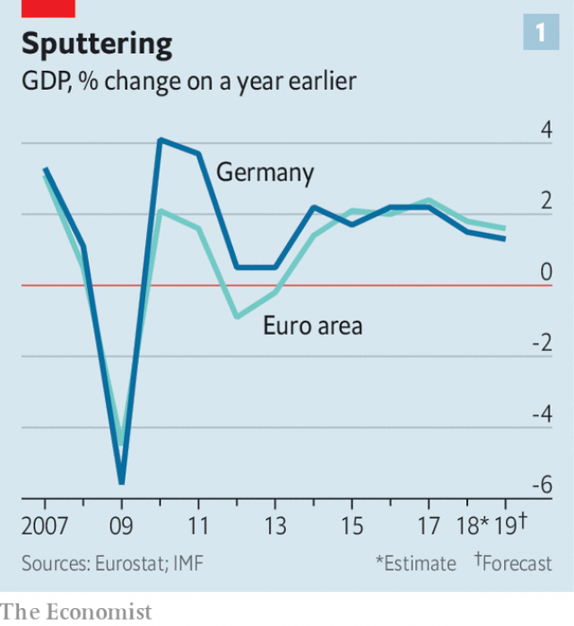
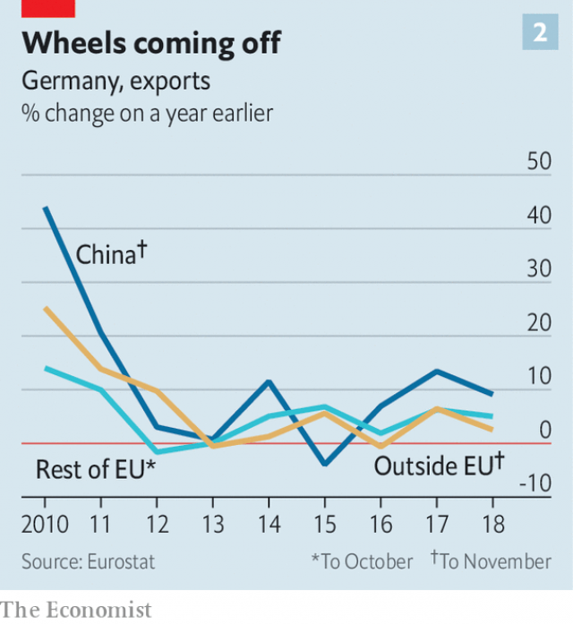

###### Germany’s economy

# Germany’s long expansion comes under threat 

 

> print-edition iconPrint edition | Finance and economics | Feb 9th 2019 

GERMANY’S EXPORTING prowess is so impressive that other countries seek to import even its policies. France recently passed labour reforms inspired by its neighbour to the east. British politicians periodically try to copy its vocational-training system. Governments far and near have sought to emulate the Mittelstand, its small and mid-size producers. Germany’s knack for producing goods desired by emerging economies, notably a booming China, helped it recover rapidly from the financial crisis of 2007-08, and cushioned the impact of the sovereign-debt crisis that subsequently engulfed the euro zone. 

Now Germany is propelling the currency bloc into a slowdown. The economy shrank in the third quarter of 2018 and probably grew only slightly in the fourth. Over the year as a whole, GDP grew by 1.5%, down from 2.2% in 2017 and below the euro-zone average (see chart 1). New emissions tests slammed the brakes on car production in the summer; low water levels in the Rhine delayed shipments. But even without these temporary disturbances, says Holger Schmieding from Berenberg, a bank, annualised GDP growth would have slowed to below 1% in the second half. 

 

Domestic-facing sectors, and planned rises in public spending, should help Germany avoid outright recession. But the flip side of exporting success is vulnerability to conditions abroad. Exports make up half of GDP, compared with 12% for America and 30% for Britain. The risks of increasing protectionism and a hard Brexit mean that manufacturers expect another poor year. 

After a robust 2017, net exports detracted from GDP growth in 2018, which probably slightly lowered Germany’s mammoth current-account surplus of 8% of GDP. Exports to Britain fell. Those to a number of emerging economies slowed. China’s appetite for German goods became a little less voracious (see chart 2). Volkswagen, a large carmaker, reported a drop in sales to China in the second half of 2018. Wolfgang Schäfer, the chief financial officer for Continental, a car-parts manufacturer, notes that an unprecedented fall in Chinese demand and the new emissions tests dented revenue growth in the car industry. Cars, their parts and accessories make up over 15% of German exports. 

 

There was also disappointment at home. Spending by consumers grew more slowly last year than in 2016-17, despite rock-bottom interest rates, the lowest unemployment rate since reunification and annual wage growth picking up to a heady—by German standards—2.8%. Instead they saved more. Some economists think households are preparing to weather a downturn; others see an ageing population preparing for retirement. Either way, they are unlikely to propel growth this year. 

The industrial slowdown seems set to continue. Figures published on February 7th showed that industrial production fell in December. Mr Schäfer expects the first half of the year to reflect a continuation of the declining demand seen in the second half of 2018. Analysts at Deutsche Bank think that data for January are consistent with GDP shrinking in the first quarter. Both the IMF and Germany’s economy ministry have marked down their forecasts for GDP growth this year to 1-1.3%. 

Worse is quite possible. Three of Germany’s five biggest export markets—America, China and Britain—could suffer sharp slowdowns this year. Trade tensions could heat up. If President Donald Trump acts on his threat to whack tariffs on imports of European cars it could knock 0.2% off German GDP, says the Institute for Economic Research, a think-tank in Munich. 

Some cooling, German officials say, is only to be expected in an expansion’s tenth year. Reports of rising capacity utilisation and skills shortages had stoked fears of overheating, even though price pressures remain subdued. In January Jens Weidmann, the head of the Bundesbank, said he saw no need for the European Central Bank to loosen monetary policy. Philipp Steinberg, the chief economist at the economy ministry, points out that social-security spending and income-tax relief will support demand. Tax incentives for research and development have also been agreed on. And if recession looms Germany has plenty of room for stimulus. A fifth consecutive budget surplus last year brought government debt to below 60% of GDP. 

But behind these short-term considerations looms a bigger worry: that Germany could lose its competitive edge. Despite recent high immigration, the IMF expects the workforce to start shrinking in 2020. Together with lacklustre productivity growth, that will limit the economy’s potential. Businesses and economists want to spur investment, which has been chronically weak, and to upgrade public infrastructure, from roads to broadband. 

In an industrial strategy published on February 5th Peter Altmaier, the economy minister, warns that Germany’s economic strengths are not “God-given” and must be earned—particularly as China shifts from consumer to competitor. Proposals include lowering energy prices, and supporting industry and increasing investment with tax incentives. More controversially, Mr Altmaier wants to loosen antitrust rules and protect “national champions” from foreign takeovers, so that they can compete with Chinese behemoths. For all that other countries may want to learn from Germany, its government is looking East. 

