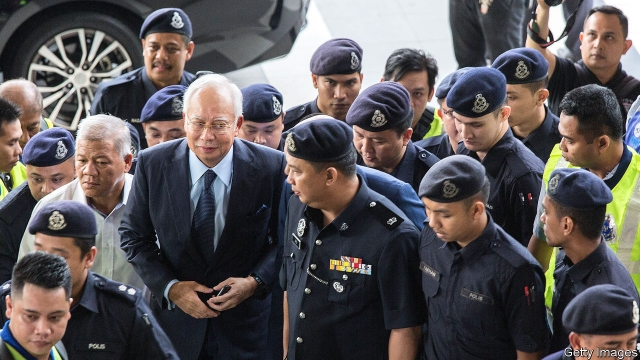

###### Settling up

# Malaysia’s former prime minister faces trial in the 1MDB scandal 

 

> print-edition iconPrint edition | Finance and economics | Feb 9th 2019 

ACCORDING TO America’s Department of Justice, between 2009 and 2015 $4.5bn disappeared from 1 Malaysia Development Berhad (1MDB), a Malaysian state development fund set up a decade ago by Najib Razak, then the prime minister. The money passed through a maze of institutions and accounts in the Middle East, the Caribbean and the Seychelles. It was frittered away on property, parties, gems, art, private jets and a superyacht. It helped fund a film on scamming, “The Wolf of Wall Street”. The mastermind behind the fraud is allegedly Jho Low, a Malaysian financier. But more than $600m ended up in Mr Najib’s personal bank accounts. 

Mr Najib denies wrongdoing and says the money was a gift, since returned, from an unnamed Saudi royal. His claims of innocence in one of the biggest financial scandals ever are about to be put to the test. On February 12th he is due to enter the High Court in Kuala Lumpur for the first of several trials relating to 1MDB, for dozens of counts of money-laundering, abuse of power and criminal breach of trust, all of which he denies. This trial relates to $10.6m from SRC International, a unit of 1MDB set up to invest in energy projects, which ended up in one of his accounts. 

The prosecution’s star witness is the former director of SRC, Suboh Yassin. After three years on the run, last year he surrendered to Malaysia’s anti-corruption authorities and is in a witness-protection programme. The prosecution is expected to call around 60 other witnesses, including government officials. Mr Low will be absent, however. Wanted by America and Singapore as well as Malaysia, his whereabouts is unknown; he is rumoured to be in China. The deals under investigation were “undertaken openly and lawfully”, says a spokesman for Mr Low, through his lawyers. He adds that Mr Low “intends to defend himself against these false allegations”, but has been presumed guilty and “cannot get a fair trial in Malaysia”. 

If found guilty, Mr Najib could face decades in prison, though lengthy appeals mean that any sentence will start next year at the earliest. No clemency is likely to be offered by the new government. Mahathir Mohamad, Mr Najib’s former mentor and successor as prime minister, campaigned against kleptokrasi. The 1MDB affair split the party the two men once shared and caused Dr Mahathir to align himself with the opposing coalition that now runs the country. 

Authorities in America, Singapore and Switzerland are also investigating wrongdoing related to 1MDB. Their targets go beyond those accused of perpetrating the fraud to those accused of facilitating it, including Goldman Sachs and Deloitte. Goldman faces particular trouble for underwriting three bond offerings for 1MDB, worth $6.5bn in total, more than a third of which then vanished. 

That work earned Goldman a startlingly juicy $600m. Last November it emerged that its former chairman for South-East Asia, Tim Leissner, had pleaded guilty to charges of bribery and money-laundering filed by prosecutors in New York. A former colleague, Roger Ng, was also indicted, along with Mr Low. Goldman’s newish chairman, David Solomon, has apologised to Malaysians. But the country wants more than words: Lim Guan Eng, the finance minister, is demanding $7.5bn in penalties. Malaysian prosecutors filed criminal charges against Goldman and Messrs Leissner, Ng and Low in December; Mr Lim says the government might discuss dropping those against the bank if it pays up. 

Goldman argues that the fault lies with rogue bankers, rather than the firm itself. In a filing this month it raised the prospect of clawing back compensation from some senior executives “if it is later determined that the results of the 1MDB proceedings would have impacted the [compensation committee’s] 2018 year-end compensation decisions”. It is due to file written defences in March; any substantive admissions are likely to be followed up by America’s Department of Justice. Depending on what its investigators find, the bank risks censure for inadequate supervision and perhaps a stiff fine. The bigger issues are whether more Goldman staff are drawn in, whether the bank will be prosecuted in America and, if criminal rather than civil charges are pursued, whether it can keep all its operating licences. 

Some Malaysians think Mr Najib’s prosecution may mark a turning point for their country in the fight against corruption. The election last May was the first his party had lost in more than six decades. “I don’t think there will be any prime minister who can muster as much administrative and financial leeway as Najib had,” says Rafizi Ramli, a politician linked to the ruling coalition. He was tried and found guilty in 2016 of leaking parts of a secret government audit into 1MDB. After an appeal last year, his jail sentence was lifted. 

The new government has devolved more powers and removed the ministry of finance from the purview of the prime minister. But far more is needed to clean up Malaysian business. Government-linked companies constitute about 42% of the market capitalisation of all listed firms in Malaysia, according to Terence Gomez of the University of Malaya in Kuala Lumpur. They are opaque and unaccountable, and some are vehicles for patronage and corruption. A fund for retired people and another supposed to help pilgrims save for the haj were plundered to bail out 1MDB. When campaigning, the new administration promised to reform the government’s business dealings. But it continues to appoint politicians to positions on the boards of government-linked companies. 

Discussions with China over Mr Low and its involvement with 1MDB are particularly delicate. Malaysia cannot afford to offend its largest trading partner. An investigation by the Wall Street Journal last month contends that in 2016 China offered to bail out 1MDB in return for infrastructure deals in Malaysia worth tens of billions of dollars. The Chinese embassy in Malaysia dismissed the claims as “groundless”. Wrangling continues over Chinese infrastructure projects in Malaysia agreed upon by Mr Najib. For Malaysia’s government, sorting out the scandal at 1MDB and prosecuting those behind it will be as much a diplomatic challenge as a legal one. 

