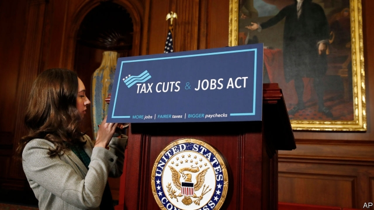
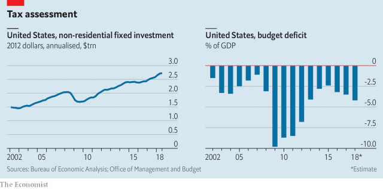

###### Cut it out

# Some fights about the Tax Cuts and Jobs Act seem over 

 

> print-edition iconPrint edition | Finance and economics | Feb 9th 2019 

HURRIED THROUGH Congress in late 2017, the Tax Cuts and Jobs Act (TCJA) was the biggest overhaul to America’s tax system in more than 30 years. Boosters claimed it would turbocharge investment and growth, generating so much extra taxable income that it would pay for itself. Critics claimed it would shower the rich with tax breaks, and that balancing the books would mean the costs were ultimately born by the poor. Over a year later, beliefs on neither side have been shaken. 

The law’s complexity makes its impact hard to assess. It sprawls across individual and corporate taxation, and affects individuals’ health insurance, too. Some changes are temporary, others permanent. It redraws the basis for taxing multinationals, which are expert at finding loopholes. 

Though it has been clear all along that the tax cuts go mainly to richer Americans, there is disagreement over just how regressive they are. Alan Auerbach of the University of California, Berkeley, Laurence Kotlikoff of Boston University and Darryl Koehler of the Fiscal Analysis Centre, for example, find that comparing people of similar ages, and considering lifetime tax liability, make the relative benefits for the best-off seem much less outsized. That is because some of those who benefit in a given year will lose out later on. 

Others have compared the TCJA with what might have been. Economists at the Tax Policy Centre, a think-tank in Washington, DC, looked at more than 9,000 possible reforms to the same bit of the personal-tax code. Nearly three-quarters would have cost the government less revenue. Less than 1% would have given more benefits to the richest 20% at no extra cost, whereas half would have been cheaper and benefited the poorest 20% more. 

The TCJA aimed to increase investment by slashing the tax rate on corporate profits from 35% to 21%, and temporarily allowing companies to deduct capital spending from profits immediately. It was hoped that encouraging firms to add to America’s capital stock would ultimately raise growth and wages. The bill’s backers say they have been proved right. Investment rose in 2018 (see chart), GDP accelerated and wage growth continued on its longstanding upward trend. Kevin Hassett, the chairman of President Donald Trump’s council of economic advisers, argues that economic growth since the tax cuts compares favourably to the trend from 2009-16. Those who say the tax cuts aren’t working are, he told a room of economists in January, “in some kind of denial”. 

 

In reality there are at least three possible causes of America’s boom in 2018: animal spirits, which picked up globally before the tax bill passed; the bump from more government borrowing; and the direct effect of lower tax rates on incentives to invest. Of these, only the third could be expected to last very long. With so much going on in the economy, it is clearly outlandish to claim, as some do, that all the improvements in long-term economic forecasts since 2017 are thanks to the TCJA. 

Companies certainly claim that they have responded to the lower taxes with higher investment (see article). One study finds that 95 of 424 companies in the S&P 500 announced a TCJA-related increase in investment in the first quarter of 2018. Mr Hassett calculates, again relative to the trend in 2009-16, that the contribution of investment to GDP growth is up by around 0.4 percentage points. 

But some remain sceptical. Investment was already rising before the tax cuts. Higher oil prices since 2016 have stimulated investment in the shale industry and its suppliers. Alexander Arnon of the Penn Wharton Budget Model, a research initiative, thinks that this accounts for almost all the rise in investment growth in 2018. Then there is the fact that investment is volatile and may respond to policy changes only after some time. “The results from this year support almost anybody’s forecast,” says Richard Prisinzano, also of the Penn Wharton Budget Model. 

One conclusion seems reasonably firm: the tax cuts will not pay for themselves. Despite a hotter-than-expected economy, revenues in the 2018 fiscal year were $200bn lower than the Congressional Budget Office’s forecast in 2017. Tax cuts, together with a spending bill implemented in early 2018, have increased the fiscal deficit. The bill does include income-tax cuts set to expire. But that will be politically awkward, and so the cuts may well be rolled over. Either future generations will be lumped with extra debt, or future legislators will have to fill the budget hole. 

The need for future policy changes to offset the TCJA’s costs makes any assessment “inherently speculative”, says Greg Leiserson of the Washington Centre for Equitable Growth, a think-tank. If those policies were to include spending cuts along the lines proposed by the administration last year, he adds, poorer Americans, who have gained relatively little from the tax cuts, could end up losing out overall. 

A private poll commissioned by the Republican National Committee before the midterms found that many voters thought that the beneficiaries of the TCJA were “large corporations and rich Americans”. It concluded that “we’ve lost the messaging battle.” Published polls since autumn 2018 suggest that roughly even numbers of voters approve and disapprove of the reform, with a split along party lines. Even as the battle of the wonks rages on, the fight for public opinion seems largely over. 

