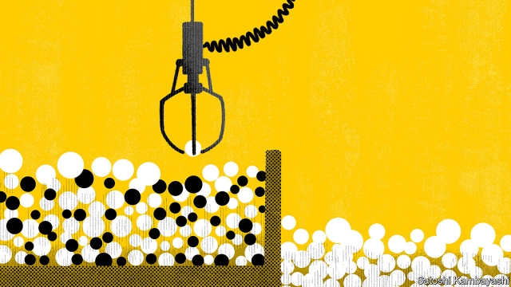

###### Buttonwood

# The benefits of better credit-risk models will be spread unevenly 

 

> print-edition iconPrint edition | Finance and economics | Feb 9th 2019 

IN “PLAYER PIANO”, a novel by Kurt Vonnegut, society is divided into a workless majority and an elite who tend all-powerful machines. A character tells how her husband lost his status as a writer when his novel fails to hit the “readability quotient”. She turns to sex work after he refuses the public-relations job he is assigned. “I’m proud to say that he’s one of the few men on earth with a little self-respect left,” she says. 

The novel, published in 1952, anticipates present-day fears about the social impact of automation. Clever algorithms already make finely graded distinctions about the price each consumer pays for an air ticket, or which advertisements or news he sees. They will soon decide who gets credit, and on what terms. Vonnegut touches on a deeper worry. The husband fails to reach the mark because his book is anti-machine. It is easy to imagine credit being similarly denied for reasons other than credit risk—such as race. 

Such concerns are the motivation for a recent academic paper.* Its authors use a unique data set of more than 9m mortgages, approved between 2009 and 2013, which they track over the following three years. They use the data to build a conventional model of default and a machine-learning model. A comparison reveals some stark results. The machine-learning model allows for a more accurate pricing of default risk and thus for a greater supply of credit. But the benefits in cheaper mortgages go disproportionately to white borrowers. 

The paper might easily be filed under dystopian science fiction, alongside “Player Piano”. In fact, it is part of an academic sub-genre, known as household finance, which looks at how ordinary people handle their financial affairs. Mortgage choice is a natural focus for this kind of research, as it is one of the biggest financial decisions people make. In this instance, though, the authors study how mortgage firms pick borrowers. And what lenders care about most is getting their money back. To stay solvent, they must set the price of borrowing to reflect the likely risk of default. This kind of reckoning requires a statistical model. A standard one would uncover how default risk varies with income, loan size and a host of other factors. A model of this kind is the paper’s baseline. 

The machine-learning model is more sophisticated. It sorts the data continuously to come up with better predictions of default. Imagine there are only two bits of information about loan applicants—their income and a score based on their credit history. The machine-learning model searches the data set for people with a similar combination of salary and credit score. Its decision to advance a loan, and at what rate of interest, will depend on how reliable these near-neighbours have proved to be as borrowers. In reality, such profiles will use far more data (though race is not an input in either model). To build them requires lots of computing power. 

The machine-learning model is better at predicting default. It thus allows for a modest increase in credit supply, which brings in some marginal borrowers. And with regard to rates of interest, it creates more “winners” (ie, those who are classified as less risky than by the standard model) than losers. But the proportion of winners is significantly higher, at about 65%, for white and Asian borrowers than for blacks and Hispanics, at around 50%. The natural question to ask is whether the model is tacitly sorting by race. Tests by the authors suggest not. Including information about race changes the forecasts of default only marginally. 

To understand this skewed outcome, imagine a crude model that sorts borrowers into three buckets: good, bad and middling. Some of the middle group are close to being good credits; others are close to being bad. A property of statistical models is that, as they improve, they are able to discern subtler differences and so make finer judgments. Some almost-good borrowers benefit; some almost-bad borrowers lose out. It seems that the sophisticated model more accurately picks up their underlying fragility. 

It is a disquieting result. A hypothetical lender concerned only with allocative efficiency (the better pricing of risk) is nevertheless sure to have unwished-for societal effects. Technology has a tendency to amplify inequalities that already exist. Indeed it is the merciless sorting by technical criteria that makes the world of “Player Piano” a dystopia. 

*“Predictably Unequal? The Effects of Machine Learning on Credit Markets” by Andreas Fuster, Paul Goldsmith-Pinkham, Tarun Ramadorai and Ansgar Walther (November 2018) 

