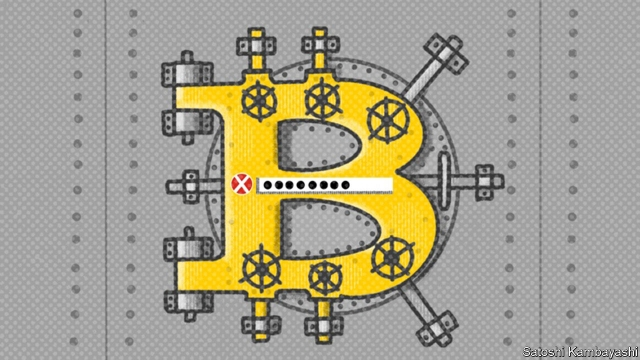

###### Cryptocurrencies

# What happens when your bitcoin banker dies? 

 

> print-edition iconPrint edition | Finance and economics | Feb 9th 2019 

BITCOIN WAS introduced to the world in August 2008, in the aftermath of the financial crisis. According to its techno-libertarian fan-base, one of its main attractions was the promise that users could avoid dealing with the hated banks. But after a decade of amateurism, scams and billions of dollars of lost or stolen money, it is clear that many of the ramshackle institutions that play the role of banks in the cryptocurrency world make even their most reckless conventional counterparts look like paragons of good management. 

The latest example is QuadrigaCX, a Canadian cryptocurrency exchange that was granted protection from its creditors on February 5th. The problem, according to the firm, is not that it has lost its customers’ money, but that it cannot get to it. It says that Gerald Cotten, its boss, died unexpectedly in India in December. 

Few banks would be brought to ruin by the death of a single member of staff. But QuadrigaCX says that Mr Cotten was in sole charge of handling deposits and payouts, running everything from an encrypted laptop to which only he knew the password. In court documents Mr Cotten’s widow says that “despite repeated and diligent searches, I have not been able to find [the passwords] written down anywhere”. QuadrigaCX’s 90,000 customers cannot get to around C$180m ($136m) of bitcoin, Litecoin, Ethereum and various other cryptocurrencies stored on the exchange. One is thought to have lost access to C$70m-worth of cryptocurrency. 

Discussion of QuadrigaCX online is a swamp of anger, amateur detective work and conspiracy theories. The firm seems to have been in trouble for a while; in January 2018 the Canadian Imperial Bank of Commerce froze C$28m held by Costodian, QuadrigaCX’s payment processor. The bank tried repeatedly to contact Mr Cotten, to no avail. There are other curiosities. A screenshot supposedly showing a death certificate issued by the government of Rajasthan misspells Mr Cotten’s name. Experts consulting bitcoin’s public transaction register have struggled to identify the inaccessible deposits. Jesse Powell, the boss of Kraken, another cryptocurrency exchange, said on Twitter that QuadrigaCX’s story was “bizarre and, frankly, unbelievable”. 

This is not the first time that large amounts of cryptocurrency have been inadvertently removed from circulation. James Howells, a British cryptocurrency enthusiast, amassed 7,500 Bitcoins in 2009, when they were nearly worthless, before throwing away the hard drive on which they were stored. By 2013 they were worth millions of dollars. Mr Howells’s attempts to recover his hard drive from a Welsh landfill failed. Chainalysis, a firm of cryptocurrency-watchers, reckons access to 2.78m-3.79m bitcoins has been lost in similar circumstances. Since the way bitcoin is designed caps the number of coins at 21m, that is 13-18% of all bitcoins that will ever exist. 

The cryptocurrency world has seen bigger collapses than QuadrigaCX’s. The biggest was MtGox, which was responsible for around 70% of all bitcoin transactions when it went bust in 2014 after the theft of 850,000 bitcoins, then worth $450m. Like QuadrigaCX, it had been run on a wing and a prayer. Some exchanges are better than others, says David Gerard, a cryptocurrency-watcher and sceptic. But too often storing cryptocurrency on an exchange is little better than “keeping your money in a sock under someone else’s bed.” 

