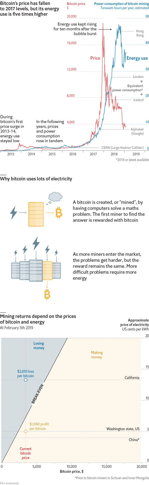

###### Bitcoin

# Will bitcoin’s price crash cut into its energy use? 

 

> print-edition iconPrint edition | Graphic detail | Feb 7th 2019 

WHEN GOLD prices fall, precious-metals firms suspend exploration and close mines with high operating costs. In theory, bitcoin miners should act similarly. Although bitcoin is a virtual currency, it is expensive to obtain. To “mine” new bitcoins—ones that do not already belong to someone else—users hook up their computers to a network, and instruct them to keep guessing the solution to a maths problem until they get it right. 

The difficulty of these tasks protects the integrity of the system: anyone seeking to rewrite bitcoin’s transaction ledger would face the monumental burden of repeating them. However, such security is not cheap. Finding the answers requires lots of computing power, and thus lots of energy. At their peak in late 2018, bitcoin miners were thought to be using electricity at an annualised pace of at least 45 terawatt-hours per year, the average rate of all of Hong Kong. 

As wasteful as it may seem, miners were rewarded handsomely for responding to a surge in demand for bitcoin. In 2017 the currency’s price rose from $1,000 to nearly $20,000, yielding profits for speculators and miners alike. But in order to limit the supply of coins, the system adjusts the difficulty of the maths problems in response to computers entering or leaving its network. As more computing power becomes available, the solutions become harder to guess, raising the amount of electricity needed to mine each coin. Moreover, during the past year the bitcoin bubble has burst. Its price is now $3,400, down more than 80% from the peak. 

With higher costs and lower proceeds, miners should have stampeded out of the market. But in fact, relatively few have departed. Bitcoin’s daily energy consumption today is still 16 times its level of two years ago, and just 30% below its record high. 

At the current price and bitcoin network size, mining returns are sensitive to energy costs. Even within one country, industrial electricity prices can vary widely. In Washington state, a part of America rich in hydropower, each bitcoin fetches 45% more than the market price of the energy needed to mine it on an average day. But in nearby California, electricity costs 2.5 times more. Bitcoin would need to rebound to $6,200 to make full-time mining there profitable. 

As the roller-coaster ride of bitcoin’s price makes clear, the currency’s value is impossible to predict. Miners have mostly weathered the crash so far. But a further decline of 50% or so would start forcing them out of business. The shake-out would only abate once the maths problems get easy enough that less power is needed, enabling the remaining miners to scrape by. 

Sources: Alex de Vries; blockchain.com; EIA; press reports; national statistics 

