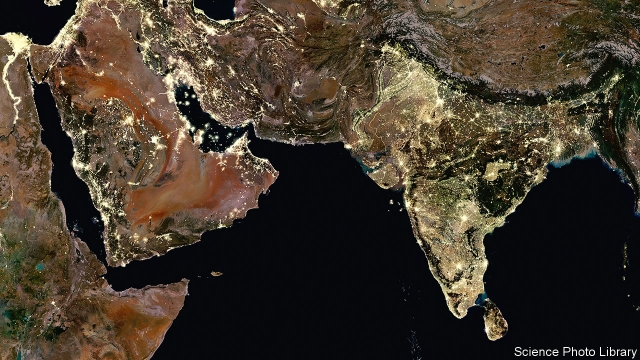

###### When politicians see the light

# Night-time satellite imagery can measure electricity provision 

 

> print-edition iconPrint edition | International | Feb 9th 2019 

FOR YEARS AMERICAN satellites have circled the Earth, measuring light levels at night and estimating how much is man-made. One straightforward use of such data is to see whether a place has electricity. Take India. Brian Min of the University of Michigan has shown that the government’s ambitious plan to connect every village to the grid is less dazzling than it appears. Many newly connected villages do not quickly light up, perhaps because the power supply is so unreliable. Indian states do, however, get brighter shortly before elections, suggesting politicians lean on power companies to minimise blackouts. The effect is strongest when the governing party is defending a slim majority. 

