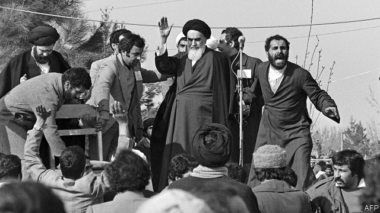

###### The Iranian revolution at 40

# American sanctions on Iran keep the mullahs mighty 

 

> print-edition iconPrint edition | Leaders | Feb 9th 2019 

THE CRY of “Death to America!” has rung out in Tehran every Friday since the Islamic revolution of 1979. But the ritual is hollow. The mullahs know they have failed their people. Iranians are much poorer than they should be; promises of justice have been drowned in the blood of enemies and supposed sinners; and theocracy has made Iranians less pious. Protests occur often, even among the poor who make up the regime’s base (see article). 

Yet the mullahs remain in charge, despite war, sanctions and decades of enmity with America—or perhaps because of them. To the alarm of Israel and many Arab states, Iran has spread its influence, helping save the odious regime of Bashar al-Assad in Syria, and ensuring that the Saudis remain bogged down in Yemen. Its Lebanese client, Hizbullah, poses a grave threat to Israel. In Europe Iranian spooks are accused of plotting to kill dissidents. 

For President Donald Trump, Iran is a unique menace. He has abandoned Barack Obama’s nuclear deal in favour of tight sanctions. His officials will try to forge an anti-Iran alliance at a conference in Poland on February 13th-14th. In seeking “maximum pressure”, America may hope to stir another uprising to reverse the one of 1979. But it will probably make things worse. 

The mullahs have a woeful record. Their theocracy helped turn Islam into a tool of radical, and often violent, politics. But Iran’s was not the Middle East’s only convulsion in 1979. The siege of the grand mosque in Mecca stung Saudi Arabia into promoting its rival Sunni brand of ultra-puritanism at home and abroad. Together with America, the Saudis helped weaponise Sunnism by supporting mujahideen fighters against the Soviet invasion of Afghanistan. Arabs who volunteered to fight with them became the godfathers of jihadism. America, pledging to protect Gulf oil against outsiders, was drawn deep into the region’s conflicts. 

America has rarely been able to think clearly about Iran; not least because the regime’s followers held 52 of its citizens hostage for 444 days after seizing the American embassy in Tehran in 1979. But if Iran has recently extended its power it is in large part because of the mess caused by America’s invasion of Iraq in 2003. 

Iran is confusing and infuriating to deal with. Power is shared ambiguously between a weak president, who is elected from a field of loyalists and deals with day-to-day problems, and a nebulous revolutionary caste that controls the instruments of coercion. Sometimes Iran has proved pragmatic, for instance acquiescing in America’s overthrow of the Taliban in Afghanistan. Yet, under the supreme leader, Ali Khamenei, ideology often trumps rational policymaking. Neither confrontation nor diplomacy can reliably sway the mullahs. And neither economic carrots nor sanctions seem to work as an alternative. 

That said, Mr Obama’s accord, the JCPOA, succeeded in freezing Iran’s nuclear programme in exchange for the lifting of many sanctions. Mr Trump thinks this was a terrible deal that failed to halt the nukes for good or stop Iran from stirring trouble around the region. Renewed sanctions are pushing Iran into a deep economic crisis. But re-imposing them when Iran was abiding by the JCPOA casts America as the rogue. This has deepened the split with European allies, which have created a system to help firms sidestep them. America has bound itself more tightly to autocratic Arab regimes, such as Saudi Arabia, that have themselves fomented instability and radicalism. What “moral clarity” can America claim in denouncing Iran’s human-rights abuses when it turns a blind eye to those committed by its friends? 

Above all, indiscriminate sanctions are likely to strengthen Iran’s hardliners. American pressure gives them excuses for bad behaviour; adventurism abroad becomes self-defence; oligarchic control of the economy is portrayed as a means to bust sanctions; and critics are dismissed as puppets of the Great Satan. If Iran casts off the JCPOA’s nuclear constraints, America and Israel will have to choose between the risk of Iran building a nuclear bomb and the dangers of a bombing campaign to stop it. 

America’s apparent efforts to bring down the regime are unappealing to most Iranians, given the bloody chaos they see all around. The mullahs are still willing to shoot opponents; few ordinary Iranians are yet ready to die trying to overthrow them. The best hope for change in Iran may come with the death of Ayatollah Khamenei, who is 79 and in poor health. 

To nudge Iran towards normality, America needs to mix firmness with pragmatism, rather as it did in the cold war with the Soviet Union. This means containing Iran until its people grow weary of their rulers, and negotiating partial deals that limit the risk of outright conflict. America should seek unity with its own democratic allies and attempt to isolate Iran’s revolutionaries from their subjects. It should aim sanctions at hardliners rather than the country as a whole. It should do more to expose the regime’s brutality and corruption, counter its propaganda and increase contacts with Iranian citizens—giving them more visas to visit America, not fewer. And it should offer to talk to Ayatollah Khamenei. To him, America’s outstretched hand may be more terrifying than its fist. 

