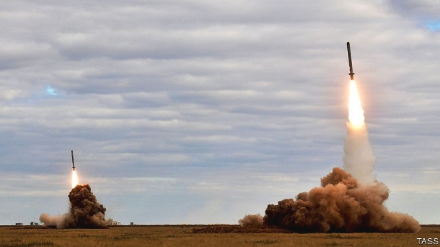

###### Nuclear discord

# Blame Russian cheating, not America, for killing the INF treaty 

 

> print-edition iconPrint edition | Leaders | Feb 9th 2019 

WHEN IT TURNED 30 in 2017, the Intermediate-Range Nuclear Forces (INF) treaty was ailing. Russia had proposed ripping up the pact in 2005. When it was rebuffed it tested an illegal cruise missile, the 9M729. A few years later the Obama administration called out Russian cheating. In December 2018 America’s NATO allies belatedly backed America. So, when Russia failed to meet a deadline to destroy the missile this month, America pulled out of the treaty and Russia soon followed. The only pact to ban an entire class of nuclear weapons will thus expire in August. The task for America and NATO is to meet the Russian challenge without triggering an arms race that would split the alliance and jeopardise what is left of global arms control. 

Under the treaty, America and the Soviet Union scrapped all ground-based missiles with ranges of between 500 and 5,500km (310-3,400 miles), weapons that could quickly reach targets deep into enemy territory. The intention was to remove missiles that strike so quickly that leaders might be panicked into rash nuclear escalation. 

The temptation is to blame America for the treaty’s demise. It might have worked harder to win inspections of the 9M729, perhaps in return for allowing Russia to look at what it says is a suspect American missile-defence launcher in Romania. It should have done more to bring allies along—who, in turn, ought to have protested about Russian behaviour earlier. Yet there should be no confusion: Russia, not America, set the pact ablaze. Even strenuous diplomacy may not have put out the flames. 

 

What to do next? A realistic starting-point is to acknowledge that conventional (not nuclear) missiles will play a central role in future wars. This is why countries like China, India and Israel have piled up INF-range missiles as America and Russia destroyed theirs. It is also why Russia furtively built new ones. 

Russia has reportedly deployed four battalions of the 9M729 (nearly 100 missiles) that allow it to strike targets across Europe quickly and precisely—including NATO’s nuclear weapons. Such land-based mid-range missiles have advantages over those launched from the air and sea, which were allowed under the INF treaty. Mobile ground-launchers are cheaper than a warship or warplane, can be hidden more easily and have no other missions to distract them. America’s army is right to explore whether they offer an effective way to strike key military targets, including those deep behind enemy lines. 

But INF-type missiles come with problems, too. Their limited range means that they must be parked on allied soil, rather than in America. NATO, to its credit, has resoundingly backed America so far, but it may be less unified about new weapons. If America cuts a bilateral deal with an enthusiastic volunteer, such as Poland, it would be divisive and destabilising. Suitable sites are even scarcer in Asia. Japan and South Korea would be wary of the political backlash from China were they to host American weapons. Missiles could be put on Guam, where lush forests provide useful cover. But the island is so far from China that it would require America to make a new type of missile. Congress may not indulge this; America is already due to spend some $1.7trn in real terms on its nuclear arsenal over the next 30 years. 

China is unlikely to agree to limits. But its competition with America is over conventional rather than nuclear missiles, so the risks are lower. Even in Europe, America should avoid seeking to match Russia missile for missile. Instead it should work closely with its allies to assess how far existing weapons can redress the military balance, and the impact of any new missiles. America and Russia should discuss how to limit new deployments. Vladimir Putin has reasons to hold back. Despite his boasts of super-weapons, Russia’s defence budget is falling and an influx of new American missiles would stretch it even more. 

Most worrying, the death of the INF treaty threatens New START, a pact which governs American and Russian long-range “strategic” nuclear weapons. The problem is threefold. First, the Trump administration holds arms control in contempt. Second, Russia has poisoned the well of trust by playing fast and loose with the INF treaty. And third, an accumulation of long-legged intermediate-range missiles might devalue the limits on strategic ones. If New START is allowed to expire in 2021, there will be no constraint on the nuclear forces of America and Russia for the first time in almost 50 years. It is almost certainly too late to save the INF treaty. But its collapse must not mean a return to the frenzied arms race of the cold war. 

