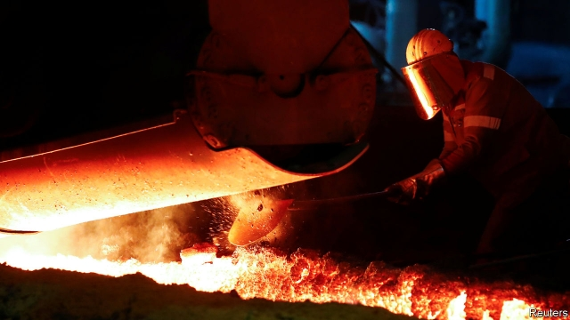
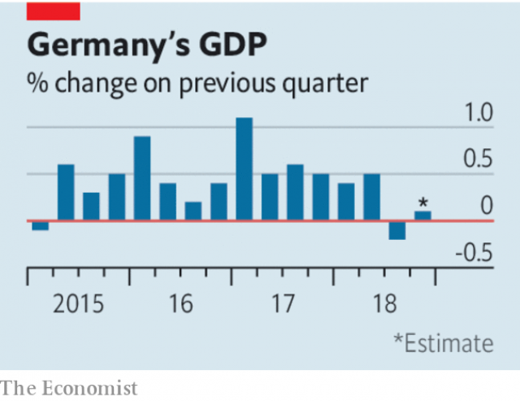

###### A sputtering engine

# It is time to worry about Germany’s economy 

 

> print-edition iconPrint edition | Leaders | Feb 7th 2019 

THE WORLD is used to a thriving German economy. A decade ago, during the financial crisis, it shed relatively few jobs, as unemployment soared elsewhere. Since then it has been an anchor of fiscal stability while much of the euro zone has struggled with debt and deficits. Its public debt is below the target of 60% of GDP set by EU treaties—and falling. Thanks to labour-market reforms introduced during the 2000s, Germans enjoy levels of employment that beat job-friendly Britain, even as inequality is barely higher than in France. Its geographically dispersed manufacturing industries, made up of about 200,000 small and medium-sized firms, have mitigated the regional disparities that have fuelled populism across the West (see article). 

Yet the German economy suddenly looks vulnerable. In the short term it faces a slowdown. It only narrowly avoided a recession at the end of 2018. Temporary factors, such as tighter emissions standards for cars, explain some of the weakness, but there is little sign of a bounceback. Manufacturing output probably fell in January. Businesses are losing confidence. Both the IMF and the finance ministry have slashed growth forecasts for 2019 (see article). In the longer term, changing patterns of trade and technology are moving against Germany’s world-beating manufacturers. In response, on February 5th Peter Altmaier, the economy minister, laid out plans to block unwanted foreign takeovers and to promote national and European champions. 

Germany is getting both the short and the long term wrong. Start with the business cycle. Many policymakers think the economy is close to overheating, pointing to accelerating wages and forecasts of higher inflation. In their view, slower growth was expected, necessary even. That is complacent. Even before the slowdown, the IMF predicted that in 2023 core inflation will be only 2.5%—hardly a sign of runaway prices. In any case, higher German inflation would be welcome, as a way to resolve imbalances in competitiveness within the euro zone that would elsewhere adjust through exchange rates. The risk is not of overheating but of Europe slipping into a low-growth trap as countries that need to gain competitiveness face an inflation ceiling set too low by Germany. 

 

The slowdown also portends deeper problems for Germany’s globalised economic model. Weakness in part reflects the fallout from the trade war between China and America, two of Germany’s biggest trading partners. Both are increasingly keen on bringing supply chains home. America is due soon to decide whether to raise tariffs on European cars. Trade is already becoming more regionalised as uncertainty grows. If global commerce splits into separate trading and regulatory blocs, Germany will find it harder to sell its goods to customers around the world. 

Reform has made Germany’s labour market strong, but it will soon face new challenges. Industrial jobs look particularly vulnerable to automation, yet lifelong learning and retraining are relatively rare in Germany. The workforce is ageing. Neither the government nor business is much digitised and neither invests enough. If technological change demands that its economy embraces digital services, Germany will struggle. 

The government is not blind to these problems, but Mr Altmaier’s protectionism is the wrong medicine. The left, meanwhile, wants to roll back labour-market reforms. Better to expand a recent boost to infrastructure spending and press ahead, at scale, with tax incentives for private investment. Both should help growth today and boost the economy’s long-term prospects. Significantly lower taxes on households would encourage a rebalancing away from exports and towards consumption. A dose of competition could invigorate coddled service industries. The German economy has had an impressive run, but cracks are appearing. It is time to worry. 

