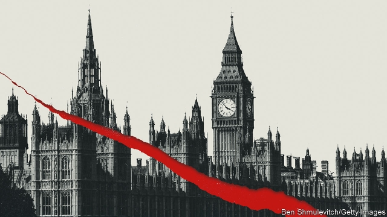
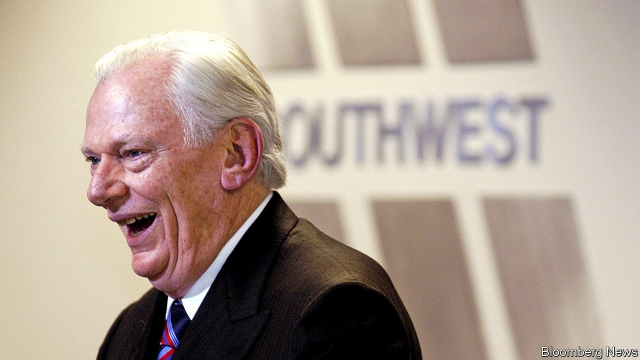

###### On the Democratic Republic of Congo, hygiene, Brexit, Japan and South Korea, chicken, King Crimson, airlines

# Letters 

> Feb 9th 2019 

 

Your leader about the presidential election in the Democratic Republic of Congo (“The great election robbery”, January 26th) missed the key point. The alternative to the selection of Félix Tshisekedi as the winning candidate was not Martin Fayulu, but Ramazani Shadary. He was the “heir” of the outgoing president, Joseph Kabila. It was expected that the electoral commission would rig the vote to make Mr Shadary president. But his vote count was so low that Mr Kabila could not get away with declaring him the winner. On the other hand, he could not accept Mr Fayulu because his political backers, Moïse Katumbi and Jean-Pierre Bemba, had promised to pursue Mr Kabila for his ill-gotten gains. 

Mr Tshisekedi is apparently less of a threat to Mr Kabila, but within a few days of his inauguration, the governor of the central bank was arrested and charged with stealing government money, and the ministers in charge of the budget and the economy were called in for questioning. Note that the people who voted for Mr Fayulu have not taken to the streets in protest. That is because Mr Kabila has left office, which was everyone’s main objective to begin with. 

HERMAN COHENUnited States ambassador (retired)Washington, DC 

 

Reading your article on hospital hygiene (“First, wash your hands”, January 26th) brought to mind the groundbreaking role played by Ignaz Semmelweis, a Hungarian doctor who practically invented the practice in 1847. By introducing the washing of hands with chlorinated lime water he greatly reduced the mortality rate associated with childbirth infections over two years at Vienna’s general hospital. Semmelweis was a pioneer of antiseptic procedures. 

ANDREA TRABOULSIBeirut 

 

The Economist’s chronic anti-Brexit bias continues to surface in issue after issue (“The mother of all messes”, January 19th). What I find most objectionable is the idea that, since Parliament has rejected the withdrawal proposal it now becomes necessary to have another referendum. Rubbish! The voters have spoken, making it clear in 2016 that Britain should leave the European Union. The fact that the government cannot figure out how to do it doesn’t mean the voters need to be consulted once again on the issue of whether to stay or leave, which regardless of the spin put on it, represents nothing more than a new chance for Remainers to throw sand into the Brexit machinery. 

Imagine the precedent. If an issue is presented to the electorate, and a decision is made that one side very much dislikes, then all that side has to do is to make it almost impossible to put in place the wishes of the voters, suggesting that the complexities are so enormous and nuanced that further clarification from the electorate is the only way out. 

What a destructive notion this is to the basic concept of democracy and letting voters have their say. If another vote is to be held, it should be to recall those members of the government responsible for this mess in the first place. 

BILL POLLOCKAtlanta 

According to you, “doddery, claret-swilling uber-bureaucrats” in Brussels are among the very unattractive facets of the EU that might justify Brexit. However, in a week of meetings with putative colleagues and interviews in Brussels, I found youngish, highly educated, well-motivated and generally rather congenial people. Even an Antipodean interloper who serendipitously held a British passport was impressed. 

I fear the causes of Brexit must be found elsewhere. 

REX DEIGHTON-SMITHParis 

Contrary to the negative mainstream opinion about a messy Brexit, I am absolutely thrilled by the discussions, the parliamentary procedures and democratic traditions. What we are witnessing is the flexibility and evolutionary power of an old democracy in a peaceful way. The power plays are akin to “Game of Thrones”, but without the blood. Yes, the politicians are mediocre, but they are compensated for by traditions and a society with a democratic DNA. 

ANDREAS SCHMIDTLeamington Spa, Warwickshire 

Japan and South Korea* Your article on the Supreme Court rulings in South Korea ordering Japanese firms to “compensate” former civilian workers from the Korean Peninsula for their labour during the second world war failed to fully apprehend the Japanese-Korean relations re-established in 1965 and developed ever since (“Shackles of the past”, December 22nd).The agreement in 1965 clearly stipulates that any claims between Japan and South Korea as well as their nationals were “settled completely and finally” and “no contention shall be made” on these problems. In fact, in 2005, the Korean government itself reconfirmed that the claims of such workers are covered by the agreement. Moreover, that agreement was the hard-won fruit after decades of negotiation between the predecessors on both sides, who were determined to normalise relations through sealing the past enmity and paving the way for a future-oriented relationship. Japan provided South Korea with $500m for economic co-operation (at a time when the entire Korean national budget was roughly $300m) and the Korean government allocated a part of the funds provided by Japan to the bereaved of those workers. There is no denying that the 1965 agreement has been the legal basis of the stable diplomatic and economic relationship between Japan and South Korea for more than half a century.According to a fundamental principle of international law, no country is allowed to use a ruling by the judiciary branch as a justification to turn its back on its own legal commitment. Therefore, it is South Korea that has the responsibility to take appropriate measures, including immediate actions to remedy such breaches of international law. 

TAKESHI OSUGAPress secretaryMinistry of Foreign Affairs of JapanTokyo 

 

“Ruling the roost” (January 19th) described the economics of the poultry industry and how Westerners will pay a premium for lean white chicken meat, while people in Asia and Africa prefer dark meat, which includes legs and thighs. With a preference for white meat, chicken producers in the West make their profits from chicken breasts. They then dump the unwanted brown meat in frozen bulk in any market that will take them and at any price they can get. 

The EU pays lip service to assisting industries in developing countries. In reality economic-partnership agreements usually require these developing countries to agree not to impose tariffs on EU goods. Because of a flood of cheap imports from Europe, the chicken industries all but vanished in Ghana, Cameroon and Senegal until their governments took steps to protect local producers. The South African chicken industry declared a crisis as production was cut and jobs were lost. South African chicken producers are more efficient than those in EU countries, but they cannot compete with dumped chicken portions. 

EU exports have been curtailed since 2016 because of bird flu, but other exporting countries, particularly Brazil, have filled the gap. Brazil is an efficient and low-cost producer, but its agricultural industry, like that in the EU, benefits from direct and indirect subsidies. Consumers in Africa and elsewhere do enjoy some benefit, mainly from price suppression, while the middle men grow rich. Meanwhile substantial poultry industries, the grain producers that depend on them, and the jobs of thousands of workers in rural areas, are at risk. 

This is the dark side of the Western preference for white chicken meat. 

FRANCOIS BAIRDFounderFairplayJohannesburg 

 

The giant toothy, gaping mouth at the Oval Office door in Lexington’s piece on Mick Mulvaney, the new White House chief of staff (January 19th), brought to mind the cover art on King Crimson’s iconic album from 1969, “In the Court of the Crimson King”. Looking back, that collection of songs was uncannily prescient. As Mr Mulvaney takes his daily “March for No Reason” to confer with the “21st Century Schizoid Man”, I wonder if he’ll be thinking to himself, “I Talk to the Wind”. 

RONALD STEENBLIKParis 

 

Your obituary of Herb Kelleher, the boss of Southwest Airlines, concluded that low-fare air travel has become synonymous with extorting charges from passengers (January 12th). That may be true for most low-fare carriers, but Southwest still allows two free checked bags, waives fees on ticket changes and gives me a free beer on Valentine’s Day, all in coach. There is still some love left in the air. 

CHAD PRIESTDallas 

* Letters appear online only 

