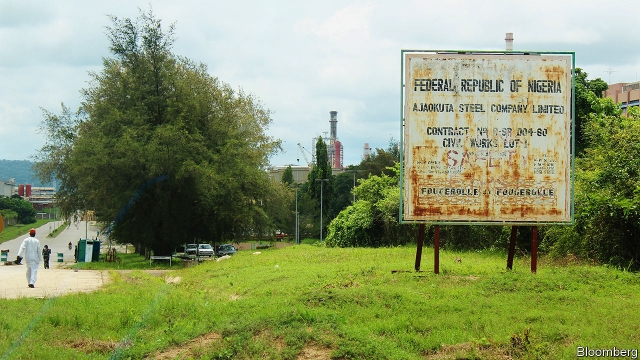

###### Battle of the big men

# A Nigerian election pits an ex-general against a tycoon 

 

> print-edition iconPrint edition | Middle East and Africa | Feb 9th 2019 

NOTHING SEEMS awry on arrival at the Ajaokuta Steel Company near Lokoja in central Nigeria. Nestled in scrubland are rows of depots, mills and furnaces; the complex covers 800 hectares, or four times the size of Monaco. Inside the main building workers amble through the foyer, barely noticing a suggestion box. 

Your correspondent is, however, tempted to leave a note that reads: “How about making some steel?” Since construction of the state-owned firm began 40 years ago, it has received $8bn in public money without producing a beam. Corruption and mismanagement have gone on for so long that Ajaokuta has more than 10,000 pensioners on its books. There is no more colossal symbol of Nigeria’s squandered potential. 

On February 16th Nigerians will go to the polls in the largest democratic event in African history. Fully 84m people are registered to vote in the country’s sixth general election since military rule ended in 1999. Yet the prospect of consolidating democracy in Africa’s most populous country has not elevated the campaign. Too many Nigerians have been let down by politicians to ditch their cynicism. 

Muhammadu Buhari, Nigeria’s president, has promised to revive Ajaokuta. Yet he made the same commitment in 2015. In total Mr Buhari has delivered on just seven of the 222 pledges he made as a candidate, according to the Centre for Democracy and Development, a Nigerian think-tank. 

These promises came in three areas. The first was corruption. Despite having 27 agencies with a mandate to clean things up Nigeria remains filthy. The latest report by Transparency International, a watchdog, finds no sign of corruption ebbing under Mr Buhari. In fact, his administration has used the prospect of protection from prosecution to entice opponents to join the All Progressives Congress, the ruling party. Together these turncoats had N600bn ($1.7bn) worth of corruption allegations hanging over them. 

Mr Buhari’s record on security is little better. After taking office he oversaw a military offensive against Boko Haram, the terrorist group that in 2015 controlled an area of the north-east the size of Belgium. However, in the past few months the army has suffered setbacks. An attack last month in the town of Rann killed 60 people and forced another 30,000 to flee to Cameroon. 

Nor is the north-east the only problem. Last year more people were killed in clashes over land between farmers and cattle-herders than were slain by Boko Haram. In the north-west armed bandits killed 371 people and displaced 18,000 in the first seven months of 2018. Across Nigeria, 7.7m people need humanitarian aid and 2m have had to leave their homes. 

Mr Buhari’s third set of promises concerned the economy. Alas, Nigerians are poorer today than in 2015. Unemployment has risen from 8.2% to 23.1%. The president is partly the victim of low oil prices; the black stuff provides 70% of government revenue. But his statist instincts have made matters worse. Interest payments are set to reach 80% of federal government spending by 2022. Though Nigeria’s government has three space agencies, it can barely run a power grid. The country generates less electricity than the city of Edinburgh. 

Atiku Abubakar, the main challenger to Mr Buhari, is also in his 70s. His slogan is: “Let’s Get Nigerians Working Again”. Citing Margaret Thatcher, he says he wants to privatise state-owned firms. But his plans are short on detail. Many fear privatisation would be a smokescreen for enriching his cronies. Though he has not been charged with any crime in Nigeria, in 2010 a US Senate committee alleged that Mr Abubakar’s (fourth) wife helped him bring “over $40m in suspect funds” to America. 

Mr Abubakar, a former big man in the Nigerian customs service, denies that he is corrupt. His various businesses, from oil services to property, make him the largest employer in his home state of Adamawa. His vast fortune allows him to donate copiously to charity. He has a deep patronage network across the country. 

That will help ensure the presidential election is closer than it was in 2015, when Mr Buhari won by more than 2.5m votes. “It’s going to be a bare-knuckle fight,” says Matthew Page of Chatham House, a think-tank. Elections in Nigeria are largely shaped by which political machine runs most effectively. Mr Buhari can depend on a lot of support in the north. Mr Abubakar’s People’s Democratic Party will sweep most of the south-east. Much will depend on turnout in these core areas and on who can win swing votes in the south-west. 

Some worry that the tightness of the race will encourage rigging. Recent elections in Anambra and Ekiti states saw widespread vote-buying; it is likely to happen again. Another concern is how easy it is to change the tallies when the results are sent from Nigeria’s 120,000 polling units to counting stations. Then there is the spectre of thugs or police intimidating voters. 

Four times Mr Buhari has blocked reforms that would strengthen Nigeria’s electoral commission. Such intransigence frustrates Samson Itodo, a founder of the “Not too young to run” campaign, which is trying to clean up elections and make political involvement easier for the three-quarters of Nigerians who are under 35. “We are tired of these same old leaders,” he says. “We are laying the foundation for a revolution in 2023.” Until then, Nigeria will be stuck with mediocrity. 

