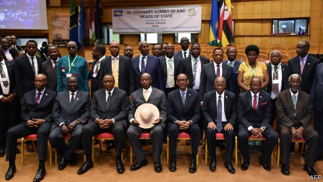

###### You say you want a federation

# A political union for east Africa? 

##### Regional leaders have big ambitions but short tempers 

 

> Feb 7th 2019 

 

AFRICA’S REGIONAL institutions do not lack ambition. The African Union’s master plan promises a rich, peaceful continent criss-crossed by high-speed trains. Eventually. Its target is 2063, a date well past the likely retirement date of all the bigwigs who signed the plan. 

The East African Community (EAC), by contrast, has no time to waste. It wants to form a single currency by 2024. At a recent summit, heads of state discussed drafting an east African constitution, with the ultimate goal of political federation. The EAC is the most successful of Africa’s regional blocs. Since its revival in 2000 it has established a customs union and the rudiments of a common market. But its leaders are getting ahead of themselves: deepening rifts have put the project in jeopardy. 

Four of its six members (Rwanda, Burundi, Uganda and South Sudan) are led by ex-rebels, some with competing interests in the Congolese borderlands to the west. The recent summit was postponed twice because Burundi, which has fallen out with Rwanda, refused to attend. That quarrel goes beyond mere words. In 2015 Pierre Nkurunziza, the Burundian president, fought off a coup. His government accuses Rwanda of backing it. In 2016 UN experts reported that Burundian refugees were being recruited to fight against their home government. In December the same experts said that arms and men were also flowing through Burundi to undermine Rwanda. 

Rwanda’s president, Paul Kagame, is also on bad terms with Yoweri Museveni, his Ugandan counterpart. The rift is personal. Mr Museveni fought his way to power in the 1980s with the help of Rwandan refugees; Mr Kagame, who grew up in a Ugandan refugee camp, was his military intelligence chief. Later, as presidents, the former comrades launched two wars in Congo, then fell out over the loot. By 2000 their soldiers were firing at each other, 600km from home. 

Relations are again dicey. Last year Mr Museveni sacked his police chief, who was later charged by an army court with aiding the kidnap of Rwandan exiles (among other things). The abductees, including one of Mr Kagame’s former guards, had been illegally sent back to Rwanda and imprisoned. 

Rivalry between Kenya and Tanzania, the two largest members, is more straightforward. Together they account for three-fifths of the region’s population and three-quarters of its GDP. Yet commerce between them is hobbled by a trade war. Although both are meant to be in a common market, Tanzania has imposed tariffs on Kenyan sweets. Kenya has retaliated by taxing Tanzanian flour. Tanzania, which is sliding towards protectionism, also objects to a proposed trade deal between the EAC and the EU, which Kenya is keen on. As the only EAC countries with coastlines, both vie for investment in infrastructure: in 2016 Uganda decided to route an oil pipeline through Tanzania, to Kenya’s chagrin. 

Some worry that the escalating tensions could cause history to repeat itself. The first East African Community collapsed in 1977. More likely, the region will continue to make faltering progress on trade, where the spread of cross-border business creates its own momentum. But political issues are trickier. Leaders who brook no dissent at home have little taste for compromise abroad. Each wants integration, as long as he is in charge. 

-- 

 单词注释:

1.federation[fedә'reiʃәn]:n. 联邦, 联合, 联盟 [法] 联邦, 联盟, 联邦政府 

2.regional['ri:dʒәnәl]:a. 地方的, 地域性的 [医] 区的, 部位的 

3.feb[]:abbr. 二月（February） 

4.regional['ri:dʒәnәl]:a. 地方的, 地域性的 [医] 区的, 部位的 

5.retirement[ri'taiәmәnt]:n. 退休, 隐居, 撤退 [经] 退休, 退股, (固定资产)报废 

6.bigwig['bigwig]:n. 要人, 大亨 

7.EAC[]:[医] 红细胞抗体补体 

8.regional['ri:dʒәnәl]:a. 地方的, 地域性的 [医] 区的, 部位的 

9.bloc[blɒk]:n. 集团 

10.revival[ri'vaivl]:n. 复兴, 复活, 恢复精神, 苏醒 [医] 复苏, 回生, 精神重振 

11.rudiment['ru:dimәnt]:n. 基础, 入门, 雏形, 退化器官 [医] 原基, 始基, 残遗器官, 痕迹器官, 遗迹 

12.rift[rift]:n. 裂口, 空隙 vi. 裂开 vt. 使分开, 使割开 

13.jeopardy['dʒepәdi]:n. 危难, 危险 [法] 危险, 危难, 危险处境 

14.rwanda[rj'ændә]:n. 卢旺达（东非国家）；卢旺达语 

15.Burundi[bu'ru:ndi]:n. 布隆迪 

16.Uganda[ju(:)'^ændә, u:'^ændә]:n. 乌干达 

17.Sudan[su:'dæn]:n. 苏丹 [化] 苯偶氮间苯二酚; 苏丹 

18.Congolese[,kɔŋ^ә'li:z]:n. 刚果人, 刚果语 a. 刚果的, 刚果语的, 刚果人的 

19.borderland['bɒ:dәlænd]:n. 边界地方, 边陲, 两可间的状态 

20.pierre[pi(:)'eә, peә]:n. 皮埃尔（男子名） 

21.Nkurunziza[]:[网络] 恩库伦齐扎 

22.Burundian[bu'ru:ndiən]:n. 布隆迪人 a. 布隆迪的；布隆迪人的 

23.coup['ku:]:n. 砰然的一击, 妙计, 出乎意料的行动, 政变 [医] 发作, 中, 击 

24.UN[ʌn]:pron. 家伙, 东西 [经] 联合国 

25.refugee[.refju'dʒi:]:n. 难民, 流亡者 [法] 避难者, 流亡者, 难民 

26.undermine[.ʌndә'main]:vt. 在...下面挖, 渐渐破坏, 暗地里破坏 [法] 暗中破坏, 以阴谋中伤伤害 

27.paul[pɔ:l]:n. 保罗（男子名） 

28.kagame[]:[网络] 卡加梅；卡加梅总统；卡根 

29.yoweri[]:n. (Yoweri)人名；(乌干)约韦里 

30.museveni[]:un. 穆塞韦尼(Yoweri,1945—乌干达共和国总统,1986年1月任职) [网络] 乌干达总统穆塞韦尼；穆赛韦尼；总统慕塞维尼 

31.Ugandan[ju:'^ændәn]:n. 乌干达人 a. 乌干达(人)的 

32.counterpart['kauntәpɑ:t]:n. 副本, 复本, 配对物, 相应物 [经] 副本, 正副二份中之一 

33.Rwandan[rj'ɑ:ndәn, -'æn-]:a. 卢旺达的 

34.Congo['kɔŋ^әu]:n. 刚果, 刚果河, 工夫茶 [建] 刚果, 直接刚果红 

35.loot[lu:t]:n. 赃物, 洗劫, 抢夺 v. 洗劫, 抢夺 

36.dicey['daisi]:a. 不确定的, 危险的, 冒险性的 

37.kidnap['kidnæp]:vt. 绑架, 诱拐, 拐骗 [法] 拐带, 诱拐, 绑架 

38.exile['eksail]:n. 放逐, 流放, 被放逐者 vt. 放逐, 流放, 使背井离乡 

39.abductee[,æbdʌk'ti:]:n. 被绑架者 

40.illegally[]:[法] 非法地, 不合法地, 违法地 

41.rivalry['raivlri]:n. 竞争, 对抗 [医] 拮抗 

42.Kenya['kenjә]:n. 肯尼亚 

43.Tanzania[.tænzә'ni:ә]:n. 坦桑尼亚 

44.GDP[]:[化] 鸟苷二磷酸 

45.hobble['hɒbl]:vi. 蹒跚 vt. 使跛行, 阻碍 n. 跛行 

46.tariff['tærif]:n. 关税, 关税表, 价格表, 收费表 vt. 课以关税 [计] 价目表 

47.kenyan['kenjәn]:n. 肯尼亚人 

48.retaliate[ri'tælieit]:vt. 报复, 回敬 vi. 报复, 以牙还牙 

49.Tanzanian[,tænzə'niən]:a. 坦桑尼亚的 坦桑尼亚人 

50.protectionism[prә'tekʃәnizm]:n. 贸易保护主义, 贸易保护制 [经] 保护(贸易)主义, 保护(贸易)制 

51.EU[]:[化] 富集铀; 浓缩铀 [医] 铕(63号元素) 

52.coastline['kәustlain]:n. 海岸线 

53.vie[vai]:vi. 争, 竞争, 争胜 vt. 提出...来竞争, 以...作较量 

54.chagrin['ʃægrin]:n. 懊恼 vt. 使懊恼 

55.escalate['eskәleit]:vi. 逐步扩大, 逐步升高, 逐步增强 vt. 使逐步上升 

56.falter['fɒ:ltә]:vt. 支吾地说 vi. 支吾, 蹒跚地走 n. 颤抖, 支吾, 踌躇 

57.momentum[mәu'mentәm]:n. 动力, 动量 [化] 动量 

58.tricky['triki]:a. 狡猾的, 机敏的 

59.dissent[di'sent]:n. 异议 vi. 持异议, 不同意 

60.integration[.inti'greiʃәn]:n. 综合, 与环境协调的行为, 集成 [化] 集成; 整合 

