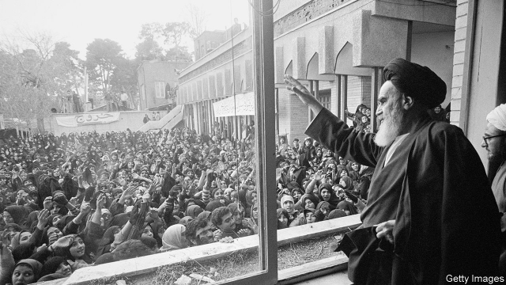

###### The shadow of 1979

# Four decades after its revolution, Iran is still stuck in the past 

 

> print-edition iconPrint edition | Middle East and Africa | Feb 9th 2019 

FOR A FEW tense moments it seemed as if the flight carrying Ayatollah Khomeini back to Iran would not make it. Two weeks had passed since the shah, Mohammad Reza Pahlavi, had left the country amid enormous protests against his autocratic rule. Khomeini’s aides were eager for the ayatollah to return from exile in Paris and fill the power vacuum. But the government left behind by the shah warned them to stay away. As their plane approached Iranian airspace, the air force threatened to shoot it down. Some on board cheered the chance for martyrdom. The Western journalists in tow were more subdued. 

The plane eventually landed in Tehran and, after a brief argument between his followers over who would assist him, Khomeini walked slowly down the stairs to the tarmac, helped by an Air France steward (a compromise). He was greeted in the capital by what some believe to be the largest crowd in history. The date was February 1st 1979. Ten violent days later, the shah’s government resigned and the army gave way to the revolutionaries. 

Forty years on, Iran is nominally democratic, but unelected mullahs still wield the real power. They have defied expectations by remaining in charge for so long. University enrolment has increased, services for the poor have improved and the economy is more diversified. But in most other ways Iran is worse off. In the months after the revolution, Khomeini and his hardline followers, nicknamed “the beards”, made decisions that set the country on a terrible path. Iran today is less pious than the mullahs would like, less prosperous than it should be and less engaged with the world than most countries. 

Khomeini made his first big decision long before coming to power. “The government must be directed and organised according to the divine law, and this is only possible with the supervision of the clergy,” he wrote—nearly four decades earlier. As the shah teetered, he obscured his aim of velayat-e faqih (guardianship of the Islamic jurist). The leftists and liberals who supported the revolution misjudged him. Some imagined that Khomeini would retreat to the holy city of Qom and leave others to govern. 

Khomeini did go to Qom, but he did not give up power. From the start, he undermined his handpicked prime minister, the relatively moderate Mehdi Bazargan. When the oil minister refused to purge non-Islamic workers, Khomeini branded him a traitor. The ayatollah mandated the veil for women and banned broadcast music, which he compared to opium. Secular groups were ignored and critics persecuted. In the early years after the revolution, thousands of people were executed, including prostitutes, homosexuals, adulterers and the shah’s officials. The state needed purifying, said Khomeini. Iran remains a world leader in executions. 

Some clerics worried that politics would tarnish the religious establishment. Among the critics was Grand Ayatollah Muhammad Kazem Shariatmadari, who gave Khomeini the title of ayatollah in 1963, in part to stop the shah from executing him. Shariatmadari denounced the extremes of the new order and rejected velayat-e faqih. 

He was placed under house arrest, but his fears were quickly borne out. Khomeini twisted Islam to justify the regime’s actions. Brazenly, he said that officials could override the Koran if it was somehow found to be in the interest of Islam. In choosing a successor, Khomeini even abandoned a tenet of velayat-e faqih, which held that “the most learned cleric” should lead. When his first choice, Ayatollah Hossein Ali Montazeri, called for more freedoms, he picked Ali Khamenei, a loyal former president, but not a senior cleric. 

Pro-regime clerics, in the minds of many Iranians, became associated with an oppressive and out-of-touch state. Mr Khamenei has made things worse. When his favoured candidate for president, Mahmoud Ahmadinejad, a hardliner, won a fishy election in June 2009, swarms of people protested. The regime clamped down, accusing the moderate leaders of the opposition, known as the Green Movement, not only of sedition, but of being mohaareb—people who fight with God. 

The public long ago lost its revolutionary zeal. More than 150,000 educated Iranians are thought to leave the country each year, among the world’s highest rates of brain drain. Younger Iranians attend mosque less frequently than their parents did. “People laugh at all the nonsense the mullahs are telling them,” says Darioush Bayandor, a former Iranian diplomat. 

Yet the regime acts as if the revolution were only yesterday. The judiciary recently banned walking dogs in public (Islam deems dogs impure). This month Mr Khamenei scolded women who remove their hijabs. “That captures the essence of Islamist rule in Iran: Dogmatic septuagenarian clerics forcing their own antiquated views on a young, diverse society,” writes Karim Sadjadpour of the Carnegie Endowment for International Peace, a think-tank. “It can only be sustained through coercion.” 

The clerics’ main tool of oppression is the Islamic Revolutionary Guard Corps (IRGC). Khomeini did not trust the shah’s army, so he gathered the armed groups that supported the revolution into a single force, the IRGC. In 1980 he sent it to fight the invading army of Saddam Hussein, Iraq’s then-dictator, calling the war a “divine cause”. Hundreds of thousands of Iranians probably died in the eight-year conflict. 

The war changed the IRGC, which now commands more than 100,000 troops and oversees the baseej, a thuggish militia of perhaps one million volunteer vigilantes. Its secretive Quds force operates in Syria, Yemen, Iraq and Lebanon. At home, the Guards have extended their reach into all aspects of society. Former members hold top jobs in government and seats in parliament. The Guards ensure that television and radio shows support the state, and that schools teach students to be loyal to the regime—which, in turn, protects the Guards’ vast commercial interests. 

Iran’s government had little to offer the soldiers who returned from the Iran-Iraq war, so it put the IRGC to work rebuilding the country. Ever since, it has hogged government contracts, often without bidding. Today it controls, directly and indirectly, a business empire worth billions of dollars. It is building a subway line in Tehran, extracts oil and gas, and runs laser eye-surgery clinics. While American sanctions sting their competitors, firms tied to the Guards are able to smuggle goods and avoid taxes. Mr Khamenei himself controls Setad, an opaque conglomerate with interests in almost all economic sectors. 

In the face of sanctions, the state has developed a “resistance economy”, which is diverse and self-sufficient in some areas, but hardly efficient. Iran today ranks near the bottom of the World Bank’s Ease of Doing Business Index and Transparency International’s Corruption Perceptions Index. All that helps explain why it has performed so poorly. In 1977 GDP per person in Iran was slightly higher than in Turkey, another large Islamic country; today Iranians are less than half as wealthy as Turks. But the ruling elite still do well. “None of these clerics would have dared acquire such vast wealth under Khomeini,” says Shaul Bakhash of George Mason University. “He would be appalled.” 

In January last year thousands of Iranians took to the streets to protest against corruption, repression and rising living costs. The initial anger was directed at Hassan Rouhani, the reformist president. But people quickly turned their ire to the ruling clerics and the IRGC, too. “People are paupers while the mullahs live like gods,” chanted the protesters, and “Death to the Revolutionary Guards.” The regime, as is its wont, arrested hundreds and blamed America for the unrest. 

Hatred for the “great Satan”, Khomeini’s nickname for America, was a central tenet of the revolution. It was America, after all, that installed Pahlavi after helping topple the democratically elected government of Muhammad Mosaddegh, a nationalist prime minister, in 1953. By 1979 Iranians of all stripes had turned against the shah’s misrule. Many worried that their society was under assault by Western culture. 

America’s view of Iran was poisoned nine months after the revolution. When Jimmy Carter allowed the shah to come to America for cancer treatment, it caused outrage in Iran. On November 4th 1979 student activists scaled the walls of the American embassy in Tehran, seizing most of the staff. The hostages remained in captivity for 444 days. Eight American soldiers died in an aborted rescue effort in 1980. Khomeini used the seizure to whip up support. 

The mutual enmity has hardly dissipated. America supported Iraq in its war with Iran. The IRGC has sponsored terrorist attacks on Americans. In 2002 George W. Bush said Iran was part of an “axis of evil”. But his invasion of Iraq a year later, and the tumult since the Arab spring revolts of 2011, allowed Iran to extend its influence (see article). Growing evidence that Iran was pursuing a nuclear-weapons programme provoked successive rounds of sanctions. 

A new era seemed possible when Barack Obama offered to “extend a hand” if Iran would “unclench [its] fist”. Mr Rouhani agreed to a deal in 2015 whereby Iran curbed its nuclear programme in return for sanctions relief. Both leaders hoped that better relations would follow. But the deal did not produce prosperity, as Mr Rouhani had promised Iranians, and Iran continued to test missiles and meddle abroad. 

Last year President Donald Trump yanked America out of the deal. He is surrounded by Iran hawks, such as John Bolton, his national security adviser, who has previously advocated bombing Iran or overthrowing the mullahs. 

For all his bluster, Mr Trump has offered to talk to Mr Rouhani, who declined the invitation, blaming renewed sanctions for Iranian suffering. Such entreaties, nevertheless, make the clerics and IRGC nervous. American hostility gives the regime a raison d’être; isolation means less competition for its businesses. 

Daily protests continue in Iran, as the economy sinks. “America is not the enemy, the enemy is right here,” say some in the crowds. Hatred for the shah united Iranians behind Khomeini. Today, though, the opposition is disparate and leaderless. Iranians look around their region and see only failed uprisings. The revolution of 1979 has brought mostly misery, but another one is probably not in the offing. 

