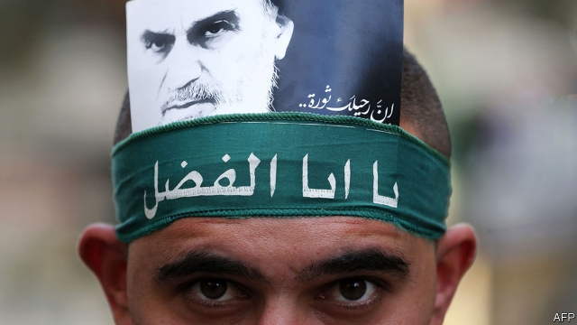
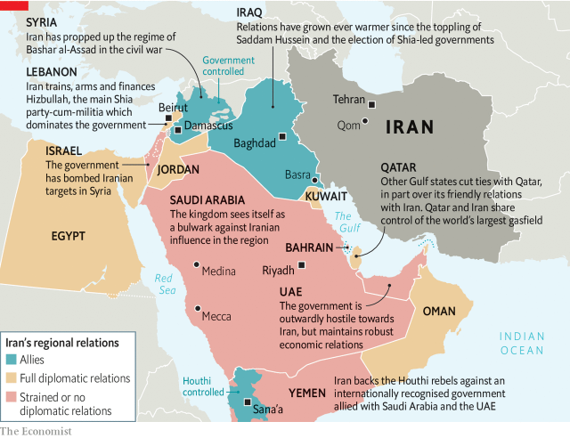

###### Pushing on an open door

# Iran was not predestined to become a regional hegemon 

 

> print-edition iconPrint edition | Middle East and Africa | Feb 9th 2019 

FLUSH WITH victory at home in 1980, Iran’s new rulers turned their attention abroad. “I hope that [Iran] will become a model for all the meek and Muslim nations in the world,” Ayatollah Khomeini said. His wish did not come true. No other state has adopted the concept of velayat-e faqih, or Shia clerical rule. Ali al-Sistani, the Iranian-born spiritual leader of Iraq’s Shias, wants clerics to stay out of politics. When Bahrain’s long-suffering Shia majority revolted in 2011 they demanded a democratic parliament, not a theocracy. Iran is broadly unpopular in the Arab world. A recent poll found that 66% of Arabs see it as a threat, below only Israel and America. 

Though it failed to become a model, the revolution nonetheless had a lasting impact on the region. It terrified Saudi Arabia, mobilised millions of dispossessed Shias and shaped the rhetoric of Sunni Islamists in far-off places like Egypt and Tunisia. The greatest threat to Israel is no longer conventional armies on its borders but Hizbullah, an Iranian-backed paramilitary group in Lebanon. Iran did not gain such influence through the allure of its ideas, though. It owes its success to circumstance: wars, terrorism and the utter failure of autocratic regimes in Arab states. 

Saudi rulers describe 1979 as an inflection point. “We, in this country, did not witness terrorism or extremism until the Khomeini revolution emerged in 1979,” King Salman said in 2017. This is revisionist history. His country was never a tolerant one. The king’s father established the modern state as an alliance between royals and puritanical clerics. It also elides the other seminal event of 1979, when pious rebels seized the grand mosque in Mecca. Saudi officials blamed Iran, but the culprits were home-grown, led by a former Saudi soldier angry about the state’s supposed drift from Islam. (He may have been inspired by the Iranian revolution.) Worried that such criticism might resonate, the Al Sauds allowed clerics to dictate ever more conservative policies. Images of women were stricken from public places; cinemas were closed. 

 

The Iranian revolution was a different challenge. Saudi kings fancy themselves guardians of Islam, the “custodians of the two holy places”, the shrines in Mecca and Medina. As Iran sought to export its vision of Islam, Saudi royals urged their clerics to follow suit. The kingdom started spending tens of billions of dollars to fund mosques, train imams and distribute religious texts in the Middle East, Asia and Europe. No official figures exist but estimates range as high as $100bn over four decades. The kingdom maintains an almost comical obsession with Iran’s activities. One leaked diplomatic cable from 2010 fretted about “Iranian influence” in the Philippines, a Catholic country 7,000km away that is hardly ripe for a Shia revolution. 

Such proselytising stoked the sectarianism that now poisons the Middle East. So did the Iran-Iraq war, in which both sides claimed God’s backing. Iran urged Shias in Iraq to overthrow Saddam Hussein’s government. It went further in Lebanon, offering financial and military support to the nascent Hizbullah, which later became a political party. Hizbullah was not the only faction vying for influence among Lebanon’s Shias. But it had a foil: Israel, which invaded and occupied south Lebanon in 1982. “It was our presence there that created Hizbullah,” Ehud Barak, a former prime minister, said in 2006. Even some non-Shia Lebanese came to see it as a protector, first against Israel and more recently the fanatics of Islamic State. Iran’s alliance with the Assad regime in Syria is more strategic than spiritual. But rivals see it as another piece of what King Abdullah of Jordan dubbed the “Shia crescent”, a sectarian alliance sweeping across the Levant. 

It was not always so. Despite their doctrinal differences, Sunni Islamists initially saw Iran’s revolution as an inspiration. In its early days the Muslim Brotherhood was an ideological movement of the educated middle class. Ayatollah Khomeini offered a new political lexicon: he spoke of earth as well as heaven, railing against inequality and injustice. As they dabbled with electoral politics in the 1980s, the Brotherhood and its offshoots adopted this language, positioning themselves as the parties of a growing Arab underclass. The warm feelings were short-lived, though, because of both sectarianism and Iran’s growing authoritarianism. Islamists wanted to persuade the world that they would play by the rules and compete in fair elections. A superficial democracy controlled by theocrats was not an ideal model. 

But by then the Arab world had no models. The defeat by Israel in 1967 discredited Arab nationalism. Leftist economics was falling out of favour. Political Islam was harshly repressed. Dictators ruled the day and cared for little but their own survival. Later events again tilted in Iran’s favour. The American-led invasion of Iraq in 2003 left a vacuum to be filled by sympathetic Shia-led governments in Baghdad. While Iran sent troops to prop up Bashar al-Assad in Syria, Gulf spymasters sat in Istanbul hotels, bankrolling disparate rebel groups. Some ended up fighting each other. 

Both the regime’s cadres and its critics sometimes say that Iran controls four Arab capitals: Baghdad, Beirut, Damascus and Sana’a. This is a wild exaggeration. But Iran has been adept at filling the void left by Arab states. If its rivals want to contain it, they need to offer something better. 

