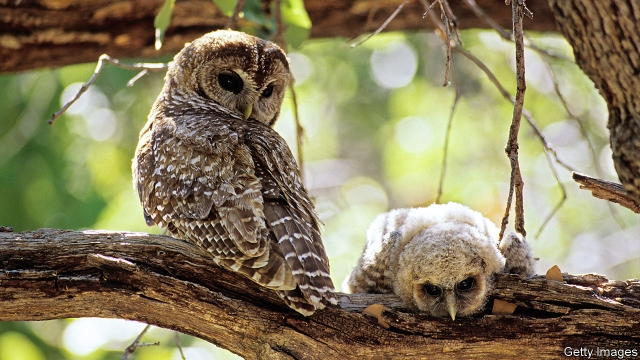
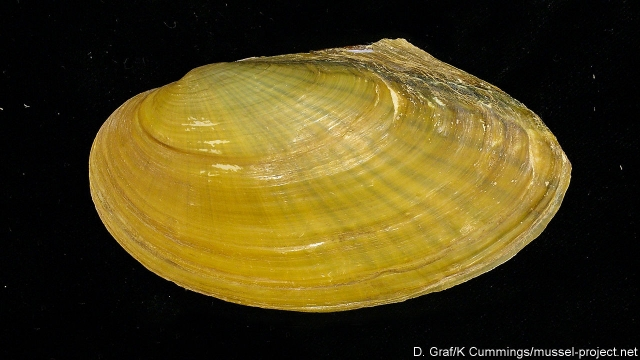

###### Ecology and economics

# How to preserve nature on a tight budget 

 

> print-edition iconPrint edition | Science and technology | Feb 9th 2019 

THE NORTHERN spotted owl, pictured above, is a handsome creature. Dark brown and, as the name implies, dappled with white flecks, it stands up to half a metre tall when perched on branches in the ancient forests of America’s north-west. Its swivel neck lets it scan its sylvan habitat for woodrats, flying squirrels and other prey—or, rather, to scan what is left of that habitat, after decades of heavy logging. This logging has caused the owl’s numbers to decline steadily. Fewer than 2,500 pairs remain, mainly in Oregon, northern California and Washington. As a result, the spotted owl is listed under America’s Endangered Species Act. 

Listing means money. Efforts directed at preserving spotted owls receive $4.4m a year, through various channels, from American taxpayers. This sum is almost double what the United States Fish and Wildlife Service (USFWS), a federal agency, recommends be spent on the species. Nor is the owl the only over-endowed threatened organism in America. In 2016 Leah Gerber of Arizona State University found that 139 of the 1,124 plants and animals with federal recovery plans in place got more than their fair share of public resources, as defined by USFWS recommendations. The surplus totalled $150m a year, more than a quarter of spending in the area. Re-allocated, this could bring nearly 900 currently underfunded plans up to budget. 

Conservation then, as is true of so many other things in life, is not fair. People have favourites, even within the official lists—and those favourites receive special treatment. Spotted owls get money. Scaleshell mussels do not. Yet according to the Nature Conservancy, a big American charity, about 70% of North American mussel species are extinct or imperilled. That compares with 15% of birds. 

Some of this favouritism may not matter (though freshwater mussels are important parts of their local ecosystems and were, until recent decades, so abundant that entire industries, such as buttonmaking, depended on them). But with extinction rates estimated as being between 100 and 1,000 times their pre-human level, and man-made climate change reshaping even those parts of Earth’s surface that humanity has yet to trample under foot, ship or fishing net, a rational approach to conservation would be welcome. 

The instinctive response of many conservationists to the sprawl of Homo sapiens across Earth’s surface is to fence off sprawl-free areas as rapidly and extensively as possible. That thought certainly dominates discussions of the UN Convention on Biological Diversity, the main relevant international treaty. An eight-year-old addendum to the pact calls for 17% of the world’s land surface and 10% of the ocean’s water column (that is, the water under 10% of the ocean’s surface) to be protected by 2020. Currently, those figures are 15% and 6%. Campaigners want the next set of targets, now under discussion, to aim for 30% by 2030—and even 50% by 2050. This last goal, biogeographers estimate, would preserve 85% of life’s richness in the long run. 

As rallying cries go, “Nature needs half” has a ring to it, but not one that sounds so tuneful in the poor countries where much of the rhetorically required half will have to be found. Many people in such places already feel “Cornered by Protected Areas”, to cite the title of a report last year by the UN special rapporteur on indigenous rights. Some conservation projects wash their faces as sources of income, by attracting high-spending tourists. Most, though, are seen as impediments to development. 

James Watson, chief scientist at the Wildlife Conservation Society (WCS), another American charity, has an additional worry about focusing on the fence-it-off approach. If you care about the presence of species rather than the absence of humans, he warns, “‘nature needs half’ could be a catastrophe—if you get the wrong half.” Many terrestrial protected areas are places that are mountainous or desert or both. Expanding them may not translate into saving more species. Moreover, in 2009 Lucas Joppa and Alexander Pfaff, both then at Duke University in North Carolina, showed that protected areas disproportionately occupy land that could well be fine even had it been left unprotected: agriculture-unfriendly slopes, areas remote from transport links or human settlements, and so on. Cordoning off more such places may have little practical effect. 

The reverse of this, as Dr Joppa (who has since moved to Microsoft) and Stuart Pimm, another ecologist at Duke, have shown, is that even 17% of the world’s land surface, if chosen carefully, could be arranged to protect as many as 67% of the world’s plant species. In the United States it is the underprotected southern Appalachians, in the south-east of the country, that harbour the main biodiversity hotspots. The largest patches of ring-fenced wilderness, however, sit in the spectacular but barren mountain ranges of the west and north-west. In Brazil, the world’s most speciose country, the principal hotspots are not, as might naively be assumed, in the vast expanse of the Amazon basin, but rather in the few remaining patches of Atlantic rainforest that hug the south-eastern coast. These are where SavingSpecies, a charity that Dr Pimm has founded, has focused its resources. 

Nor is speciosity the only consideration. So is risk-spreading. A team from the University of Queensland, in Australia, led by Ove Hoegh-Guldberg, has used a piece of financial mathematics called modern portfolio theory to select 50 coral reefs around the world as suitable, collectively, for preservation. Just as asset managers pick uncorrelated stocks and bonds in order to spread risk, Dr Hoegh-Guldberg and his colleagues picked reefs that have different exposures to rising water temperatures, wave damage from cyclones and so on. The resulting portfolio, reported last June in Conservation Letters, includes reefs in northern Sumatra and the southern Red Sea that have not previously registered on conservationists’ radar screens. 

Knowing where biodiversity worth saving is concentrated is useful, says Dr Watson. But knowing how to save it is just as important. The world’s big nature conservancies, the WCS included, are therefore busily tracking what works, and at what price. 

Conservation International (CI), a wildlife charity headquartered, like the Nature Conservancy, in Virginia, maintains a spreadsheet marking nearly 200 past and present projects on things like deforestation rates and species counts, as well as variables such as grant size and management quality. This latter is certainly important. In 2017 Michael Mascia, CI’s chief scientist, published a paper on the matter in Nature. He and his colleagues found large disparities in staff numbers and skills between 62 marine sanctuaries in 24 countries. Though fish populations recovered in 70% of these sanctuaries after their establishment, those in the best-managed reserves did so three times faster than those in the worst-managed ones. Creating more reserves without investing adequately in the means of running them, Dr Mascia and his colleagues conclude, “is likely to lead to sub-optimal conservation outcomes”. 

Another common finding—counterintuitive to those who take the “fence-it-all-off” approach—is that a mixed economy of conservation and exploitation can work. For example, rates of deforestation in a partly protected region of Peru, the Alto Mayo, declined by 78% between 2011 and 2017, even as coffee production increased from 20 tonnes a year to 500 tonnes. 

 

This chimes with Dr Pfaff’s observation of the Chico Mendes reserve in Brazil, which is deep in the Amazon basin but where some rubber-tapping and farming is permitted. Ungazetted parts of this region at similar distances from roads and other sources of human pressure experience considerably higher deforestation rates, but without any concomitant increase in economic productivity. In this area, then, having (and enforcing) the right rules seems to benefit biodiversity without constraining the economy. It is true that fully protected areas see less deforestation than the reserve, but these, as Dr Pfaff shows, are areas where you would not expect much tree-cutting in the first place. They are, in other words, the sorts of places that do not really need regulatory protection. Dr Pfaff and his colleagues have replicated these findings in other countries, including Peru and Cameroon. 

Environmental groups can also draw on a growing body of academic research into the effective stewardship of particular species. For too long, says William Sutherland, of Cambridge University, conservationists have relied on gut feelings. Fed up with his fellow practitioners’ confident but unsubstantiated claims about their methods, and inspired by the idea of “evidence-based medicine”, he launched, in 2004, an online repository of relevant peer-reviewed literature called Conservation Evidence. 

Today this repository contains more than 5,400 summaries of documented interventions. These are rated for effectiveness, certainty and harms. Want to conserve bird life threatened by farming, for example? The repository lists 27 interventions, ranging from leaving a mixture of seed for wild birds to peck (highly beneficial, based on 41 studies of various species in different countries) to marking bird nests during harvest (likely to be harmful or ineffective, based on a single study of lapwing in the Netherlands). 

Dr Sutherland’s dozen full-time staff and 250 collaborators sift through 230 or so ecological journals for updates. To catalogue dead-ends as well as successes, they look at foreign-language journals, where negative results spurned by more prestigious English-language periodicals as uninteresting are likelier to appear. The book version of their compendium, “What Works in Conservation”, runs to 662 pages. It has been downloaded 35,000 times. 

The next step, says Dr Sutherland, is to factor in costs. This is harder than it sounds. Few studies disclose expenditures. Labour costs vary a lot: besuited consultants are more expensive than sandal-wearing volunteers. Financial-reporting standards in the conservation business are a work in progress. Only in July did Conservation Biology publish a proposed set of guidelines, by a group led by Hugh Possingham, chief scientist at the Nature Conservancy. 

Then there is land. Its price rises with demand, mostly from ranchers, miners, property developers and others eager to exploit rather than preserve it. This could be taken to imply that conservationists should be eyeing expensive plots, not cheap ones where the price signals a lesser threat. In Dr Pfaff’s words, “no trade-offs means no impact”. But others seek out bargains. Conservationists should “go to places five to 20 years from the bulldozer”, Dr Possingham reckons. The Nature Conservancy has adopted this approach to its own considerable land purchases. 

Tompkins Conservation, an outfit set up by the late Douglas Tompkins, founder of the North Face, a maker of outdoor kit, does one better. It has snapped up cheap properties in Chile and Argentina, next to larger areas of disused public land, with the aim of donating them to the state on condition that adjacent private and public plots are united into single national parks. And it is working. A year ago Chile’s government created two such hybrids, both in Patagonia, with a total area of 40,000km{+2}—roughly the size of the Netherlands. For Tompkins, which contributed 4,000km{+2}, it was thus a tenfold return on investment. 

Debates about which places to focus on pale in comparison to arguments over which species to save. Such arguments involve the concept of triage, which has divided ecologists since at least 1976, when Thomas Lovejoy, now at George Mason University, published a paper entitled “We must decide which species will go forever”. Triage is a term borrowed from Allied forces’ field hospitals in the first world war, which sorted the wounded into three groups: those too injured to be saved, those likely to recover on their own, and those for whom medics could make a difference. “When the numbers of endangered species were small, it did not seem necessary to choose between trying to save the ivory-billed woodpecker or the whopping crane,” Dr Lovejoy wrote. “With longer and growing lists of endangered species such choices are being forced.” 

Businesses, politicians and philanthropists are unlikely to part with as much cash as conservationists deem necessary to save every species. Faced with limited resources, conservation groups have no option but to engage in triage, however unwitting. Nor is it evident that prioritisation crimps budgets. The Save Our Species programme introduced by New South Wales, in Australia, in 2015, has nine “management streams” into which species are allocated, according to the nature and seriousness of threats to them. But this came with an additional sum of A$100m ($70m) over five years. As for the acceptability of extinctions, Dr Possingham adds, sadly, that they are already “very much acceptable”. Just witness their accelerating rate. 

In the end, economic calculations will not resolve such ethical dilemmas any more than they explain why the American public prefers spotted owls to scaleshell mussels. But nor will economic considerations go away. Estimates of how much the world spends on conservation vary between about $4bn and $10bn a year. Implementing even current UN targets, let alone “nature needs half”, would cost more than $70bn. Dyed-in-the-wool greens who bridle at talk of “return on investment” or “cost-benefit analysis” need to grow up. 

Correction (February 14th 2019): We originally described Hugh Possingham as moonlighting as chief scientist at the Nature Conservancy, while working at the University of Queensland. In fact, it is the other way around. Working at the Nature Conservancy is Dr Possingham’s day job. Sorry. 

