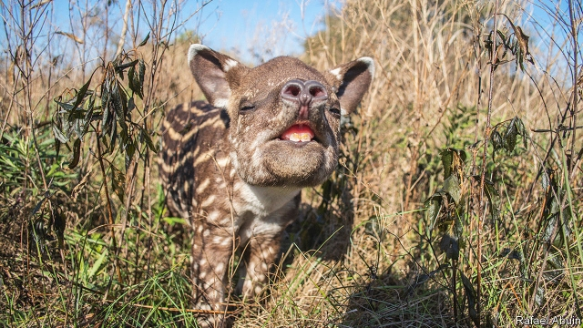

###### Conservation

# The rewilding movement is going from strength to strength 

 

> print-edition iconPrint edition | Science and technology | Feb 9th 2019 

TAPIRS ARE South America’s largest land mammals. They are one of six species Ignacio Jiménez and his team are trying to re-introduce to the Iberá project, a 7,500km{+2} wetland reserve in north Argentina, run by Tompkins Conservation, an American charity. Like jaguars, pampas deer, giant anteaters, macaws and peccaries (a type of wild pig), tapirs were driven extinct here years ago by ranchers and hunters. For now, to assuage the area’s ranchers, Iberá’s jaguars are confined to an island deep inside the reserve. The macaws, previously caged, have been taught to recognise danger (by exposing them to a stuffed conspecific being savaged by cats), to find fruit and to fly for distances longer than a few metres. And the tapirs, as the picture shows, are breeding successfully. The renewed presence of all these animals is part of a plan to restore the place to its prelapsarian glory—and thus lure eco-tourists to a poor corner of the country. 

Such “rewilding” is gaining currency among eco-entrepreneurs and ecologists. Its commercial appeal is obvious (“We are in show-business,” quips Mr Jiménez). Scientifically, it rests on the theory of trophic cascades. This holds that ecosystems are shaped by “apex consumers”—large herbivores and carnivores atop food chains. Remove them, as humans are wont to do, and the mixture of species lower down the food chain mutates, often to the detriment of biodiversity. When wolves were chased out of Yellowstone National Park, in the United States, for instance, unchecked deer outcompeted bison and beavers for food. The wolves’ return in 1995 rapidly unwound these changes. That success has spurred dozens of other projects. Iberá is one, though most are in Europe and North America. 

Not all rewildings turn out well. Oostvaardersplassen is a 56km{+2} piece of reclaimed land near Amsterdam. It has been populated with red deer, and also semi-feral cattle and ponies intended to fill ecological niches occupied by long-extinct aurochs and tarpans. The idea is to prevent an important bird habitat from overgrowing. But lack of predators and a run of mild winters pushed the number of these ungulates above 5,000. A harsh winter last year then starved two-thirds of them, fuelling a public backlash against perceived cruelty. 

As for Iberá, it was one of three projects graded by Aurora Torres of Martin Luther University, in Germany, in the first systematic attempt to measure rewilding’s progress, which was reported recently in the Philosophical Transactions of the Royal Society. The habitat was judged to have improved since rewilding began late last century, from 3.6 to 4.9 on a rewilding index that runs from zero to ten. The hope, eventually, is to make the area a national park. 

