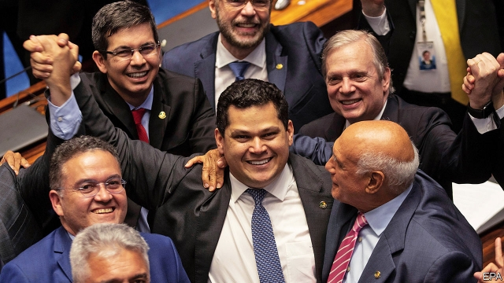

###### Davi v Goliath

# A congressional win for Jair Bolsonaro 

 

> print-edition iconPrint edition | The Americas | Feb 9th 2019 

BRASÍLIA IS FULL of secrets. Normally, one of them is how senators vote when they elect the president of their chamber. On February 2nd they delivered a shock. The favourite for the job was Renan Calheiros, who had won it four times. A skilled dealmaker from the north-eastern state of Alagoas, he faces probes into allegations of graft, which he denies. His candidacy provoked two days of tumult, with shouting and shoving in the chamber. Some senators declared their voting intentions on Twitter, where the hashtag #RenanOut was trending. In one vote, the 81 senators mysteriously cast 82 ballots. Realising he would lose, Mr Calheiros dropped out. 

This was a victory for Brazil’s populist president, Jair Bolsonaro, who won an election in October by campaigning against such leaders of the establishment as Mr Calheiros. No one can accuse the senate’s new president, Davi Alcolumbre (pictured), of being that. The 41-year-old first-time senator (elected in 2014) has a long political history in Amapá, another poor north-eastern state, but is barely known outside it. His party, the Democrats, supports the government. Rodrigo Maia, the new speaker of the lower house of congress, is also a member. Three Democrats are ministers. Mr Alcolumbre’s elevation is thus a good omen for the conservative social policies and liberal economic reforms that Mr Bolsonaro says he wants to enact. These include cuts to the growth of Brazil’s absurdly generous pensions. 

But the senate rebellion is also a sign of the risks the government could face if it loses public support. Mr Alcolumbre belongs to the “lower clergy” of backbench congressmen, as did Mr Bolsonaro before he became president. They have gained influence as grandees like Mr Calheiros have been tainted by scandals. That makes them less inclined to take direction from leaders of their parties. “The rules of the game have changed,” says Simone Tebet, a senator from the southern state of Mato Grosso do Sul. Although she belongs to the same party as Mr Calheiros, the Brazilian Democratic Movement, she voted against him. 

Many members of the lower clergy are new to congress. Roughly half of legislators are serving their first terms. They tend to be more loyal to their Twitter followers than to their party leaders. Felipe Rigoni, Brazil’s first blind congressman, says that he will support Mr Bolsonaro’s plans to reform pensions even though fellow members of the opposition Brazilian Socialist Party are likely to oppose them. They “are more blind than I am”, he says. 

In the new congress, “public opinion will be the key driver of legislative dynamics in a way it wasn’t before,” says Chris Garman of Eurasia Group, a consultancy. For now that favours Mr Bolsonaro, who has an approval rating of nearly 70%. That improves the odds that his two big policies, pension reform and a crackdown on crime and corruption, will get through congress. 

Until now, Mr Bolsonaro has been reluctant to curb pension spending, even though it crowds out other public spending and slows economic growth. But on February 4th details of an ambitious proposal leaked to the press. Share prices surged. 

Mr Bolsonaro is more gung-ho about the crime-fighting bit of his agenda, as are most Brazilians. On February 4th the justice minister, Sérgio Moro, presented his plans, which include tougher punishments for some criminals and milder ones for police who kill in the line of duty. That was well received. The hashtag #MoroinAction spread on Twitter. 

But public acclaim is fickle. One threat to it comes from investigations of people who served on the staff of Mr Bolsonaro’s son, Flávio, who was a state congressman in Rio de Janeiro and is now a senator. His driver and aide, Fabricio Queiroz, is under scrutiny for receiving 7m reais ($1.9m) in unexplained money transfers and for hiring the mother and wife of a fugitive former police officer accused of leading a criminal militia. He denies wrongdoing. If this scandal spreads, the government may yearn for the days when congressmen toed the party line. 

