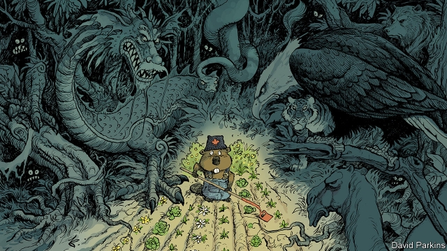

###### Learning survival skills

# Canada in the global jungle 

 

> print-edition iconPrint edition | The Americas | Feb 9th 2019 

ON FEBRUARY 4TH Canada was among friends. It hosted a meeting of the Lima group of a dozen countries, most of them Latin American, that are trying to find a solution to the crisis in Venezuela (see article). Justin Trudeau, Canada’s prime minister, pledged C$53m ($40m) in humanitarian aid. This is how Canada likes to conduct diplomacy, as an enthusiastic member of a team of countries that can accomplish more together than they would separately. It “exemplifies the approach we are taking around the world”, says Chrystia Freeland, Canada’s foreign minister. 

That approach is out of fashion. Under Donald Trump the United States belittles allies and undermines international institutions it had helped build. Undemocratic China and Russia throw their weight around. Canada is unhappy. The United States, its biggest trading partner by far, has slapped tariffs on Canadian steel and aluminium exports, preposterously citing “national security”. China, which ought to be a promising economic partner, is punishing Canada for arresting a Chinese executive at the behest of American prosecutors. China has arrested two Canadian citizens and sentenced another to death for drug-trafficking. “I can’t recall a government that has had to deal with so much geopolitical flux and an erratic US ally,” says Andrea Charron, a security specialist at the University of Manitoba. 

Canada’s instinct is to redouble its commitment to old principles rather than to adopt new ones. It remains a vocal defender of human rights, which pleases idealists but annoys despots. Ms Freeland says that one of her favourite new books is Robert Kagan’s “The Jungle Grows Back: America and our Imperilled World”, a gift from Germany’s foreign minister, Heiko Maas. It argues that jungle-like chaos is taking over the ordered garden created by the United States. Ms Freeland believes that Canada must fend it off as best it can. “The rules-based international order is powerfully in our national self-interest,” she says. 

Canada’s Liberal government is therefore sticking with the foreign policy it adopted when it took office in 2015, but tweaking it to take account of Mr Trump’s unpredictability. It has three main elements: to work with like-minded countries to shore up multilateral institutions; to invest more in the armed forces; and to diversify trade. The question is how well this will work in a jungle-like world. 

Since its founding as a confederation in 1867, Canada has sheltered under the protection of a superpower, first Britain and then the United States. At first, Canada resisted American influence. Confederation and the construction of the Canadian Pacific railway were attempts to avoid being swallowed whole. After 1988, when Canada signed a free-trade agreement with the United States (replaced in 1994 by the North American Free Trade Agreement, or NAFTA), resistance to American influence weakened. Relations with the United States became so cosy that Canadian diplomats referred to them as “intermestic”, a cross between international and domestic. 

“You don’t know what you’ve got till it’s gone,” sighs Ms Freeland, quoting a song by Joni Mitchell. Tensions began after the terrorist attacks in New York on September 11th 2001, when the United States tightened border controls. This dramatically slowed trade. They got worse with Mr Trump’s tariffs, which Mr Trudeau called “insulting”, and his demand for the renegotiation of NAFTA. The United States first struck a deal with Mexico, NAFTA’s third partner, which Canada reluctantly accepted. 

Foreign-policy boffins once fantasised about setting a truly independent course for Canada, but that now seems unrealistic. Few small countries succeed when they spurn their neighbours, notes Margaret MacMillan, a historian. The main example of a neighbour that has tried to break free of the United States’ influence is not an encouraging one: Cuba, which allied with the Soviet Union and is now a dictatorship with skimpy rations. 

One partial answer to Canada’s predicament would be to spend more on defence, a longstanding American demand that Mr Trump is especially keen on. Canada has raised military spending, from C$23.9bn in the 2015-16 fiscal year to an expected C$27.6bn this year. But that is just 1.2% of GDP, well short of the target of 2% that members of NATO have set themselves. The fiscal deficit is not much smaller than the defence budget, which means that Canada is unlikely to step up expenditure quickly. 

Demands on that spending, however, will rise rapidly. Climate change, which is warming the Arctic at a faster rate than southern Canada, has opened new waters to shipping. This is creating a new coast for Canada to defend. Last year the army started issuing new C-19 rifles to 5,000 Canadian Rangers, a reserve unit that patrols the Arctic. They replace Lee-Enfield bolt-action rifles of the sort used by Britain in the second world war. Such upgrades are unlikely to arrest the United States’ drift away from its established allies. 

Rather than sue for divorce, Canada is trying to widen its circle of friends. Ms Freeland hopes that coalitions of countries committed to international institutions, such as the World Trade Organisation (WTO), can protect them in the face of indifference or hostility from the United States. It belongs to a group of countries trying to fix the WTO’s dispute-resolution procedures in ways that will allay American objections to them. But such tactics face long odds. “I don’t think middle powers can sustain the world order without major players for very long,” says Roland Paris, a former foreign-policy adviser to Mr Trudeau. “But they could slow the decay.” 

Canada’s decades-old aspiration of reducing its economic dependence on the United States has made progress recently. In 2016 the government signed a free-trade deal with the European Union and last year it signed one with ten other Pacific countries, including Japan. With the NAFTA negotiations in the balance in July, Mr Trudeau signalled Canada’s ambitions for more such agreements by changing the trade minister’s title to minister for international trade diversification and appointing Jim Carr, a politician from Manitoba, to the job. He will not have an easy time. Relations with China are in a deep freeze. India, another potential partner, has turned frosty, in part because it believes that Mr Trudeau does not take seriously the threat to it from Punjabi separatists, some of whom live in Canada. 

Canada’s quest for new friends has not been helped by its defence of human rights and the rule of law. It irritated Saudi Arabia last August by demanding the release of two women’s-rights activists and again in January by giving asylum to a Saudi woman fleeing her family. In retaliation, Saudi Arabia’s crown prince ordered Saudi students to leave Canada. Polls show that Canadians want their government to stand up for human rights, says Ms Freeland. Russia has barred her from visiting since 2014 because she criticised its seizure of Crimea and warmongering in other parts of Ukraine. 

She seems undeterred. Canada has little choice but to defend the international order, Ms Freeland says. “The law of the jungle does not work for Canada.” 

