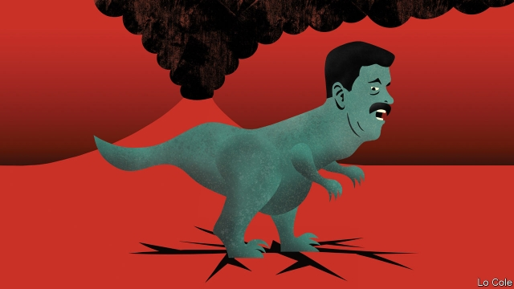

###### Bello

# The foundations of Venezuela’s regime are cracking, not yet collapsing 

 

> print-edition iconPrint edition | The Americas | Feb 9th 2019 

IT IS A fortnight since Juan Guaidó, the young speaker of the national assembly, proclaimed himself Venezuela’s caretaker president, triggering a co-ordinated push to topple the dictatorship of Nicolás Maduro. Hundreds of thousands of Venezuelans have demonstrated for that. More than three dozen countries, mainly in the Americas and Europe, have recognised Mr Guaidó’s putative government on the grounds that Mr Maduro’s second term, which began last month, is the product of a fraudulent election. The United States has imposed sanctions on Venezuela’s oil industry. 

The hope is that all this will persuade the armed forces to withdraw their support from Mr Maduro. Some officers, including two air-force generals, have backed Mr Guaidó. But so far the high command has stayed loyal. Mr Maduro is defiant. “The coup d’état they wanted has failed and they haven’t noticed,” he said on February 2nd. The longer this stand-off lasts, the greater the risks. One is that a frustrated American administration turns to military force, something that Donald Trump this month said remains “an option”. The other is that Mr Maduro survives in office, but rules a wasteland. 

The strategy of Mr Guaidó and the Trump administration is broadly backed by the Lima group of Latin American countries and Canada, and by much of the European Union. It combines a carrot, a stick and a conjuring trick, all aimed at persuading Venezuela’s army to flip. The carrot is an amnesty, approved by the national assembly, for military and civilian personnel who act “in favour of the restitution of democracy”. 

The stick is American sanctions aimed at asphyxiating Mr Maduro’s regime economically. The United States was almost the only cash payer for Venezuelan oil. The administration has set April 28th as a deadline for Americans to cease dealings with Venezuela’s state oil monopoly. Until then, it will divert payments for oil to an account reserved for a future democratic government. The sanctions are biting: several dozen oil tankers are idling off Maracaibo, Venezuela’s oil capital, reports the Wall Street Journal. 

The conjuring trick is to act as if Mr Guaidó were running the country. The Trump administration largely ignored Mr Maduro’s rupture of diplomatic relations. It is now organising humanitarian aid for Venezuela’s impoverished population. The Americans are delivering food to a collection point at Cúcuta, a Colombian city close to the Venezuelan border. Mr Maduro rejects this, saying “we are not beggars.” Marco Rubio, a Republican senator who influences Mr Trump’s policy, hopes this will force the army to choose “to either help food and medicine reach people, or help Maduro instead”. The army has reportedly blocked the first shipments. 

What happens if Mr Maduro doesn’t fold? He still has support: from Cuba, Russia and Turkey, as well as from the military commanders. Some in Venezuela still believe in his tropical socialism. Others stay loyal out of fear, or because they have enriched themselves through corruption. His opponents have long underestimated his regime’s determination to cling to power. Some outsiders worry that there is too much stick and not enough carrot: by ending military co-operation with Venezuela, Lima group members have closed a channel of communication with the high command. (Brazil’s army has not followed its government in this.) The sanctions will hasten the economy’s collapse, prompting more Venezuelans to emigrate. 

Mr Maduro’s opponents have no credible Plan B. “There’s an idea that you hear a lot in Washington that it’s now or never,” says Michael Shifter of the Inter-American Dialogue, a think-tank. “My concern is whether they’ve boxed themselves in.” Almost nobody in Latin America wants military action. The risk of it prompted the EU to set up a “contact group” to facilitate “a peaceful and democratic solution”. Many well-meaning outsiders call for a compromise, in which Mr Maduro’s government plays a role in achieving a free presidential election. That is a wonderful illusion. Mr Maduro was offered such a deal last year and rejected it. The national assembly rejects “any talks or contact group that prolong the suffering of the people”. 

Venezuela has the makings of a broader international crisis. Subjected to such sustained financial pressure, Mr Maduro could buckle any day. But he might not. For now, the Venezuelan people’s plight recalls a one-line short story by Augusto Monterroso, a Guatemalan writer: “When he woke up, the dinosaur was still there.” 

