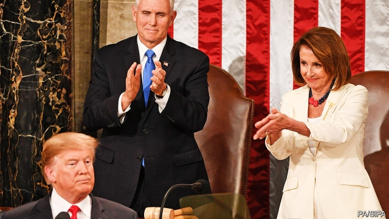
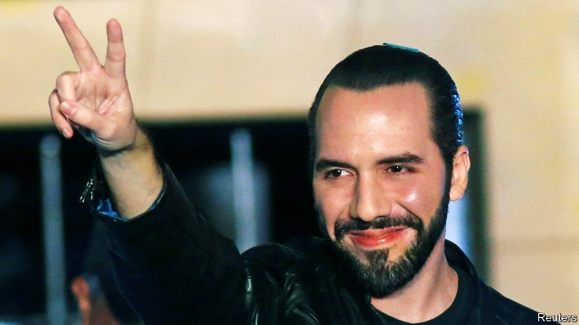

###### American politics

# Politics this week 

 

> Feb 9th 2019 

Donald Trump gave his state-of-the-union speech to Congress, delayed by a week because of wrangling over government spending. He again called for tougher curbs on illegal immigration, calling it a “moral duty”. He also said that any new trade deal with China “must include real, structural change to end unfair trade practices…and protect American jobs”. In a rare cordial moment, Mr Trump welcomed the record number of women in work, drawing whoops and cheers from Democratic congresswomen, who had dressed in white for the occasion. See article. 

Virginia’s state government seemed unable to find anyone to run the place who has not either applied boot polish to his face while at college or been accused of sexual assault. Ralph Northam, a Democrat who was initially unsure whether he was one of those depicted in a photo of a man in blackface and another in Ku Klux Klan robes, remains the state’s governor. See article. 

Cory Booker joined the race to become the Democrats’ presidential nominee in 2020. The first black senator to represent New Jersey, Mr Booker is the fourth heavy-hitter to enter the campaign. 

French warplanes bombed a convoy carrying rebels who had crossed into Chad from Libya. The air strikes in support of Chadian troops are a sign of the willingness of France to use force to prop up the government of Idriss Déby, one of its more important regional allies in the fight against jihadists. 

The government and rebel groups in the Central African Republic signed a peace deal aimed at ending more than five years of fighting. Their conflict broke out in 2013 after Islamist groups overthrew the then government. 

The armed forces of Burkina Faso said they had killed 146 jihadists near the border with Mali. Security in the country has deteriorated since a jihadist uprising in Mali in 2012. 

 

Pope Francis celebrated mass in Abu Dhabi, the capital of the United Arab Emirates. It was the first visit by a pope to the Arabian peninsula, the birthplace of Islam. The pope lamented the region’s wars, including the one in Yemen, where the UAE is involved. He also called on Gulf countries to allow more members of religious minorities to become citizens. See article. 

Robert Biedron, Poland’s first openly gay mayor, founded a new pro-EU party to contest the European Parliament elections in May. The party, Wiosna (“Spring”), supports higher social spending, civil partnerships for gay couples and ending Poland’s reliance on coal. It is polling at about 10%. 

The EU established a special-purpose corporation to help it evade sanctions that America has imposed for doing business with Iran. The company, Instex, will co-ordinate barter exchanges to allow Iran to do business with companies from European countries still participating in the nuclear non-proliferation deal, from which America withdrew last year. 

For the ninth week, tens of thousands of protesters in Serbia called on Aleksandar Vucic to resign as president. He has offered to hold elections, but the demonstrators want a fairer election law and more media time for the opposition. 

Donald Trump confirmed that he would hold a second summit with Kim Jong Un, North Korea’s dictator, in Vietnam in late February. Mr Kim has done little to fulfil his pledge at the pair’s last meeting in Singapore to give up his nuclear weapons. 

Australia cancelled the residency permit of Huang Xiangmo, a property developer with ties to the Chinese government. Mr Huang has given generous donations to politicians who express pro-China views, as well as to Australia’s two biggest political parties. 

Indian officials resigned in protest at what they saw as the government’s attempts to suppress unflattering economic data. They say unemployment is at a 45-year high of 6.1%. The government says it is reviewing the data. 

The British government approved the extradition of Vijay Mallya to India, the next stage in a process that started in 2016 when the beer-and-travel tycoon fled to Britain to escape criminal charges related to the collapse of Kingfisher Airlines. Known as the “King of Good Times” both for what he sells and for how he lives, Mr Mallya denies the charges. 

A textbook on constitutional law written by Zhang Qianfan, one of China’s leading legal scholars, was removed from the country’s bookshops for promoting Western ideas such as the rule of law. A recent edict requires universities to report any books on the topic to the authorities. China’s constitution nods to freedom of speech and religion, but in practice the Communist Party’s wishes trump it. 

A dozen members of the EU, including Germany, France and Britain, recognised Juan Guaidó, the leader of Venezuela’s legislature, as the country’s interim president. They acted after Nicolás Maduro, who won a rigged election in May, failed to meet a deadline for calling a proper ballot. Most Latin American democracies back Mr Guaidó. (Venezuela’s constitution makes him interim president if the post is not legitimately filled.) Venezuela’s army moved to block the delivery of food aid, which might fill empty bellies but would also embarrass the regime. See article. 

Brazil’s justice minister, presented a plan to get tougher on criminals and go easier on cops. Police who kill in the line of duty may escape punishment if they acted out of “fear, surprise or violent emotion”. A judge convicted Brazil’s former president, Luiz Inácio Lula da Silva, who is already serving a 12-year sentence for corruption, on an additional corruption charge and added a sentence of nearly 13 years.  

 

Nayib Bukele won El Salvador’s presidential election. His victory ends three decades of power alternating between the left-wing FMLN and right-wing Arena parties. Mr Bukele, who is 37, has promised to fight corruption and to prevent violence by creating jobs. He also favours nicer public parks. 

A bill was proposed in Hawaii to raise the legal smoking age to 100. After that Hawaiians would be free to light up. 

