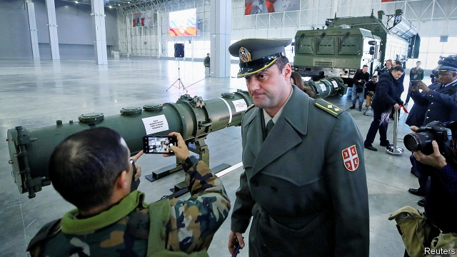

###### Trick or treaty

# America calls time on the INF treaty, ushering in a new age of missiles 

 

> print-edition iconPrint edition | United States | Feb 9th 2019 

PATRIOT PARK in Kubinka, 60km south-west of Moscow, is a military Disneyland. Families can picnic among rows of Soviet-era aircraft. Children can frolic over tanks. Those doing so on January 23rd might have noticed a long green tube, studded with ridges and dials, roped off and watched by stern guards. This was not an exhibit. It was, supposedly, the canister for the 9M729 missile. Its launcher, an imposing truck, stood nearby, as Lieutenant-General Mikhail Matveyevsky, Russia’s missile chief, pointed to a diagram of the missile’s innards. “All tests of surface-to-surface missiles,” he declared, “were conducted to a range that is less than the INF [Intermediate-Range Nuclear Forces] treaty limit.” 

The show-and-tell did not impress America, whose diplomats had turned down an invitation to the theme park. On February 1st America declared it would pull out of the INF treaty. It is exasperated not only with ten years of Russian cheating but also with the rapid growth in China’s unshackled arsenal of over 2,000 missiles, 95% of which are of the range forbidden to America. “If Russia’s doing it and if China’s doing it, and we’re adhering to the agreement,” complained Donald Trump in October, “that’s unacceptable”. The pact will die once America’s six months’ notice expires in the summer. “The likelihood of compromise is zero,” says Adam Thomson, Britain’s envoy to NATO until 2016. 

That brings over 30 years of arms control to a close. The INF treaty was forged in 1987 to defuse a missile race between America and the Soviet Union. Intermediate-range nukes were appealing because they could hit key targets while remaining a safe distance away from the front line, without resorting to intercontinental ballistic missiles (ICBMs). Appealing, but dangerous: ICBMs took 30 minutes to reach their targets; mid-range missiles got there in under ten. “It was like holding a gun to our head,” remarked Mikhail Gorbachev. He and Ronald Reagan agreed to scrap all such land-based missiles, conventional and nuclear. 

By the 2000s the treaty began to chafe Russia. Its decrepit armed forces could not afford modern warships, submarines and warplanes to carry plentiful missiles, whose utility America had demonstrated with bombing campaigns in the Middle East and the Balkans. To Russia’s south and east, countries like Israel, Iran, China and Pakistan were accumulating land-based missiles. In 2005 Russia’s defence minister proposed that the treaty should be junked. Not long after came Russia’s first test of the 9M729. Since 2016 four battalions, roughly 100 missiles, have been deployed to two bases east of the Ural mountains and near the Caspian sea. “The 9M729 is core to Russian military thinking in terms of what they need to fight a regional war,” says Pranay Vaddi, who worked on the issue for the State Department until October. 

American officials may decry the cheating. But they surely sympathise with the impulse. In recent years Pentagon officials have fretted over a widening missile gap in the Pacific. “China has a massive advantage over us,” says a former American army official. “It cannot be overstated how important it is that we can field precision-guided missiles, unlimited by range.” 

The INF treaty does not prohibit putting intermediate-range missiles on ships, submarines and aircraft. But these are expensive (a modern destroyer costs $1.8bn), demand manpower and have other things to do. Hence the appeal of land-based missiles. “A mobile TEL requires a couple of drivers and operators,” says the former official, referring to the transporter-erector-launcher trucks used to fire missiles. “It is virtually impossible for the enemy to find.” 

In a review of American nuclear posture last year, the Trump administration said it would respond to Russia’s violation of the INF treaty by building a nuclear-tipped sea-launched cruise missile (which would be INF-compliant) and reviewing “concepts and options” for a conventional land-based one (which would not be). But a deployable weapon is some way off. 

The US Army is already working on a Precision Strike Missile (PrSM) due in 2023. Its range could easily be extended beyond the current INF ceiling of 499km. But even twice that would not get from Warsaw to Moscow. A longer-legged option would be to tweak the sea-based Tomahawk to fire from land; that is what America did during the INF crisis in the 1980s to produce the 2,500km-range Gryphon. 

But Pacific geography is forbidding. Guam, the likeliest host for American missiles in Asia if Japan demurs, is over 3,000km away from Shanghai. An entirely new missile would be required. Hypersonic boost-glide missiles, which skip off the atmosphere at great speed, might fit the bill. But ground-launched ones are years away. Democrats, who took control of the House in January, have taken a dim view of the swelling defence budget. They may query why the Pentagon cannot make do with air- and sea-launched systems already in the pipeline. 

Nor is it obvious where new missiles would be put in Europe. Though NATO strongly backed America on February 1st, declaring that “Russia will bear sole responsibility for the end of the treaty,” its members will be less keen on welcoming missiles, even non-nuclear ones. 

A few allies, like Poland, which is trying to seduce Mr Trump into setting up a new tank base, would probably embrace American arms on their soil. But a deal with Poland struck over NATO’s head would compound anxiety over America’s commitment to the alliance. It might also be seen as destabilising. “Missiles deployed on the territory of newer NATO members could reach Russia’s main command points in less than five minutes,” notes Pavel Zolotarev of the Russian Academy of Sciences. That, he warns, would allow the “destruction of its critical infrastructure without the use of nuclear warheads.” In a crisis, a jittery Russia would not necessarily make wise choices. 

Another option for NATO would be to rejig the American-led missile-defence shield in Poland and Romania so that it could cope with Russian cruise missiles like the 9M729, rather than just Iranian and North Korean ballistic ones. Yet that might provoke an even bigger fight in NATO. 

The death of the INF treaty marks “the end of the post-cold war era,” says Bruno Tertrais of the Foundation for Strategic Research, a French think-tank. What is clear is that the Trump administration has pulled the plug without a clear sense of how to navigate the era to come. 

