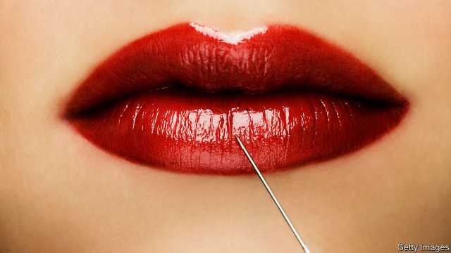

###### Narcissism

# Botox bars are coming to a city near you 

 

> print-edition iconPrint edition | United States | Feb 9th 2019 

“YOU CAN change someone’s life with a bit of lip,” says Dr Alexander Blinski, the co-founder and chief medical officer of Plump Cosmetics and Injectables, a beauty salon in New York. His practice, which feels more like a cross between a cupcake shop and a SoulCycle studio than a place where people willingly go to let needles full of neurotoxins gently paralyse the muscles in their faces, is one of a growing number of establishments in America aimed at making injectable cosmetic treatments seem less clinical. 

“West Coast Lips” are a favourite. With 20% more volume than “East Coast Lips”, they are fuller and appear more enhanced than the subtle, work-with-what-you’ve-got plump of their east-coast cousin, which is more rosebud than rhododendron. “Instaready Cheeks” are another popular treatment among those who want a more influencer-worthy contour to their jowls. They are achieved with a dose of an injectable filler and cost just over $1,000. More modestly priced treatments include the “Goodbye Gummy Smile”, which restrains the muscles in the upper lip, and is for those who want to flash more white in their posts. A $2,000 treatment helps those who wish to minimise their underarm sweat production in ways that the humble antiperspirant has yet to master. 

Celebrities like the Kardashians, Bella Hadid and the Real Housewives are credited with the mainstreaming of injectables, which are the most common minimally invasive cosmetic procedure performed, according to data from the American Society of Plastic Surgeons. Clients are mostly millennials in search of a plumper pout, but also include daughters who bring their mothers, wives who bring their husbands, Wall Street bankers keen to banish an angry-looking furrowed brow or drag queens in search of more dramatic cheeks. 

“I liked that the filler was natural-looking—I didn’t want to look like a balloon or like I lived in Los Angeles,” says Richelle Oslinker, a patient of Dr Blinski’s. Nate Storey, a magazine editor, decided to get a few shots around his 30th birthday. He did so because his preferred hairstyle—a man bun—gave him no place to hide the wrinkles creeping across his forehead. 

Although nearly 10m of these procedures were performed in America in 2017, there is reason to approach them with prudence. The main ingredient in Botox, which is generally used in the upper third of the face, is derived from the substance that causes botulism. The two most common injectables are Botulinum Toxin Type A (commonly marketed as Botox) and soft-tissue fillers. 

Botox is often referred to as the “gateway drug” to soft-tissue fillers, which are generally used in the lower two-thirds of the face. Many are made from naturally occurring substances like hyaluronic acid—which is found in the human body, especially in the fluid around the eyes and joints—but they can have serious side-effects. If accidentally injected into a blood vessel, for instance, they can cause tissue death, permanent blindness or a stroke. 

Botox generated $3.2bn in worldwide sales in 2017, which were buoyed by a multimillion-dollar marketing campaign starring a retired American football player, Deion Sanders. This was an attempt to increase its use among men, who are estimated to make up 15% of the cosmetic injectable market. Revenue from the neurotoxin is expected to reach $4.5bn by 2024. Plump, one of the biggest users of Botox in America by volume, has recently opened its second injectables bar in New York City, with plans to expand to Miami. 

