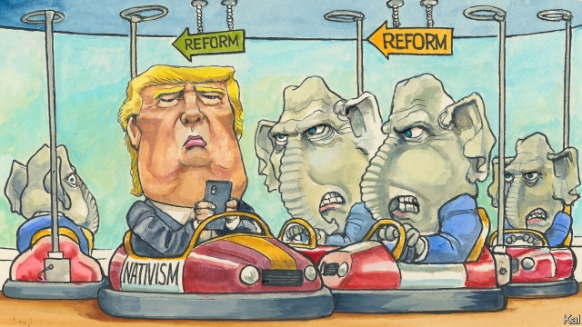

###### Lexington

# Donald Trump is the main barrier to the revision of conservatism 

 

> print-edition iconPrint edition | United States | Feb 9th 2019 

IN HIS SECOND state-of-the-union address this week Donald Trump invited the Democrats to help him cut prescription-drug prices, provide paid family leave and splurge on infrastructure. Most commentators understandably viewed this plea for bipartisanship with scepticism. Shortly after last year’s speech the president accused Democrats of “treason” for failing to applaud him. Hours before this year’s he described Chuck Schumer, the Democratic leader in the Senate, as a “nasty son of a bitch”. 

Yet the more remarkable thing about Mr Trump’s wishlist is how anathema its items, all signature promises of his election campaign, remain to the Republican establishment he has presided over for more than two years. In domestic policy, at least, the makeover of conservatism he promised, with his disdain for orthodoxy, flexible view of government and professed concern for the losers of globalisation who flocked to his rallies, has not happened. He needs Democrats to fulfil his heterodox promises mainly because the Republicans would not. 

The same resistance to his populist socioeconomic agenda is apparent across the conservative intelligentsia. No important think-tank has taken it up. The grandiose American Enterprise Institute is still plugging away at the small governmentism its donors love. The once-mighty Heritage Foundation has become an uncritical cheerleader for the administration’s tax-cutting and nativism. One or two smaller centre-right shops are doing interesting work, for example the R Street Institute’s on organised labour. Yet instead of steering into Mr Trump’s agenda, they are tending to veer off it. Progress on the rethinking of Reaganite shibboleths that his campaign promised has been scattered and rare. The hoopla generated by a recent book on labour markets by Oren Cass of the Manhattan Institute, which made a conservative case for wage subsidies and other interventions to promote the dignity of work among strugglers, was both justified and indicative of this. It highlighted the broader lack of progress on what was predicted to be the major intellectual challenge posed by Trumpism. “It has not been a productive time,” concedes Yuval Levin, a scholar who is no fan of Mr Trump although a proponent of the ideological refresh that the president had appeared to want. 

A comparison with past political realignments makes the low-energy thinking of the Trump era even plainer. The Reagan revolution was fuelled by years of intellectual ferment and more or less scripted by Heritage. The case for Bill Clinton’s shift to the centre was made by the Progressive Policy Institute, his “idea mill”. Such examples emphasise how peculiar the Trump insurgency is. Reagan and Mr Clinton were messengers of a new politics that had already put down deep roots in their parties. Mr Trump, by contrast, caught most conservative thinkers unawares. At best they were therefore always going to take time to adjust to the questions he posed. Yet the reality has turned out to be much worse than that. Instead of fostering an overdue spirit of reform, in a party that has lost the popular vote in four of the past five presidential elections, Mr Trump has emerged as the main barrier to it. 

This is most obviously because he ditched many of his iconoclastic ideas the moment he took office. Instead of the tax rise on high earners he promised, he backed a plutocratic tax cut. Instead of supporting universal health care, he tried to dismantle Obamacare. In part an exercise in self-preservation—because Mr Trump needs Republican leaders to instruct him and defend him against the investigations he faces—this ensured most learned nothing from his rise. Pre-Trump, the most powerful case for reform was proposed by a group known as reform conservatives that included Mr Levin, who argued that Republicans could not win without refreshing Reaganism. Mr Trump has offered an even more powerful riposte to that. His method—campaign for the base, govern for the elite, and maintain unity through a mix of partisanship and nativist dog-whistling—has proved unpopular. Yet it gave Republican leaders a historic opportunity to pursue hard-right policies, which they will want to reprise, if necessary by the same means. 

The intellectually chilling effect of Mr Trump is even starker among those who actually wanted the sorts of populist revisions he once promised, the former “reformicons”. Presented with a choice of embracing Mr Trump’s disruption, nativist warts and all, or defending the unreformed status quo against nihilism, the group splintered. Some of its members, including the journalists David Frum and Ramesh Ponnuru, are prominent Never Trumpers. Meanwhile, those who have stuck by or close to Mr Trump have been tarnished. Marco Rubio, a shy reformicon during the 2016 Republican primary, has to his credit doubled down: he is a rare Republican fan of paid family leave. Yet the senator’s efforts to defend Mr Trump—including over his policy of locking up immigrant children—has damaged his credibility with nonpartisans without obviously boosting his arguments for reform among Republicans. 

No wonder many conservative thinkers prefer to avoid the administration altogether. “Trump has made whole areas of policy radioactive,” says Stuart Butler, a scholar at the Brookings Institution who, while at Heritage during the 1980s, was involved in developing Reaganism. His response is to focus on state government and other areas where Mr Trump is absent. 

By stifling and discrediting the most interesting aspects of his own agenda, Mr Trump risks causing his party long-term damage. His combination of tax cuts and border walls is a losing strategy that the next Republican presidential nominee is nonetheless likely to pursue. The absence of much new thinking on the centre-right alone suggests that. What a wasted opportunity it is. Were it not for Mr Trump, reform-minded conservatives would probably be cutting a far more Trumpian path (loosely defined) than they are now. Their petrified ideology would be better for it. 

