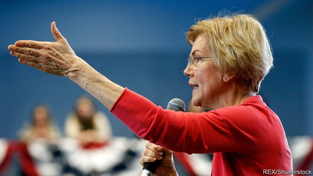

###### The ideas primary

# Elizabeth Warren’s unusual brand of wonkish populism 

 

> print-edition iconPrint edition | United States | Feb 9th 2019 

ELIZABETH WARREN, the Massachusetts senator known best for railing against big banks and billionaires, was a registered Republican for a spell in the 1990s. It is an odd bit of biography for Mrs Warren, who is now running for president as a Democrat, and is routinely caricatured as the anti-capitalist Antichrist. Unlike Bernie Sanders, who proudly describes himself as a socialist, Mrs Warren has said she is “a capitalist to my bones.” 

Government, she thinks, should be in the business of repairing market failures. She wishes to arrest inequality not just through redistribution, by boosting welfare and entitlement spending, but “predistribution”, which means rewriting rules that contribute to lopsided incomes in the first place. A brainy wonk with a populist edge, she has pumped out ideas that are at times brilliant, at others outlandish, but seldom half-baked or easily dismissed. 

The best way to understand Mrs Warren’s worldview is to examine her academic work. Before she went to Washington, she was a law professor at Harvard (having grown up working-class in Oklahoma) preoccupied with the study of debt, credit and bankruptcy. Her scholarship began as an exploration of middle-class financial instability. She published research in the early 2000s revealing an extraordinary increase in bankruptcy filings—430% over two decades—with many by middle-class families. Mrs Warren showed that the combination of precarious family finances with poorly regulated markets created opportunities for predatory lending, says Elisabeth Jacobs, the senior director for family economic security at the Washington Centre for Equitable Growth, a left-leaning think-tank. 

In “The Two-Income Trap”, a book written with her daughter in 2003, Mrs Warren explored the reasons for this. Even though more women were going to work, boosting household incomes, family finances were increasingly fragile. Armed with second incomes and deregulated credit instruments, these families bid up the cost of housing in areas near good schools, making them more vulnerable financially, rather than less. Interestingly, one of her proposed solutions at the time was a universal school-choice voucher to try to decouple housing and schooling, an intriguing idea that would be less than welcome in contemporary Democratic circles. 

That book was a nod towards Mrs Warren’s future fixations. In it, she also introduced her toaster analogy: no regulator would allow the sale of a toaster with a one-in-five chance of burning down a house, yet there is no similar concern over mortgages with a one-in-five chance of wrecking a family’s finances. This would become the founding metaphor for the Consumer Financial Protection Bureau, a federal agency which was her brainchild and catapulted her from academic obscurity to national fame. 

Since winning her Senate seat in 2012, Mrs Warren and her staff have busied themselves publishing proposals on taxation, corporate governance, lobbying, housing and health care. She proposes a wealth tax on those with fortunes above $50m to stymie the growth of inequality and fund other programmes. Thomas Piketty, the French economist who wrote “Capital in the Twenty-First Century”, has long advocated a similar policy. An accompanying analysis by Emmanuel Saez and Gabriel Zucman, two economists and collaborators with Mr Piketty, suggests that such a tax would raise $2.75trn over 10 years. Their assumptions are probably too rosy—the wealthy are good at avoiding taxes, and determining the size of fortunes is trickier than tracking annual incomes. Mr Piketty’s native France has ditched its wealth tax. 

To “predistribute” income Mrs Warren would give more economic power to workers, imitating German industry by letting workers elect at least 40% of the seats on corporate boards. Importing the German context of less adversarial labour relations would prove harder. 

When it comes to fixing America’s health-care system—perhaps the industry most plagued by market failure—Mrs Warren is more cautious than some other prominent Democrats. She has offered proposals to shore up the insurance exchanges set up under Obamacare. She has also put forward legislation which would inject competition into the generic-drugs market, which is rife with anti-competitive behaviour, by setting up a public manufacturer of drugs. Yet she also co-sponsored Mr Sanders’s “Medicare for all” bill, which would upend the American health system, transforming it into a single-payer model by eliminating private health insurance and rapidly increasing taxes. The two approaches cannot coexist. But paying fealty to left-of-centre slogans that stand little chance of becoming law may be the price of running in the Democratic primary. 

Mrs Warren’s most intriguing plans concern housing. High rents in productive cities limit opportunity and economic growth. Fixing this with federal policy is difficult, since planning laws are so decentralised. Mrs Warren proposes to coax cities into changing restrictive development rules for a share of a large pot of money—$10bn in total—while also funding large public-housing developments. A paper by Mark Zandi, chief economist for Moody’s Analytics, claims that this could bring rents for low-income families down by 10%. She also wants the federal government to assist first-time homebuyers in formerly segregated neighbourhoods. 

On matters of trade and foreign policy, Mrs Warren’s thinking is less sophisticated. She applies her domestic mantra—that market failure and corporate greed are the taproots of dysfunction—to international affairs, with peculiar results. If the American economy is rigged, then trade deals are meta-riggings of the global economy, crafted by multinational firms to weaken American labour relative to capital. 

In a recent essay for Foreign Affairs, Mrs Warren sketched out a foreign-policy manifesto of sorts. It includes standard stuff for Democrats: a dislike of foreign entanglements and a suspicion that defence spending is inflated. But she also struggled to escape domestic concerns. Her bold new proposal is that “US foreign policy should not prioritise corporate profits over American families”. Daniel Drezner, a professor at Tufts University, describes this as “Trumpism with a human face”. 

