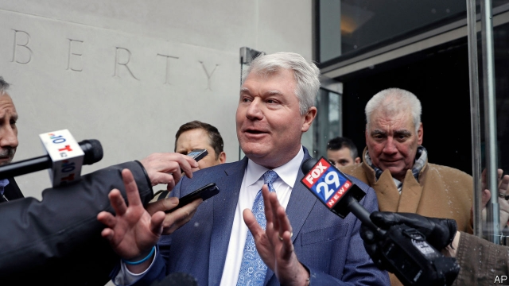

###### Union shenanigans

# Philadelphia politics are stuck in the era of prog rock 

 

> print-edition iconPrint edition | United States | Feb 9th 2019 

PHILADELPHIA’S CITY HALL is an immense 700-room building, even taller than the Capitol in Washington, DC. A statue of William Penn, the city’s founder, stands on top of it. Until 1987 no building in the city was higher than the top of Penn’s hat. High-rises now dwarf the statue. John “Johnny Doc” Dougherty, head of the Local 98 electrical union, has long helped shaped Philadelphia’s politics as well as its skyline. How he did so is outlined in a 160-page federal indictment, containing 116 counts of embezzlement, fraud and public corruption, which reads like a relic from the mid-1970s. 

“I got a different world than most people ever exist in. I am able to take care of a lot of people all the time,” said Mr Dougherty, in a conversation caught by an FBI wiretap. The indictment alleges that he and seven pals, including a city councilman, embezzled more than $600,000 of union money, collected from members’ dues, to fund personal shopping sprees, a $20,000 security system and dinners in New York and Atlantic City, among other things. 

As well as controlling the electrical union, Mr Dougherty is head of the building trades council, which represents 50 local unions. If a construction site attempted to use non-union workers, he ordered a giant inflatable rat to be put outside. He funnelled millions of dollars to help Democrats. His support helped two mayors win elections, including the incumbent, Jim Kenney. His brother, Kevin Dougherty, won a state Supreme Court seat with union help, then helped strike down the state’s congressional map for being unconstitutionally gerrymandered. 

Donating to campaigns, boosting candidates and supporting policies are not illegal. But Mr Dougherty’s clout went further. Bobby Henon, who was also indicted on January 30th, stayed on the union payroll even after he was elected to the city council. This is not illegal either, but the indictment alleges that he used his position to do Mr Dougherty’s bidding. In 2016 Philadelphia became the first big city to impose a tax on fizzy drinks. Text messages between the two men indicate that Mr Henon’s position was part of a vendetta against the Teamsters union, which feared the loss of delivery jobs. According to the indictment, Mr Dougherty said to a union official: “Let me tell you what Bobby Henon’s going to do…put a tax on soda again and that will cost the Teamsters 100 jobs in Philly.” The lowest point in the indictment describes Mr Dougherty allegedly strong-arming a children’s hospital because the manufacturer of an MRI machine required its own (non-union) workers to install it. 

Mr Dougherty pleaded not guilty to all charges. It is a municipal election year and politicians still need his money and his members to get out the vote. They also suspect he is vengeful. According to the FBI, Mr Dougherty once got Mr Henon to investigate a towing company that seized his car. He remains head of his union. 

Still, if he is convicted, that would shake up the “Democratic party’s wheezing political machine”, says David Thornburgh of the Committee of Seventy, a government watchdog. In any case, he may be Philadelphia’s last powerful local union leader. The national ironworkers’ union has already taken control after its local leaders ordered a Quaker Meeting house, built by non-union workers, to be torched. The national carpenters’ union also kicked out the city’s union leader, who had led the local branch since 1981. Mr Dougherty has damaged the local’s reputation. Members may have difficulty securing work and contracts. Who’s the rat now? 

