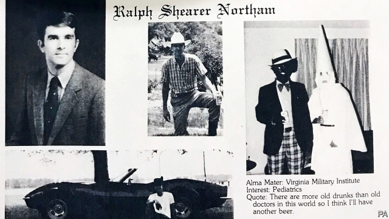

###### Inappropriate circumstances

# What is it with shoe polish in Virginia? 

##### Scandals ensnare the state’s top three elected officials 

 

> Feb 7th 2019 

 

AS THE ECONOMIST went to press, consumer-protection offices in Virginia had not yet announced plans to affix a sticker to every canister of shoe polish sold in the state reading “FOR FOOTWEAR, NOT FACES”. That the stuff should be used to brighten shoes rather than darken faces may seem obvious to most, but not to Ralph Northam and Mark Herring, respectively Virginia’s governor and attorney-general, both Democrats. 

On February 1st, a website released Mr Northam’s page from his 1984 medical-school yearbook, on which a picture showed a man in blackface grinning next to a man in a Ku Klux Klan outfit. One of Mr Northam’s former classmates, angry at the governor’s clumsily worded defence of a bill loosening restrictions on abortion, reportedly alerted the website to the page. 

Over the next two days, Mr Northam provided an object lesson in how not to respond to a political crisis. Shortly after the picture emerged, he apologised for “the decision I made to appear as I did” (he did not say whether he was in Klan robes or blackface). During a surreal press conference he then said that in fact he was not in the picture, though he admitted to once having “darkened my face as part of a Michael Jackson costume.” He appeared ready, after a reporter’s question, to start moonwalking, until his wife leaned over and whispered: “in appropriate circumstances.” 

Democrats from Nancy Pelosi to Mr Herring have urged him to resign. He has so far resisted, and is reportedly considering leaving the Democratic Party and serving out the rest of his term (Virginia governors cannot run for a second consecutive term) as an independent. If he steps down, he will be replaced by Justin Fairfax, the 39-year-old, African-American lieutenant-governor, also a Democrat. 

But Mr Fairfax has problems of his own: Vanessa Tyson, a university professor, said he sexually assaulted her at the Democratic National Convention in 2004. Mr Fairfax admitted to knowing Ms Tyson, but said that she was “very much into a consensual encounter.” Ms Tyson said that he physically forced her to perform oral sex. 

Should Messrs Northam and Fairfax both resign, Mr Herring is next in line. But on February 6th, Mr Herring admitted that he too attended a party in wigs and blackface, “dressed like rappers we listened to at the time, like Kurtis Blow.” Mr Herring apologised profusely, and left open the possibility of resignation, but for the moment he too remains in office. 

If all three leave then Kirk Cox, the Republican House speaker of Virginia’s General Assembly, would become the state’s governor. Mr Cox holds the speakership because Republicans won a 51-49 majority in the lower House after the state’s board of elections drew a name out of a hat in a district where the Democratic and Republican candidates received exactly the same number of votes. Mr Cox, assuming he was never photographed in blackface, would then get to appoint a lieutenant-governor, and the Republican-controlled legislature would elect an attorney-general. 

Republicans, who have not won a statewide race in Virginias since 2009, are salivating at the prospect of claiming all three top posts. But as long as they line up behind a president whose record on race or groping is not exactly woke, their condemnations of Messrs Northam, Fairfax and Herring may ring a little bit hollow. 

Yet if the Democrats’ position is that doing something offensive while in university renders someone unfit to hold office, regardless of whether his attitudes and political views have since changed, they risk setting an impossible standard. Perhaps their current zeal mirrors the lack of it across the aisle: Democrats may feel that they must be less forgiving because Mr Trump has made the previously unsayable acceptable. Perhaps the three accused men have also taken a lesson from the president: that if they hunker down and withstand the outrage, the news cycle will eventually move on to fresher meat. 

-- 

 单词注释:

1.inappropriate[.inә'prәupriәt]:a. 不适当的, 不相称的 

2.ensnare[in'snєә]:vt. 以陷阱捕捉, 诱入圈套, 诱捕 

3.feb[]:abbr. 二月（February） 

4.economist[i:'kɒnәmist]:n. 经济学者, 经济家 [经] 经济学家 

5.Virginia[vә'dʒinjә]:n. 弗吉尼亚 

6.affix[ә'fiks]:vt. 使附于, 署名, 粘贴, 盖印于 n. 附加物, 词缀 

7.sticker['stikә]:n. 屠夫, 尖刀, 刺, 芒, 尖物, 携带尖刀者, 张贴物, 滞销品, (非正式)难题 [经] 呆滞商品 

8.canister['kænistә]:n. 罐, 筒, 霰弹 [机] 罐, 滤毒罐 

9.footwear['fjtweә(r)]:n. 鞋类, 靴类 

10.darken['dɑ:kn]:vt. 弄暗, 使模糊 vi. 暗下来, 颜色变深 

11.Ralph[reif, rælf]:n. 拉尔夫（男子名） 

12.northam[]: [人名] 诺瑟姆; [地名] [澳大利亚、南非共和国、英国] 诺瑟姆 

13.herring['heriŋ]:n. 青鱼, 鲱 

14.democrat['demәkræt]:n. 民主人士, 民主主义者, 民主党党员 [经] 民主党 

15.yearbook['jiәbuk]:n. 年鉴 

16.blackface['blækfeis]:n. 粗黑体字 

17.grin[grin]:n. 露齿笑 v. 露齿而笑 

18.ku[]:abbr. 堪萨斯大学（University of Kansas）；科威特航空公司（Kuwait Airways）；哥本哈根大学（Kobenhavns Universitet） 

19.klux[]:n. 光照强度 

20.Klan[klæn]:n. 三K党 

21.outfit['autfit]:n. 用具, 配备, 机构 vt. 配备, 供应 vi. 得到装备 

22.clumsily['klʌmzili]:adv. 笨拙, 粗陋, 不漂亮 

23.reportedly[ri'pɒ:tidli]:adv. 根据传说, 根据传闻, 据报道 

24.apologise[ә'pɔlәdʒaiz]:vi. 道歉（等于apologize） 

25.surreal[sә'riәl]:a. 超现实主义的；离奇的；不真实的 

26.michael['maikl]:n. 迈克尔（男子名） 

27.jackson['dʒæksn]:n. 杰克逊（男子名）；杰克逊（美国密西西比州的城市） 

28.costume['kɒstju:m]:n. 装束, 服装 

29.moonwalking['muːn.wɔːk]:n. 月球漫步 [网络] 太空舞步；太空步；初次表演太空步 

30.nancy['nænsi]:n. 女性化的男人 a. 女性化的, 同性恋的 

31.pelosi[]:佩洛西 

32.cannot['kænɒt]:aux. 无法, 不能 

33.consecutive[kәn'sekjutiv]:a. 连续的, 联贯的 [计] 连续的; 连接的 

34.justin['dʒʌstin]:n. 贾斯廷（男子名） 

35.Fairfax['fεəfæks]:n. 费尔法克斯郡（位于弗吉尼亚州的东北部）；费尔法克斯（男子名、姓氏）；费尔法克斯（澳大利亚报纸名） 

36.democrat['demәkræt]:n. 民主人士, 民主主义者, 民主党党员 [经] 民主党 

37.vanessa[vә'nesә]:n. 瓦内萨（女子名） 

38.Tyson[]:n. 泰森（姓氏） 

39.sexually[]:adv. 性别地；两性之间地 

40.assault[ә'sɒ:t]:n. 攻击, 袭击 vt. 袭击, 攻击 vi. 发动攻击 

41.consensual[kәn'sensjuәl]:a. 在两方愿意下成立的, 交感的 [医] 同感的, 交感的 

42.physically['fizikli]:adv. 按自然规律, 完全地, 实际上, 真正地, 身体上地 

43.Messrs['mesәz]:[法][pl. ](=Messieurs)各位(先生) 

44.wig[wig]:n. 假发, 斥责 vt. 给...戴假发, 激怒, 使发狂 vi. 激动, 发狂 

45.rapper['ræpә]:n. 敲门人, (美)(非正式)控告人, 证人, 检举人 [机] 敲杆 

46.kurtis[]: [人名] 柯蒂斯 

47.profusely[prәj'fju:sli]:adv. 极其丰富地, 大量地 

48.kirk[kә:k]:n. 教会, 苏格兰教会 

49.cox[kɒks]:n. 舵手 v. 做舵手 

50.speakership['spi:kәʃip]:n. 议长的职位 [法] 议长的职务, 议长的任期 

51.legislature['ledʒisleitʃә]:n. 立法机关, 议会, 立法院 [法] 立法机构, 立法机关 

52.statewide['steitwaid]:a. 全州的, 遍及全州的 

53.Virginia[vә'dʒinjә]:n. 弗吉尼亚 

54.salivate['sæliveit]:vi. 分泌唾液, 流涎 vt. 使分泌唾液 

55.grope[grәup]:v. 摸索 n. 摸索 

56.condemnation[kɒndem'neiʃәn]:n. 非难, 宣告有罪, 非难的理由 

57.offensive[ә'fensiv]:a. 令人不快的, 侮辱的, 攻击性的 [法] 攻击的, 进攻的, 冒犯的 

58.les[lei]:abbr. 发射脱离系统（Launch Escape System） 

59.trump[trʌmp]:n. 王牌, 法宝, 喇叭 vt. 打出王牌赢, 胜过 vi. 出王牌, 吹喇叭 

60.unsayable[,ʌn'seiәbl]:a. 不可说出的,不易表达的 

61.hunker['hʌŋkә]:vi. 蹲座 n. 守旧者 

62.outrage['autreidʒ]:n. 暴行, 侮辱, 愤怒 vt. 凌辱, 虐待, 触犯 

