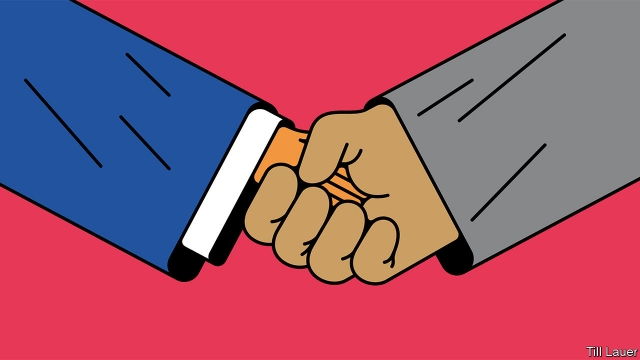

###### Banyan

# At the Trump-Kim summit in Hanoi, expect a bad small deal 

##### Kim Jong Un has managed to shift the focus from nuclear details to vague hopes of peace 

 

> Feb 23rd 2019 

AFTER THEIR made-for-television spectacular last June in Singapore, Donald Trump and Kim Jong Un needed another gig. A second summit between the American president and North Korea’s dictator will take place on February 27th and 28th in Hanoi, the Vietnamese capital. The choice of venue is intriguing. For America, Vietnam’s Communist Party is foe turned buddy, and it has blazed a trail of market reforms in the country. Mr Kim, presumably, is expected to look and learn. But he has steadfastly refused to emulate Vietnam’s economic transformation. And, though Mr Trump has confessed to falling in love with the young despot, North Korea and America have only just started dating. For Mr Kim, Vietnam may just be a country that defeated the United States. 

Hanoi, of course, is merely a backdrop. In Singapore residents got official notices to keep their lights on at night to maximise the dazzle of the skyline. In Hanoi locals have a slightly more subversive edge. One barber is offering customers the Trump or Kim looks free of charge. Both leaders are sensitive about fun being made of their hair, though only one may send the mockers to the gulag (the fate of some of the 50-70 critics of Mr Kim’s foreign policy, who were reported this week to have been purged in an “anti-corruption” drive). 

The coiffures may be sharp but the outlines of any summit agreement remain fuzzy. In Singapore the two sides agreed to build “a lasting and stable peace regime”. Mr Trump said he would provide North Korea with “security guarantees”, and Mr Kim committed himself to “complete denuclearisation” of the Korean peninsula. Much was left vague: timetables, verification and indeed what denuclearisation means; North Korea has long taken it to include the removal of America’s security commitment to South Korea. Yet Mr Trump’s people were adamant: this was all about the “complete and verifiable” dismantling of North Korea’s nukes. 

What a difference a few months make. This week Mr Trump put his desired outer limit on the time frame for North Korea’s denuclearisation: “ultimately”. “I’m in no rush,” he added, so long as “there is no testing.” The “testing” involved North Korean missile launches and six nuclear detonations that, by late 2017, had evolved into a dangerous game of brinkmanship. Mr Trump’s decision to sit down with Mr Kim deserves some credit (though it is hardly worthy of the Nobel peace prize for which, he has indiscreetly boasted, Japan’s prime minister, Shinzo Abe, has obsequiously nominated him). The region certainly feels less tense because of the whirlwind diplomacy, involving South Korea too, that began early last year. But Mr Trump’s claim that North Korea is no longer a nuclear threat is gainsaid by his own intelligence chiefs. It may even dismay Mr Kim, who is almost certainly expanding his arsenal. 

Mr Trump has set a low bar for success in Hanoi, but Mr Kim will surely have to offer something. Choi Kang of the Asan Institute, a think-tank in Seoul, predicts a “bad small deal”. It might include destroying the nuclear reactors at Yongbyon and letting inspectors confirm that the Punggye-ri site, where nuclear devices were detonated underground, really is closed. But the fifth and sixth nuclear tests are thought by experts to have taught the North Koreans all they need to know from blasting. Yongbyon, which has been mothballed before, is decrepit anyway. Thae Yong Ho, the most senior North Korean diplomat to have defected, says such steps are like painting an old car for resale. Meanwhile, expect little in Hanoi on the inspection of the North’s nuclear programme, let alone declaring its full extent. 

Mr Thae argues that Mr Kim has cleverly shifted the emphasis from nuclear disarmament to “peace”. Both sides may agree in Hanoi to establish liaison offices in each other’s capitals, a first step towards normalising diplomatic relations, and an eventual “peace declaration”—some vague, non-binding assertion that neither side will threaten the other. 

What Mr Kim wants above all is some relief from UN sanctions. Mr Trump might calculate that granting this would not cost America much. South Korea’s president, Moon Jae-in, is offering to invest in the North’s railways and to promote economic co-operation. If larger shipments of oil were allowed, China would presumably foot the bill. Mr Trump might also be fine with that outcome—even if it gets little closer to dismantling the North’s nukes. In Singapore Mr Trump was played without knowing it. In Hanoi he may not even care. 

