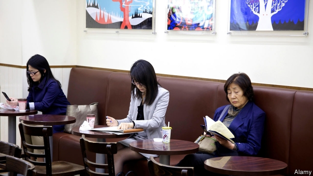

###### Fifty shades of grey

# In Japan, there is a boom in books by and for the elderly 

##### As the market ages, so do the authors and themes 

 

> Feb 23rd 2019 

LITERATURE REFLECTS life. So in ageing Japan there is a raft of smash-hit books by aged authors. “Age 90: what’s so great about it?” is a humorous essay on the difficulties of the elderly, by Aiko Sato, who is 95 and wrote it with a pen. It sold 1m copies in 2017, making it Japan’s bestselling book that year. In 2018 the Akutagawa literary prize went to Chisako Wakatake, 63 at the time, for her debut novel “Live by Myself” with its 74-year-old protagonist, Momoko. 

The books talk about how to live in old age, and it is not all doom and gloom. The widowed Momoko, for example, learns to live on her own. “The Finished Person” by Makiko Uchidate, who is 70, opens with the line “retirement is a living funeral” before going on to depict the adventures of a retired salaryman, including falling for a younger woman and returning to his home town. “Going to Die Soon”, also by Ms Uchidate, features 78-year-old Hana, a vibrant former alcohol-shop owner trying to make the most of her remaining years. The novel has been called a book for shukatsu, or preparing for death, making readers think more deeply about what it means to age. 

Japan’s population has the world’s highest proportion of over-65s, at 28%. People are living longer and staying healthier, so many have at least 20-30 years of retirement, for much of which they are sprightly. And although the Japanese have been spending less on books, that is least true for the over-60s. Lawson, a convenience-store chain, recently decided to stock books with the older generation in mind. 

But the wrinkly writers’ books are attracting younger readers, too, according to the Research Institute for Publications (RIP), a body in Tokyo. Some are preparing for their own old age or want to understand the increasing number of old people they see around them. Others find relevance in the themes explored, such as loneliness, a problem that stretches well beyond the silver-haired. In Hiroyuki Itsuki’s blockbuster self-help book, “Recommendation for Solitude”, the 86-year-old author promotes reminiscing about “the good old days”. 

The most notable feature of the new genre is that the vast majority of authors, and main characters, are women. Especially popular, says the RIP, are the ara-hun (“around-hundred” years-old) writers like Ms Sato, whose book, readers say, helps them be more positive. It is not just that women have a longer life expectancy. Their popularity, reckons the institute, also reflects support for strong women who are passionate about their work, a phenomenon that is all too rare in Japan today. 

