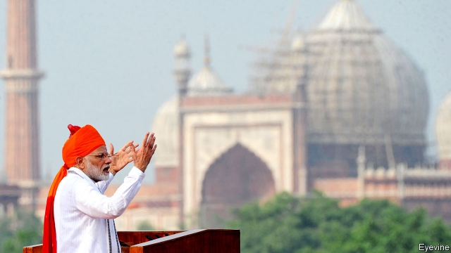

###### Sabre-rattling in South Asia

# India vows to punish Pakistan after the latest terrorist attack 

##### With an election looming and public anger feverish, restraint will be difficult 

 

> Feb 21st 2019 

“IT’S TIME to repay Pakistan in its own coin,” snarls India’s rumpled but brilliant national-security adviser, plotting vengeance for a terrorist attack. Soon after, in this season’s runaway hit film, “Uri: The Surgical Strike”, muscled Indian commandos resoundingly smite the enemy. As in Bollywood, so, perhaps, in real life. After a Pakistan-based jihadist group claimed responsibility for a suicide-bombing on February 14th that killed some 40 Indian paramilitary police, Narendra Modi, India’s prime minister, promised a “jaw-breaking” response. Suspense is mounting as to how and when, rather than if, India plans to punish Pakistan. 

Some repayment has already been inflicted. India has suspended Pakistan’s favoured trading status, slapping a 200% duty on its products. This will not hurt much. India imports less than $500m of Pakistani goods a year. Security forces in Kashmir did also swiftly find and kill three men they said planned the bombing. But public anger remains at fever pitch and, perhaps more important, a general election looms in April. Mr Modi came to office promising to get tough with Pakistan, but has lately sagged in the polls. In the felicitously timed “Uri”, a lurid recreation of an actual Indian retaliatory raid in 2016 that is believed to have left some three dozen Pakistan-based guerrillas dead, he is portrayed as a wise, stern commander-in-chief. Now, despite the risk of escalation between the nuclear-armed states, the temptation is for him to burnish his image by giving Pakistan another bloody nose. 

India’s fury is understandable. The attack struck a bus filled with young recruits heading for deployment in the wintry Kashmir valley. News channels endlessly replayed grim footage of the carnage and moving scenes from funerals across the country. The toll was the highest for a single attack on the security forces in three decades of unrest in the picturesque valley, a densely settled part of Jammu & Kashmir, a former princely state that was split unhappily between India and Pakistan after their independence in 1947. 

The bomber himself was Indian. But the target of Indian anger is still understandable. Pakistan has for years covertly helped militants infiltrate the Indian-administered, Muslim-majority valley. Jaish-e-Muhammad, the group that claimed responsibility for the bus attack, is guilty of some of the worst atrocities in a 30-year conflict in Kashmir that has taken some 45,000-70,000 lives. After dropping, the death rate has been rising since Mr Modi came to office in 2014. The group’s leader, Masood Azhar, lives openly in Bahawalpur in Pakistan, where it runs a seminary, a training camp and a media arm. 

It is understandable, too, that India scoffed at a call for dialogue made by Imran Khan, Pakistan’s prime minister. In a televised speech four days after the attack, Mr Khan scolded India for being hasty to blame its neighbour, promising that if Mr Modi had any evidence, Pakistan would be happy to aid the investigation. 

As a curt reply from India’s foreign ministry noted, “Promises of ‘guaranteed action’ ring hollow given the track record of Pakistan.” India has in the past often supplied Pakistan with actionable intelligence, such as against the perpetrators of a terrorist attack on Mumbai in 2008 that left 166 people dead. Pakistan has either done nothing, or limply chastised the culprits and let them go. Mr Azhar himself has at various times been detained, before being quietly released to mould more jihadists. 

Indian officials note, in addition, that they are scarcely the only ones to complain of Pakistani perfidy (see next story). Indeed, some Pakistanis join them in questioning Mr Khan’s sincerity. “Would you care to order an inquiry independent of how we respond to Delhi about how Jaish continues to recruit & train ppl [people] for jihad, and runs camps?” tweeted Ayesha Siddiqa, a London-based scholar. 

Far bigger, better-armed and with an economy 8.5 times the size of Pakistan’s, India nevertheless has limited options for striking back. The nuclear balance is an obvious dampener. Nor does either country wish to drift into even a limited conventional war; the cost would be ruinous. And because Pakistan hides behind plausibly deniable proxies, India would not wish to lose its moral advantage with a direct attack. The diplomatic calendar has granted some reprieve: Mr Khan and Mr Modi both had to roll out red carpets this week to receive the Saudi crown prince, Muhammad bin Salman. And on February 21st Mr Modi was in South Korea, to collect, of all things, the Seoul Peace Prize. 

A further constraint lies in Afghanistan, where America is negotiating a wind-down of its role that will require continued help in chaperoning the Taliban—which also has mysterious ties with Pakistan’s security services—towards a smooth resolution. John Bolton, Mr Trump’s national security adviser, initially tweeted support for India’s “right to self-defence against cross-border terrorism”. But since Pakistan has signalled that any Indian retaliation would affect peace talks in Afghanistan, America has piped down. 

The mood in India, however, makes it likely that all this will merely delay some kind of punishment, not preclude it. If Mr Modi is driven by purely electoral considerations, he has perhaps two months to act. In the meantime, anger has welled up across India in the form of harassment by Hindu-nationalist groups of Kashmiris and other Indian Muslims. Ugly incidents, sometimes encouraged by officials from Mr Modi’s party, have seen Kashmiri families chased from their homes, students from schools and traders from markets. Of course, driving such a wedge into Indian society was precisely the terrorists’ aim. 

