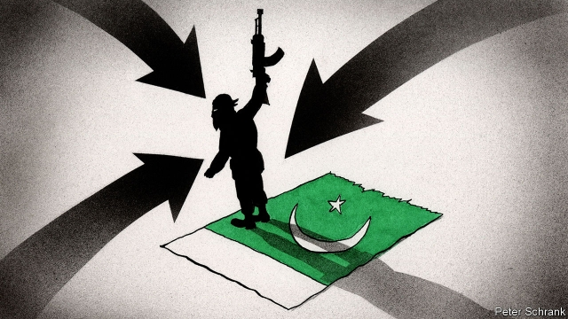
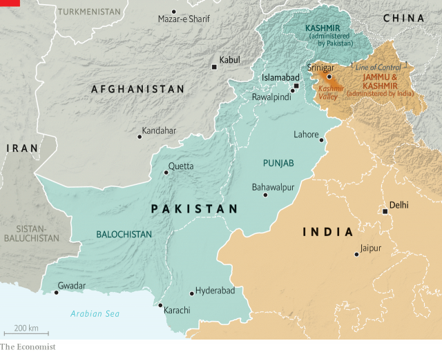

###### Pincer movement

# Pakistan’s fostering of terrorism leads to growing isolation 

##### But friendships with China, Saudi Arabia and the Taliban give it a lifeline 

 

> Feb 23rd 2019 

VISITORS TO THE bird markets of Pakistan would have found stocks depleted this week. To welcome Muhammad bin Salman, the crown prince of Saudi Arabia, who swept in for a two-day visit on February 17th, they freed 3,500 pigeons, cleaning out avian bazaars across the country. To make the crown prince feel at home, a parliamentary delegation presented him with a gold-plated submachine-gun. Yet as Pakistan firms up one relationship, others are crumbling. In recent weeks, three of its neighbours—India, Iran and Afghanistan—have accused it of fostering cross-border terrorism. 

On February 13th a bomb-laden lorry killed 27 members of Iran’s elite Islamic Revolutionary Guard Corps (IRGC) in the south-eastern province of Sistan-Baluchistan. Iranian officials said that the bomber and other plotters were Pakistanis, and that the attack was planned and launched from Pakistani soil. An IRGC commander warned that if Pakistan does not “do its duties”, Iran will fight “the terrorist groups organised by regional and extra-regional intelligence services”—an allusion to the ISI, Pakistan’s spy agency, and to those of America, Saudi Arabia and Israel. 

The next day Jaish-e-Muhammed (JEM), another jihadist group, based in Pakistan’s Punjab province, claimed responsibility for a suicide-bombing that killed 44 soldiers in Indian-administered Kashmir. And on February 15th Afghanistan wrote to the UN to complain that Pakistan’s overt meetings with Taliban leaders, part of wider American-led talks, were “a violation of the national sovereignty of Afghanistan”. 

Pakistan now finds itself in a diplomatic pincer. On February 17th Sushma Swaraj, India’s foreign minister, unexpectedly turned up in Tehran. “We agreed on close co-operation to combat terrorism in the region,” tweeted Iran’s deputy foreign minister. “Enough is enough!” And on February 19th Prince Muhammad travelled on to New Delhi, where India’s officials tried to persuade him that its economy was a bigger prize than Pakistan’s friendship. 

 

Last year Saudi Arabia was persuaded to drop its support for Pakistan in the Financial Action Task Force (FATF), an intergovernmental body that combats money-laundering and terrorist financing. That resulted in Pakistan being placed on a “grey list”. Its status is under review at a meeting that concludes on February 22nd. Its neighbours’ opprobrium means that it is unlikely to get a clean bill of health; it may even be blacklisted in October. 

None of this makes Pakistan entirely isolated. China offers diplomatic succour. It has repeatedly blocked efforts at the UN to designate Masood Azhar, JEM’s Pakistan-based leader, as a terrorist. Pakistan’s pivotal role in the Afghan peace talks, coaxing insurgents to the negotiating table, also helps. On February 19th Pakistan’s envoy in Kabul hinted that the talks might be at risk if Pakistan were put under pressure. Not for the first time, Pakistan seems to have a losing diplomatic hand, but still has some valuable cards to play. 

