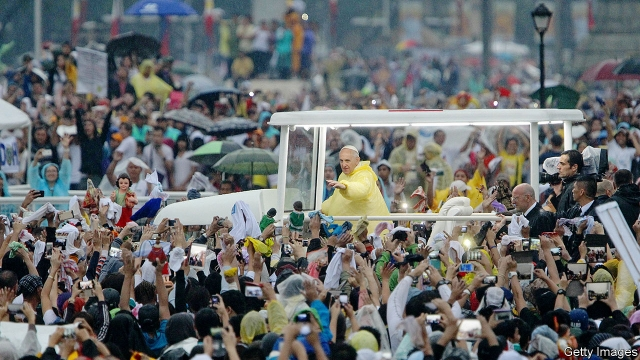

###### Duterte v the church

# Rodrigo Duterte flummoxes the Philippine church 

##### Catholic leaders struggle to respond to his vitriolic attacks 

 

> Feb 21st 2019 

“WE NEED A national exorcism,” says one celebrant at a mid-week mass in Manila’s San Carlos Seminary. The faithful see the devil’s work in the assaults on the Catholic church made by none other than the Philippine president. For almost three years Rodrigo Duterte has lambasted the institution and its symbols, calling God “stupid”, the Holy Trinity “silly” and saints “drunkards”. Bishops are “useless fools”, he said in December. “Kill them,” he went on—several priests have indeed been murdered on Mr Duterte’s watch. He says he was molested by a priest as a boy. “I told you so,” he said on February 20th, on the eve of a summit on clerical sexual abuse in the Vatican. 

Around four in five of the country’s 100m people consider themselves Catholic. And 6m of them flocked to hear Pope Francis when he visited four years ago (pictured). The president continues his vituperations regardless. He started them on the campaign trail in 2016 but still won millions of Catholic votes. That is not to say that Filipinos approve of his tirades: a survey released in September by Social Weather Stations, a pollster, found that 83% of respondents considered his insults against God to be vulgar. Yet they seem not to damage his standing and he refuses to refrain. 

Catholicism came to the Philippines in the 16th century with the Spanish conquerors. The colonial regime entwined Catholicism inextricably with the state; the church has enjoyed wealth, land and prestige ever since. Under the leadership of Cardinal Jaime Sin, formerly Manila’s archbishop, it showed its moral power to move the masses when the pious marched to oust Ferdinand Marcos from his dictatorship in 1986. Cardinal Sin also helped topple President Joseph Estrada in 2001. 

The glory days appear gone. The Catholic church serves as a convenient foil for Mr Duterte’s populist routine. Priests freely admit that, in a country where about one in five people is poor, the church needs to do more to help. Indeed, it can be argued that Catholics have actually done plenty to hinder anti-poverty efforts: decades of preaching against contraception mean large families remain common. The biggest tend to be in the most deprived areas. “We are pro-life in every respect,” explains one priest at a dinner where balut—fertilised duck eggs cooked and served with the fetus inside—are being enjoyed. 

The president’s accusations of hypocrisy sting for other reasons, too. One priest believes that, partly because many of the Philippines’ most elite colleges are Catholic, the church has become too associated with the well-heeled. “We are misunderstood by the poor because we speak the language of the middle class,” he explains. On the other hand, the better-off can contribute more generously to Church coffers. 

The church’s response to Mr Duterte is also hampered by a new scepticism in the clergy about political involvement. More than a decade of opposition to government provision of contraception came to a head in 2012. That year a bill was passed guaranteeing free contraception and sex education in school—policies a large majority of Filipinos approve of. Legal battles followed, but the church lost. “That was a humbling experience,” believes Eleanor Dionisio of the Archdiocesan Institute for Research and Development at San Carlos Seminary. Many high-ranking Catholics are now loth to meddle in politics. 

This marks a huge shift. In past elections candidates craved backing from powerful clerics. Now voters seem to care much less. “The church is not into politics,” insists Father Jerome Secillano of the Catholic Bishops’ Conference of the Philippines (CBCP). Rather, any Catholic opposition to Mr Duterte requires lay leadership. That is how a thousands-strong “interfaith” protest march against Mr Duterte in Manila in late January was organised. 

So diminished is the church that when it has criticised government policies, its remonstrations have fallen a little flat. It has opposed Mr Duterte’s murderous “war on drugs” since its beginning in 2016. Last year the CBCP asserted in a pastoral letter that “to consent and keep silent in front of evil is to be an accomplice to it”. Still, the war goes on; an estimated 20,000 people have died in extra-judicial killings. The church also failed in efforts to reverse a tax reform passed last year that increased the prices of staples such as petrol. 

Seen as out of touch with the poor, and with its clergy cowed, the church faces a third challenge in coping with Mr Duterte: cautious leadership. Toppling governments and herding crowds is not the style of the current archbishop of Manila, Cardinal Luis Antonio Tagle. Nor is chastising presidents. “The bishops don’t want to add to the chaos,” explains Father Secillano. Clearly there is no consensus in the Catholic elite about whether to wait it out quietly or to rebuke the president publicly. 

Yet, for all its loss of clout, the church’s hierarchy “remains one of the most influential institutions in Philippine society,” says Risa Hontiveros, a senator. She spent years fighting for the law on contraception and is poised to battle religious conservatives again over a bill she recently introduced to permit divorce in the Philippines (the only other place where it is still illegal is Vatican City). It has no chance of passing before mid-term elections in May. Yet even she believes the church could play a leading role in fighting Mr Duterte’s excesses; she and others opposing him could make common cause with it on several issues, such as the war on drugs. But it seems improbable a senior Catholic leader will emerge to head such an alliance. “We already have a saviour!” exclaims one priest. He does not mean Mr Duterte. 

