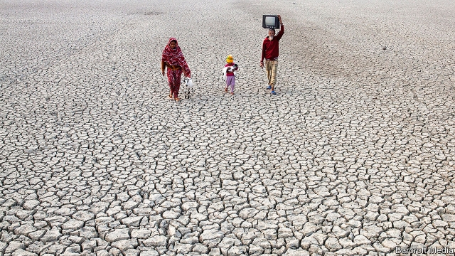

###### The end of normal

# A terrifying look at the consequences of climate change 

##### But David Wallace-Wells is optimistic about humans’ ability to reverse some of the damage 

 

> Feb 21st 2019 

The Uninhabitable Earth: Life After Warming. By David Wallace-Wells. Tim Duggan Books; 320 pages; $27. Allen Lane; £20. 

CLIMATE CHANGE is a devilish problem for humanity: at once urgent and slow-moving, immediate and distant, real and abstract. It is a conundrum for writers, too. Relegating it to a human-interest story—a Bangladeshi displaced by rising sea levels, say—downplays its civilisation-wide significance; sticking to scary forecasts—200m climate refugees by 2050, the UN warns—diminishes its visceral relevance. That may be why, for all its existential gravity, the subject has yet to produce a great work of literature. It lends itself instead to dystopian science-fiction, or to compendiums of scary science facts, sometimes derided as “climate porn”. The latest in that genre, “The Uninhabitable Earth” by David Wallace-Wells, is unabashedly pornographic. It is also riveting. 

Mr Wallace-Wells, an editor at New York magazine, freely admits that he is not an environmentalist. He has never willingly gone camping, and rarely recycles. Nor is he an environmental reporter. He is a voyeur, seduced at first by stories that appeared allegorical—Arctic scientists trapped by melting ice on an island inhabited by polar bears, or a Russian boy killed by anthrax from a reindeer carcass uncovered by thawing permafrost. 

Yet, as the author makes starkly clear, global warming is no parable. Far from being a problem only for future generations, it is wreaking havoc now. Five of the 20 worst fires in California’s history blazed in 2017; the deadliest incinerated the town of Paradise last year. Floods are becoming wetter, droughts drier and hurricanes fiercer. Such calamities, Mr Wallace-Wells notes, are not the “new normal”; they mark “the end of normal”, as climate change tips Earth beyond the conditions that allowed humans to evolve in the first place. And that is with barely 1°C of man-made warming since the industrial revolution. 

Things will get much worse. The world is on course to become at least 3°C hotter than in pre-industrial times. Within a few decades, this could mean that temperatures in Mecca render the haj physically impossible for many of the 2m Muslims who make the pilgrimage each year. With a rise of 7°C— plausible if humanity remains wedded to fossil fuels—swathes of Earth’s equatorial band would become uninhabitable. Even if warming did not exceed 2°C, as stipulated in the Paris climate agreement of 2015, rising seas may engulf $1trn-worth of American property. 

“Numbers can numb,” Mr Wallace-Wells writes. Yet like fellow climate-porn addicts, he cannot resist piling statistic on dismal statistic. In the hands of a lesser writer, this litany of woe might have degenerated into one of the dry treatises on which he draws. But whereas his chapters—on the impacts of extreme weather, sea levels, human health, economic consequences and so on—echo reports by the Intergovernmental Panel on Climate Change, his elegant, accessible prose does not. 

He has a point when he says that exercising caution over warning signs is tantamount to complacency. Occasionally, however, he could exercise a bit more of it himself. For example, he acknowledges that humans are an adaptive species, then cites projections of lives lost to heatwaves, air pollution and the like, which typically do not factor in adaptation measures. 

He nevertheless gets the big things right. His insistence that electing leaders with climate-friendly policies matters immeasurably more than forgoing a plastic straw in your cocktail is surely correct. Yet he is perversely optimistic: because humans are responsible for the problem, they must be capable of undoing at least some of it, he thinks. If Americans’ carbon footprints matched those of average Europeans, the United States would emit less than half as much carbon as it does. 

The book does not dwell on the policies that might achieve such outcomes; it is more expository than prescriptive. Some readers will find Mr Wallace-Wells’s outline of possible futures alarmist. He is indeed alarmed. You should be, too. 

