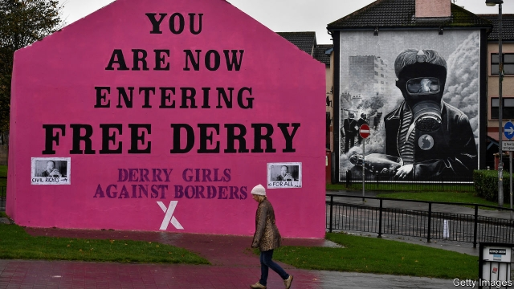

###### Walking the line

# A timely history of the Irish border 

##### Political dishonesty and smuggling have been among its biggest consequences 

 

> Feb 21st 2019 

The Border: The Legacy of a Century of Anglo-Irish Politics. By Diarmaid Ferriter. Profile Books; 192 pages; £12.99 

WHENEVER AN INTER-STATE border is inserted into a hitherto seamless terrain, the consequences will range from the farcical to the tragic, and many will be unexpected. It matters a lot whether the border is hard or soft. A key point is not merely how strictly it is policed, but whether sharp differences in tax and regulations create incentives for smuggling. Those are some of the lessons of Diarmaid Ferriter’s timely historical essay on the 310-mile (500km) boundary that came into existence on the island of Ireland in 1922, when 26 of its counties formed the new Irish state, while six stayed in the United Kingdom. 

A decade later, as part of an “economic war” between the two countries, Britain imposed a 40% duty on Irish livestock, and cross-border cattle-smuggling became virtually uncontrollable. The beasts were herded over the frontier by boat and truck and on foot at all hours of the night. The illicit drovers sometimes had to contend with somewhat harder criminals who, posing as policemen or customs officers, seized their animals and made off into the darkness. In the same year, Ireland slapped duties on coats, underwear, shoes, frocks, bread, jam and chocolate, prompting contraband in the other direction. 

In such situations, the law quickly becomes an ass. In the 1970s, when contraceptives were still banned in the Irish republic, a family-planning campaigner went south with 40,000 condoms in his station wagon; his insistence that they were all “for personal use” was met with good-humoured banter by an Irish police patrol. Nor did the economic and regulatory nonsense stop when Britain and Ireland became partners in the European club in 1973. For a while, the vagaries of agricultural subsidies from Brussels made it worthwhile to spirit the same cow or pig backwards and forwards across the line many times. 

But the border had its unfunny side, too. Life became pretty hellish for people living nearby during the Troubles, whether or not they were directly involved in the war between British security forces, which included many local recruits, and Irish republicans. Many of the 200-plus roads that linked rural communities were declared “unapproved” and partially destroyed; travelling on those that were still open meant coping with queues, checkpoints and searches. 

After studying recently unclassified files, Mr Ferriter notes that politicians on both sides of the frontier responded to this tragicomic situation with dishonesty. Irish luminaries such as Eamon de Valera both abhorred partition and found it quite convenient. It enabled old-time nationalists of his hue to fashion the new state using a Gaelic, Catholic ethos without having to worry about northern Protestants, whose heritage was different. Meanwhile London’s politicians, whatever their public commitment to keeping Northern Ireland in the union, often let slip their hunch that Irish partition might not last for ever. Winston Churchill, the book recalls, was no exception. During the second world war, he was positively keen to trade Irish unification for access to Ireland’s ports or, better still, Irish entry into the war. It was de Valera who balked. 

Now that the border’s hardness or softness has become the biggest single problem in Britain’s exit from the European Union, further oddities may be in store. On the face of things, right-wing British Tories and hard-line Ulster Unionists seem determined to maintain the inter-Irish border, even if that means stiffening it a bit. But that will only make a lot of people in both parts of Ireland, and some in Britain too, even more determined to remove the boundary altogether before this strange animal reaches its centenary. 

