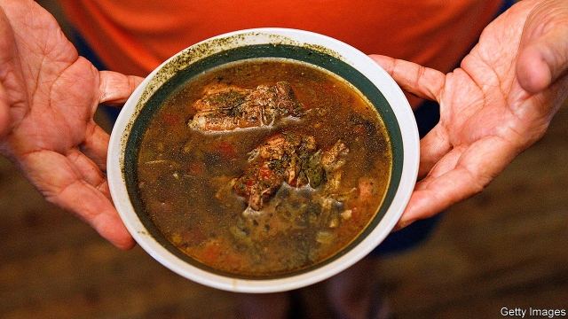

###### Roux the day

# Gumbo: a love story 

##### A beloved Louisiana dish is a stew of culture and history 

 

> Feb 21st 2019 

Gumbo Life: Tales from the Roux Bayou. By Ken Wells.W.W. Norton; 288 pages; $26.95 and £18.99.  

GUMBO IS A stew, usually served over rice. On that Louisianan cooks can agree. After that, things become contentious. Should roux, a fat-and-flour mixture, form the foundation of gumbo? Usually, but not always. And what sort of fat? These days most chefs prefer vegetable oil or butter; in colonial Louisiana, the fat of choice was bear lard. What is the right thickener—okra, filé powder (pounded sassafras roots, a Choctaw contribution) or neither? Most believe the dish should never contain fin-fish, but it can accommodate almost anything else: chicken, sausage, shellfish and, in harder times, rabbit, squirrel, whelk and smoked raccoon. There are as many ways to cook gumbo as there are people who make it. 

Its origins are disputed. They are partly African: ki-ngombo is the word for “okra” in several West African languages, and gumbo is a close cousin to the okra soups served across that region, whence most enslaved people in Louisiana came. But it also betrays Native American and European influences; cooks across Louisiana and beyond claim to have invented it. In this way, gumbo embodies the cultural confluence that makes New Orleans and its environs unique—more tropical, French and African than anywhere else in America. 

As Ken Wells writes in his delightful book, southern Louisiana is “the last redoubt of southern Europe in America and like the continental French, Spanish and Italians, our people don’t eat to live, they live to eat.” In no other part of America does food play such a central cultural role. Nowhere else between Maine and San Diego can people of all means eat as consistently well (superior boudin, a delicious, heavily spiced sausage made of pork, offal and rice, is sold at petrol stations). But, as anyone lucky enough to be invited to dinner by a Cajun or Creole friend knows, the best food, and in particular the best gumbo, is found in private homes. 

Mr Wells takes readers into dozens of kitchens, none rendered more lovingly than his mother’s. Bonnie Toups grew up in southern Louisiana and left school when she was 12—both because her family, like many others, was desperately poor and because, in early-20th-century Louisiana, speaking French in the classroom was forbidden. She married an Arkansan (no culinary rivalry there), and they brought up their children on a sugar plantation in the bayou. In her daily efforts to feed a large, boisterous family she routinely conjured up “something that flies so close to love that it must be love itself.” Her gumbo is classic: chicken, smoked sausage, filé powder stirred in at the end. 

The author’s affinity for his home region never curdles into chauvinism; he happily admits that decent gumbo can be found in San Francisco, New York and Chicago. But he is clear about the reason why: because so many people have left the bayous. The mill that employed his father closed. The public lands where he learned to hunt and fish have been parcelled out to private owners and sequestered behind “No Trespassing” signs. Every year around 15,000 acres of marshlands—the pantry that generations of rural cooks drew upon—vanish, because of subsidence, a rising sea level and the impacts of flood protection and the oil-and-gas industry. 

Yet the book’s tone is more affectionate than elegiac. What lingers in the memory is less the food itself than the warm descriptions of the people who cook it. Gumbo is an inherently social dish; it is rarely made for fewer than a dozen diners, and even more rarely, in your correspondent’s experience, prepared without a crowd. It will include whatever ingredients the chef can defend adding. 

Not long ago Brett Anderson, the restaurant critic for the New Orleans Times-Picayune (one of journalism’s most enviable jobs), opined on gumbo created by an Indian-born chef that contains delicious additions such as Kashmiri chilli powder and curry leaves; and on another made with smoked chicken and Thai curry. Gumbo, like America, contains multitudes. 

