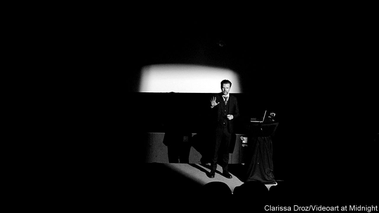

###### Do not think of a white bear

# Lecture performance showcases the power of language 

##### Listeners are forced to ask what the artist is doing—and what they are doing themselves 

 

> Feb 21st 2019 

A BEARDED SWEDE in a three-piece suit stands at a lectern. Spotlit, Erik Bünger tells his listeners about an exchange between Ludwig Wittgenstein and Bertrand Russell in 1911. According to Wittgenstein, Russell could not say with certainty that there was no rhinoceros in his study. Mr Bünger (pictured) says he is not interested in who was right, but in why Wittgenstein chose a rhinoceros. “There was certainly an elephant in the room,” he concludes. “And that elephant was a rhinoceros.” 

Laughter ripples through the audience at Video Art at Midnight (VAM), a monthly event at Berlin’s beautiful Babylon cinema. A series of video artists, including luminaries such as Wolfgang Tillmans, have shown work at VAM in the decade since its inception. Mr Bünger instead offers a lecture performance. In the 40 minutes of “The Elephant Who Was A Rhinoceros”, he leads the auditorium through a series of connections. The spectral rhinoceros turns into a metaphorical elephant, which becomes a white bear, which (Mr Bünger says) will flash in listeners’ minds when they are told not to think about it. A cultural history of language takes in Adam’s naming of the animals in the Garden of Eden, cave paintings and the invention of the alphabet. Invert the letter A, Mr Bünger says, and you see the devil and his horns. 

Gradually the amusement is muted as listeners begin to question what he is doing—and, indeed, what they are doing. To begin with, they “can follow everything, feel surprise and even laugh,” says Renia Vagkopoulou, Mr Bünger’s wife, who has seen all his performance works many times. At some point, things become more complex, as people are forced to interrogate their responses. “Some even get a little shocked. What starts as a theoretical exercise becomes more and more personal.” 

By getting the audience to grapple with its own role, Mr Bünger’s work fits into an established artistic tradition, says Manuel Olveira, an expert in the lecture form and director of MUSAC, a contemporary-art gallery in León, Spain. He cites John Cage’s “Event” of 1952 (which incorporated a talk on Buddhism), Dan Graham’s “Performer/Audience/Mirror” of 1975 (in which the artist narrated his own movements and observations), and Andrea Fraser’s “Museum Highlights” of 1989 (in which she posed as a guide to the Philadelphia Museum of Art). Like Mr Bünger, each raised questions about how knowledge is produced and disseminated. “Lecture performance is a vibrant category within the wider performance medium,” says Adela Yawitz, a Berlin-based curator, mentioning several other practitioners. The form is fluid, she notes: performances can be live or taped, discrete or combined with other media. 

Performance art is not the only means by which lectures have broken free from formal education. Internet streaming has led to the rise of TED talks, which attract billions of clicks a year, as well as boosting the audience for stand-up comedy. Mr Bünger admits to being inspired by comics such as Larry David and Louis CK, and concedes that, at first sight, his art may seem reminiscent of formats such as TED. But at a deeper level, he insists, “my lecture performance is the absolute antithesis of TED”. He sees short video talks as “vehicles of pure solutionism”: hard questions reduced to slick formulae. For him, lecture performance lays bare the imbalance of power between lecturer and listener, and highlights the alchemy of language. 

His previous work evoked similar themes. “A Lecture on Schizophonia” (2009-2011) explored the impact of recorded speech. “The Third Man” (2010) dealt with the aura of song, roping in ABBA and Kylie Minogue. “The Girl Who Never Was” (2014) tells the serpentine story of a child whose voice was once thought to have been captured on a primitive audio recording, but who turned out not to have existed. “I’m placing a voice in the heads of my listeners,” Mr Bünger explains of that piece. “Most will see the girl in their mind’s eyes—she will come to exist.” 

Human speech, maintains Mr Bünger, “refuses to follow the binary logic” of truth and falsehood or past and present. It is more slippery and magical than that. When the lights go on in the Babylon cinema, the magic seems to have worked. “Now, whenever you see an A, you will see something else,” chuckles Mats Birgert, one half of the video-art duo Birgert and Bergström. “That’s what art is about.” 

