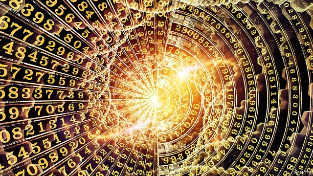

###### Every step you take

# Life and society are increasingly governed by numbers 

##### When everything is quantified, power accrues to whoever is keeping score 

 

> Feb 21st 2019 

The Metric Society. By Steffen Mau. Translated by Sharon Howe. Polity; 200 pages; $22.95 and £15.99. 

MEASUREMENTS PERVADE life and society. Infants are weighed the moment they blink into the world. Pupils are graded. Schools are judged on their students’ performance, universities on graduates’ job prospects. Companies monitor the productivity of employees while CEOs watch the share price. Countries tabulate their GDP, credit-rating agencies assess their economies, investors eye bond yields. The modern world relies on such data. It would cease to function without them. 

The numbers are proliferating. As ever-greater swathes of human activity are subsumed by the digital revolution, so they too can be calibrated. Uber riders earn stars for their back-seat behaviour. Social-media posts attract “likes”. Users of dating sites are assigned desirability scores. Apple’s iPhones tell their owners how many hours they have spent peering into their screens. Wristbands measure footsteps; apps can track sleep patterns and sex. As recently as the start of this decade, people who voluntarily observed themselves in this way had a cultish name, the “quantified-self movement”. That urge is now the premise of one of Apple’s latest products, a watch that keeps tabs on the wearer’s heart rate. 

If everything people do and every step they take is tracked, they lose the freedom to act independently of such oversight, writes Steffen Mau, a German sociologist, in “The Metric Society”. Published in German in 2017 and now in Sharon Howe’s English translation, Mr Mau’s book is a wide-ranging tour through rankings and ratings, stars and points, charts and graphs. When these technologies become embedded in society, he argues, life is reduced to checkboxes. Faith in experts is replaced by devotion to figures. Meanwhile, power is transferred from individuals to those who create and maintain the scoring systems. These in turn can be gamed and their purposes perverted. 

Take the World Bank’s annual comparison of business regulations around the world. One country stood out in its latest ranking: China, which had languished in 78th place the previous year, jumped to 46th. India seemed to have improved, too, rising 23 spots, to 77th. Those remarkable ascents have less to do with the ease of doing business in those places than with their governments’ determination to achieve good grades. Some 40 people work in a Chinese government unit dedicated to improving its World Bank score; perhaps 200 toil in India’s. At least 60 countries have teams that focus on the index. Conversely, a change in methodology can lead to precipitous falls. In 2016 Chile’s performance slumped after one such rejig, which some attributed to political machinations. 

These days, though, it is not only technocrats who have cause to fret about skewed metrics. Consider the role played by misinformation on Facebook in the American presidential election of 2016. For a relatively small sum of money by the standards of American political campaigns—about $1.25m a month—Russian propaganda reached 126m people. How did the Kremlin get such a bang for its buck? “They tracked the size of the online US audiences reached through posts, different types of engagement with the posts (such as likes, comments, and reposts), changes in audience size, and other metrics,” according to an indictment by Robert Mueller, the special counsel investigating Russian interference in the vote. 

The algorithms that power Facebook’s news feed are opaque, but it doesn’t take a state-backed operation to work out part of the method. From around 2013, media companies across the world began to pander to Facebook’s tastes, turning out increasingly emotional pieces to entice readers to click on links. Publishers monitored emerging trends using an online service called CrowdTangle (later bought by Facebook); they tracked traffic to their own websites using Chartbeat, another measurement tool. Some rewarded staff on the basis of these numbers. Some websites cynically exploited touchy issues of social justice to bring in traffic from Facebook. 

It became a self-fulfilling prophecy. A piece would appear on a website, attract attention from others through Facebook, be re-written and re-posted on Facebook, and soon it was all over the internet, morphing into a genuine news event. At the same time readers were being tracked by Facebook, CrowdTangle, Chartbeat and dozens of other outfits as they idly clicked entertaining-looking links. The position of the cursor, the amount of time spent on the page, the depth to which they scrolled—all were recorded, analysed, packaged and sold. Did these articles fulfil the basic journalistic function of informing their readers? Or, on the contrary, did readers’ clicks determine what was written? To judge from the hysterical, hyperpartisan tone of much of the ensuing coverage, it was the clicks. 

If such techniques can change how countries design regulatory regimes and what the media publish, the direct effects on individuals are even greater. “In the age of the metric society,” writes Mr Mau, “individuals constitute bundles of data in which their personal worth is encoded.” When different sources of data are linked together, it becomes possible to paint an eerily complete picture of a person, and to predict with some accuracy both their net worth and their future behaviour. 

This is already the case in car insurance, where some drivers voluntarily attach devices to their vehicles that transmit reports to their insurers. American health insurers reduce premiums for non-smokers and exercise fanatics. All-round surveillance is coming to the workplace, too. In 2015 BP gave 25,000 fitness trackers to staff as part of a health-insurance scheme. The next year the Daily Telegraph, a British newspaper, installed heat- and motion-sensors under employees’ desks. (They were removed after protests.) Elsewhere, score-keepers have begun to appraise people in the round. In China, for example, Zhima Credit, a popular private service, measures “personal characteristics”, “online behaviour” and “interpersonal relationships”, among other things. A high rating entitles people to a fast-track visa for Singapore. 

For good drivers, hard workers, athletes and the financially prudent, all this might seem an unalloyed good. For everyone else—and few people tick every virtuous box—the metric society may prove a means for faraway data overlords to capture power and entrench inequality in the guise of efficiency. It risks descending into a 21st-century dystopia that is almost as bleak, in its impersonal way, as those imagined in the darkest novels of the 20th. 

