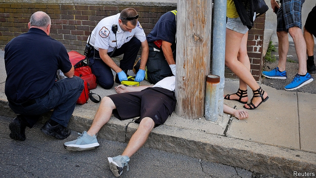
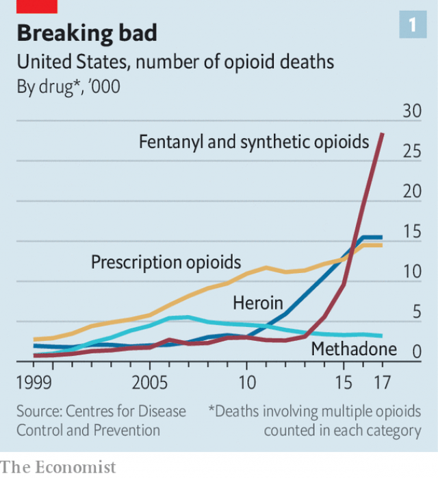
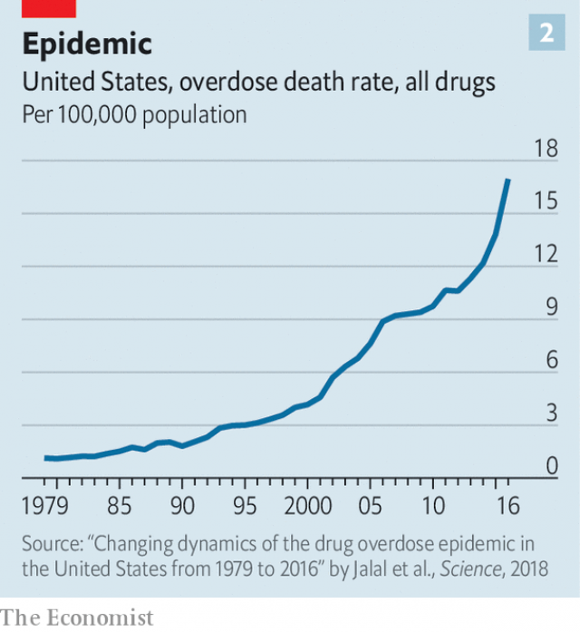
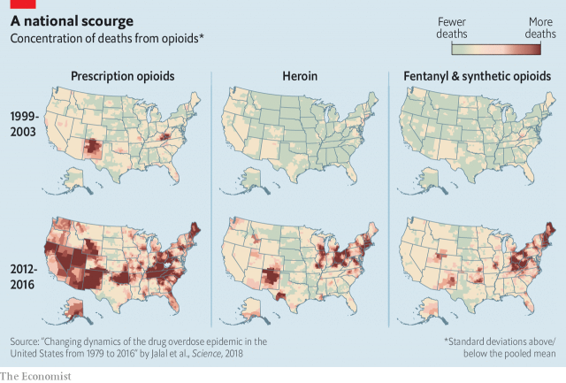

###### The death curve

# Tens of thousands of Americans die each year from opioid overdoses 

##### The federal response remains sluggish and inadequate 

 

> Feb 23rd 2019 

THE GIRL looks like a typical teenager sitting on the bench of a fire station in Manchester, New Hampshire. But she is not. Just 19 years old, with acne still marking her face, she is here seeking help for opioid addiction. Already she has been hooked for four years. At 15 she started with Percocet, a prescription drug. Now homeless, these days she uses fentanyl, a cheap, synthetic opioid. After checking herself out of treatment two weeks ago, she went on a meth- and fentanyl-fuelled bender. 

Soon a taxi arrives. It will deposit her at Granite Pathways, the treatment centre she left two weeks ago. She gathers up her few possessions, which are neatly lined up on the concrete floor. The firefighters wish her well as she climbs into the taxi, encouraging her to stick with her recovery this time. She promises to try but, once she has gone, they do not sound hopeful. They have seen this story too many times before. 

Such episodes occur regularly now across Manchester. The city has set up a programme, known as Safe Stations, whereby anyone struggling with drug addiction can walk into a fire station seeking help. About 200 people come every month. “People trust firemen,” says Daniel Goonan, the station’s chief. “We don’t ask for insurance or anything—there’s no stigma.” It is an innovative strategy for dealing with the American opioid epidemic in one of its centres. In 2017 New Hampshire had the third-highest opioid death rate in America, after Ohio and West Virginia. Shelters are full so those who are homeless and addicted wander the streets in the freezing cold. At a local hospital, 5.5% of newborn babies delivered have been exposed to opioids in utero. Mr Goonan vividly recalls the case of a ten-year-old boy who performed CPR on his overdosing parents and then went back to eating his breakfast cereal. It was not the first time the boy had done it. 

 

Drugs now kill about 70,000 Americans every year—more than car crashes or guns (both 39,000), more than AIDS did at the height of its epidemic (42,000), and more than all the American soldiers killed in the entire Vietnam war (58,000). In 2017 about 47,600 of those deaths were caused by opioid overdose—a fivefold increase since 2000. Only 32% of those opioid deaths involved prescription pills; the rest were from illegal heroin and fentanyl (see chart 1). But three out of four heroin users first became addicted to pills. 

 

Chart the overdose death rate in America since 1980 and a terrifying graph emerges (see chart 2)—an exponential curve increasing at a constant clip of 7.6% per year. Estimates suggest that the epidemic will rage for at least a further five to ten years, killing more than 50,000 people each year. An urgent and sensible response would be able to bend this death curve somewhat, to reduce the harm yet to come. But the response has been slow and fitful at best, even though measures that would help are well-known. What started as a problem of abused prescription drugs has been transformed by corporate greed, a failure of the health system and a lack of political will into a social disaster. 

The risks of opioid addiction have long been downplayed. Alexander Wood, who invented the hypodermic needle in 1853, touted his invention by claiming that morphine would not cause addiction if injected rather than smoked or swallowed. After needles and morphine were deployed in the American civil war, as many as 100,000 veterans were left addicted. In 1895 scientists at Bayer, a German pharmaceutical firm, began selling a strong morphine compound called diamorphine. To market it, they called it “heroin” from the German word meaning heroic. 

In the 20th century, heroin became a controlled substance in America, associated with poor blacks in inner-city ghettos. Medicinal opioids were legal, but used for limited purposes, such as surgery and palliative care. Then in 1996 Purdue, a private pharmaceutical firm, launched OxyContin, a pill that releases oxycodone, an opioid that, like heroin, is twice as strong as morphine. Other firms developed similar drugs, available on prescription. 

OxyContin was aggressively marketed to doctors as a wonder drug that could safely dissipate chronic pain for 12 hours at a time with what it claimed was “less than 1%” risk of addiction. Yet the sales pitch was deeply misleading. In many patients the effect of the pills wore off after eight hours, leading to cravings for more. Moreover, evidence of long-term efficacy of opioids for chronic pain is limited, according to scientists for the Centres for Disease Control and Prevention (CDC). 

Despite the quantity of opioid pills prescribed since the 1990s, the amount of pain Americans report has not decreased. To explain drug-seeking behaviour that doctors began observing in their patients, Purdue promoted the theory of “pseudoaddiction”—that what looked like addiction was really patients trying to avoid untreated pain. The basis of the “less than 1%” claim was a single-paragraph letter to a medical journal in 1980 about opioids administered in hospitals, not homes. 

As opioid sales quadrupled from 1999 to 2011, deaths from overdoses rocketed. Prescribing patterns were slow to change even as addiction became difficult to overlook. The number of opioid prescriptions peaked in 2012, at 255m—more than one for every American adult. States began implementing prescription-drug monitoring programmes, which detect if patients are seeking opioids from more than one doctor. Pills like OxyContin were made harder to crush, snort and inject. In 2015, even as doctors had begun reducing prescriptions, Americans were still getting four times as many opioids per head as Europeans. The CDC only released its revised guidelines to limit access to them in 2016. By then the crisis had already mutated from one of prescription pills, over which the government had some control, to one of illicit opioids—first heroin and then fentanyl. 

Just like any epidemic, opioid addiction can be modelled. Allison Pitt, Keith Humphreys and Margaret Brandeau, a trio of public-health experts at Stanford University, estimate that on the current course, just over 500,000 people will die of overdoses from 2016 to 2025. They also modelled the effects of 11 different policy responses possible in today’s political climate. Most would reduce the projected number of deaths marginally. 

Increasing distribution of naloxone, a life-saving drug that reverses overdoses, would decrease deaths by 4.1%; moderately expanding medication-assisted treatment (MAT), which reduces craving for drugs and helps users lead a more normal life, would cause another 2.4% drop. Other responses, like tightening drug-prescribing guidelines and instituting programmes to prevent “doctor shopping”, would, perversely, trigger a short-term increase in deaths by incentivising those addicted to prescription painkillers to switch to heroin or fentanyl. Even if America introduced all the policies likely to save lives, deaths over the next decade would drop by just 12.2%, the academics calculate. That would spare tens of thousands of lives. Yet, given the sluggish federal response, it is likely that today’s high drug-death rates have become the new normal. 

The problem of drug addiction, whether to crack or to heroin, can be reduced to stocks and flows. As a drug gains notoriety, new users flow in. As an epidemic rages and matures, the wave of new addictions dwindles. “A lot of people have real experiences—a brother who got shot over drugs, or a mother who overdosed,” says Mr Humphreys. “That cuts off the new flow of initiates.” There is some evidence that the opioid crisis is entering this phase. The number of teenagers reporting misuse of prescription opioids has fallen by more than half in the past five years. But the stock of those already addicted remains. 

According to the Substance Abuse and Mental Health Services Administration (SAMHSA), a government agency, 2.1m Americans meet the medical criteria for opioid addiction. Only 20% of them are receiving treatment. Although the official total is large, it is thought to be a severe underestimate. SAMHSA’s own statistics show that 11.5m Americans misused prescription opioids in some way in 2016. Even with treatment, the condition is chronic and relapse is frequent. John Kelly of Harvard Medical School has estimated that it takes eight years, and four or five treatment attempts, for someone addicted to opioids to achieve a single year of abstention. Bit by bit, the stock atrophies. Some go into remission, others to prison. Each year, anywhere between 1% and 4% of them will die of an overdose. 

Another team of modellers argues that the death curve might even continue its acceleration, whether from fentanyl or another drug as yet undiscovered. “Anyone who tells me otherwise has to show me why that curve should bend now when it hasn’t in the face of the war on drugs and the rise and fall of other drugs,” says Donald Burke, the dean of public health at the University of Pittsburgh. As long as there is a reservoir of at least 2m people addicted to opioids, there is significant room for the crisis to spread. With prescription pills selling for about $50 each on the streets, and a hit of heroin or fentanyl selling for $5 or less, that seems highly likely. 

The one silver lining is that America is treating this epidemic more as a public-health crisis than one of criminal justice. This change is unquestionably related to race. During the crack epidemic of the 1980s and 1990s, when users were disproportionately black, authorities responded with punitive crackdowns. As the New Hampshire fire-station initiative shows, it is quite different for opioids, which kill whites at nearly twice the rate as blacks. 

Though the newfound compassion is welcome, the public-health response remains woeful. The policies that help reduce death and harm from opioids are no mystery. Organised under the umbrella term “harm reduction”, these approaches limit the negative consequences of drugtaking without expecting that people will stop. They include expanding naloxone distribution, needle exchanges and access to MAT. No policy can reverse the opioid crisis by itself—each of these chips away at the likely future death toll. Harm reduction has been shown to save lives and, by avoiding future policing, emergency and health costs, also save public money.  

The approach has been successful in Europe. After France suffered a heroin epidemic in the 1980s and 1990s, the country established needle exchanges and drastically expanded access to MAT by allowing all doctors to prescribe buprenorphine, which reduces cravings. Four years later, heroin deaths had dropped by 79%. In the 1980s Switzerland had the highest AIDS incidence rates in Europe because of shared needles among heroin users. In the mid-1990s the government began a programme of heroin-assisted treatment, providing medical-grade heroin with clean needles in sterile facilities. Deaths from overdoses and AIDS declined by more than 50% in a decade. 

America is not Switzerland. Taxpayer-sponsored heroin therapy is unlikely any time soon. But even less controversial harm-reduction policies are being stymied by governmental inertia and a misunderstanding of the evidence. 

In Kensington, a poor district of Philadelphia, drugs are sold in broad daylight. Men without coats sway in the frigid air, before crumpling against a wall. There is rubbish everywhere, blown by the wind alongside discarded orange caps from syringes. Pawn shops that will buy anything line the main street. Philadelphia has the highest opioid-overdose death rate of America’s big cities. 

Jose Benitez, the director of a needle exchange in the city, is working to set up a safe-injection site in Kensington, which he thinks would save more than 100 lives a year. It would be the first of its kind in America, but the legal issues are immense. It is a federal felony to maintain a place for illicit drug use, and the justice department has made clear it will not tolerate what the deputy attorney-general calls “a taxpayer-sponsored haven to shoot up”. Retorts Mr Benitez, “It’s too important not to try it, because it’s clear what the benefits are.” 

Even MAT, known as the gold-standard treatment for opioid addiction, faces hurdles. Tom Price, Donald Trump’s former health secretary, unhelpfully dismissed the treatment as “substituting one opioid for another”. Half of drug courts, which divert users from jails and into treatments, require abstention and do not allow MAT. 

Access to treatment remains shackled by excessive medical regulations as well as the high costs and chaotic structure of American health care. To prescribe buprenorphine, doctors need a special waiver which requires eight hours of training. There is no such hurdle to prescribing of opioids that cause addiction. In fact, a doctor can prescribe buprenorphine without a special waiver if the purpose is to treat pain, but not if the purpose is to treat addiction. Methadone can only be distributed through speciality clinics, and cannot be given by primary-care doctors, as it is in Britain or Canada. 

Sometimes the only place to help is in hospital after an overdose. Giving buprenorphine in the emergency room staves off withdrawal symptoms that might lead a patient to go straight out to find a new fix. Initial studies show that it is effective in preventing relapse. But it is still not commonly used in America. “Addiction should have parity,” says William Goodman, chief medical officer of Catholic Medical Centre in Manchester. “You come into the emergency room with a heart attack, we’ll treat you. You come in with addiction, we give you a card and tell you to call a number.”   

 

Because many opioid users are indigent, much substance-abuse treatment and behavioural therapy is paid for by Medicaid, the government health-insurance programme for the very poor. As the programme is administered by each state, the quality of care varies. Some Republican-led states have refused the Medicaid expansion out of their dislike for Obamacare, limiting access to treatment for residents. In 17 states Medicaid does not cover methadone treatment. In West Virginia, the state with the highest opioid-death rate in the country, Medicaid only began paying for it in January 2018. 

This tendency—of sensible drugs policy emerging in fits and starts several years after the crisis has taken off—seems set to continue. But some regional leaders are fighting it. Two years ago, Chris Sununu, the governor of New Hampshire, met a woman in the rural north of the state who was struggling with addiction. She complained that all the treatment centres were more than 100 miles away from her home. "That’s the problem right there,” says Mr Sununu. “The geographic barrier between where people live and where they can get treatment.” The incident inspired him to draw up a "hub-and-spoke" network of treatment centres to minimise travel time for the state’s rural residents. He wants to link the treatment network with sophisticated data analysis. It is a good idea, but it began only last month. 

The White House Council of Economic Advisers estimates the total social cost of the opioid crisis to the country in 2015 was as high as $504bn, or 2.8% of GDP. Prosecutors of all sorts, from states to tiny towns, are trying to establish culpability, suing large opioid manufacturers and drug distributors in an effort to recoup some of those social costs. In 2007 Purdue’s parent company paid $600m in fines over charges of “misbranding”. 

Whether a big financial settlement, like the $206bn deal reached with tobacco companies, will materialise is uncertain. The manufacturers might be able to argue that regulators were asleep at the wheel, and that doctors and the addicted patients themselves were responsible, thus avoiding a calamitous civil judgment. Even if a settlement does happen, it will be years in the future. 

Right now the federal response remains weak. A bipartisan bill signed by President Donald Trump last year allocated just $1bn over two years. Thomas Farley, the health commissioner of Philadelphia, worked in public health at the height of the AIDS epidemic. He credits the huge injection of funds after the Ryan White CARE Act, passed in 1990, for helping defuse that crisis. “Ultimately a major federal response programme on AIDS allowed us to create a high-quality treatment system,” he says. “With opioids, we haven’t seen the federal government go anywhere near there.”   

